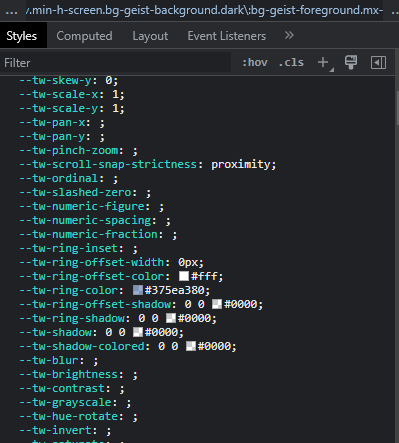
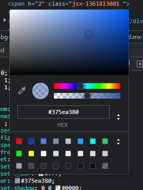

<div style="text-align: center;">
  
</div>

# Colores

Las principales propiedades CSS relativas a los colores son la propiedad color y la propiedad background-color. Color se utiliza para cambiar el color del texto de un elemento y background-color para cambiar el fondo del mismo.

```css
.myElement {
  background-color: black;   /* Color de fondo */
  color: transparent;              /* Color de texto */
}
```

Estos colores que hemos usado en el ejemplo se puede decir que son colores “reservados”. Cabe aclarar que el color transparent es un color especial que establece un color transparente para nuestros textos. Los colores reservados más comunes serán red, blue, orange, white, black…

Podéis encontrar más información sobre estos en el enlace:

[- CSS&colon; Cascading Style Sheets | MDN](https://developer.mozilla.org/en-US/docs/Web/CSS/color_value#fully_saturated_colors)

Además de los colores “base” o “reservados”, existen formas más concretas o precisas de establecer los colores que queremos en nuestra aplicación.

Funciones RGB() y RGBA(). Utilizan una función para definir los colores. La variante de RGBA() se diferencia en que incluye un canal para indicar la transparencia que queremos que tenga el elemento. Las siglas rgb significan red, green, blue y será la mezcla de estas tres tonalidades la que arrojará el color final.

Además, estos canales de rojo, verde y azul se podrán usar tanto en porcentaje (0-100%) como en valor numérico (0-255), en ambos casos siendo 0 el más oscuro. Así, el rgb(0, 0, 0) será el color negro, el rgb(255, 0, 0) será el color rojo ya que tiene el máximo de 255 de r y 0 en el resto de canales.

```css
.element {
  background-color: rgb(125 80 10);
  background-color: rgb(55% 25% 75%);
	background-color: rgb(0 0 0 / 50%); /* formato RGBA */
}
```

**Formato hexadecimal:** Es el más utilizado y es una variación del anterior que hemos visto RGB. Este formato se compone siempre de la misma estructura, que es un # seguido de 6 dígitos que pueden ser letras o números. Cada par de letras simbolizará el valor RGB en el sistema hexadecimal. En el ejemplo anterior veíamos que el rojo en RGB era rgb(255, 0, 0), si lo queremos en hexadecimal será #FF0000, donde FF será 255 y 00 00 serán 0.

```css
.element {
  background-color: #2596be;
}
```

**Formato HSL:** Este tipo de formato es mucho más intuitivo para el desarrollador, ya que sus siglas se refieren a hue (matiz de color), saturación y luminosidad (brillo). La H será un valor de entre 0 y 360deg y los dos siguientes valores se representan en porcentaje, indicando el nivel de saturación y brillo del color.

```css
.element {
  background-color: hsl(120deg 25% 75%);
	background-color: hsl(180deg 50% 25% / 75%);     /* Añadiendo transparencia */
}
```

Así, el primer valor representará el color como tal y los otros dos únicamente la saturación y brillo que queremos darle.

Como extras os comentamos que una herramienta muy útil para decidir nuestros colores es un color picker, que será una página web mayormente que nos permite movernos por una paleta de colores y nos indicará los diferentes formatos del color elegido. Os dejamos una de ejemplo pero existen muchas:

[HTML Color Picker: #2d515e](https://imagecolorpicker.com/color-code/2d515e)

Por último, puede darse el caso contrario, que entremos a una web y queramos saber qué color están usando. Para obtener ese código de color podemos abrir el inspector de elementos y en el apartado de styles del inspector buscamos cualquier formato de color.



Si ponemos el ratón sobre el cuadrado nos aparecerá un texto de Open color picker. Shift + click para cambiar el formato de color.



Como vemos se nos abrirá el color picker y si le damos al cuenta gotas podremos clickar en cualquier sitio de la web y extraer el color que usan.