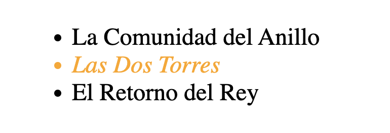
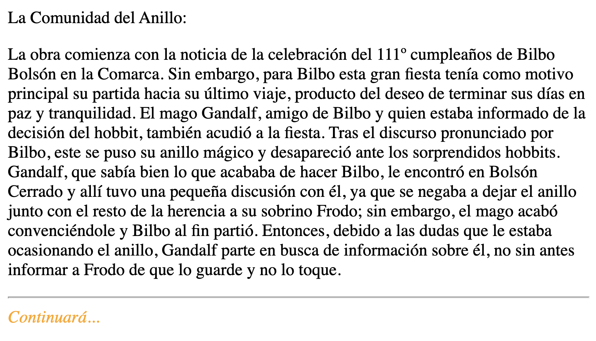
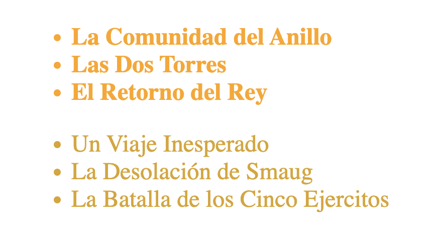
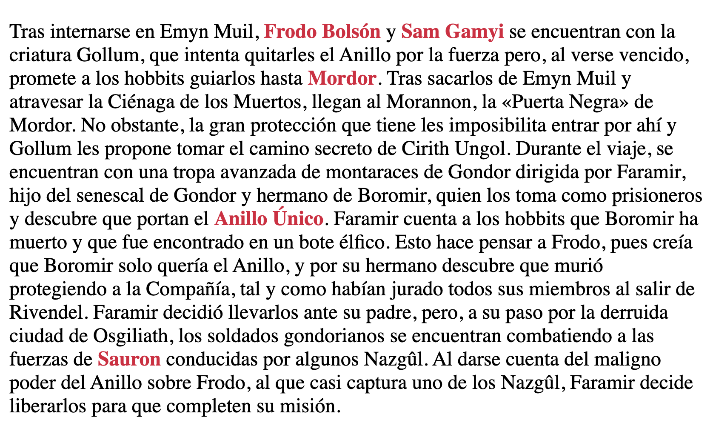

<div style="text-align: center;">
  
</div>

# Combinadores

Los combinadores son tipos de selectores que nos permiten definir relaciones entre selectores basadas en la ubicación, el tipo y los atributos de los elementos del documento HTML. Vamos a explorar los diferentes tipos de combinadores y cómo usarlos.

## Tipos de combinadores

---

**Combinador de Hermanos Adyacentes (`+`):** Selecciona un elemento que sigue directamente al primer elemento y que comparte un mismo padre.

```html
<ul>
  <li>La Comunidad del Anillo</li>
  <li>Las Dos Torres</li>
  <li>El Retorno del Rey</li>
</ul>
```

```css
li:first-of-type + li {
  font-style: italic;
  color: orange;
}
```

Aplica estilos al segundo `li` después del primer `li` del tipo.



**Combinador General de Hermanos (`~`):** Selecciona todos los elementos que siguen al primer elemento (no necesariamente adyacentes) y que comparten un mismo padre.

```html
<main>
  <span>La Comunidad del Anillo:</span>
  <p>La obra comienza con la noticia de la celebración del 111º cumpleaños de Bilbo Bolsón en la Comarca.</p>
  <hr/>
  <span>Continuará...</span>
</main>
```

```css
p ~ span {
  font-style: italic;
  color: orange;
}
```

Aplica estilos a todos los `span` que siguen a un `p` en el mismo padre.



**Combinador de Hijo (`>`):**Selecciona los elementos que son hijos directos del primer elemento.

```html
<ul class="lotr">
  <li>La Comunidad del Anillo</li>
  <li>Las Dos Torres</li>
  <li>El Retorno del Rey</li>
</ul>
<ul class="hob">
  <li>Un Viaje Inesperado</li>
  <li>La Desolación de Smaug</li>
  <li>La Batalla de los Cinco Ejércitos</li>
</ul>
```

```css
.lotr > li {
  color: orange;
  font-weight: bold;
}

.hob > li {
  color: goldenrod;
}
```

Aplica estilos a los `li` que son hijos directos de los elementos con clase `lotr` y `hob`.



**Combinador de Descendientes ( ``):** Selecciona todos los elementos que son descendientes de un elemento padre común.

```html
<section class="two-towers">
  <p>Tras internarse en Emyn Muil, <span>Frodo Bolsón</span> y <span>Sam Gamyi</span> se encuentran con la criatura Gollum.</p>
</section>
```

```css
.two-towers span {
  color: crimson;
  font-weight: bold;
}
```

Aplica estilos a cualquier `span` dentro de `.two-towers`, sin importar cuántos niveles de descendencia haya.



## Ejemplos avanzados y buenas prácticas con combinadores CSS

---

Vamos a combinar diferentes combinadores CSS para aplicar estilos complejos de manera específica y precisa. También veremos algunas buenas prácticas para el uso de estos combinadores en proyectos reales.

**Combinador de Hermanos Adyacentes (`+`) y General de Hermanos (`~`):** Imagina que tienes una lista de artículos y deseas estilizar el primer artículo, el artículo que sigue inmediatamente después y todos los `div` hermanos posteriores.

```html
<!DOCTYPE html>
<html lang="en">
<head>
    <meta charset="UTF-8">
    <meta name="viewport" content="width=device-width, initial-scale=1.0">
    <link rel="stylesheet" href="style.css">
    <title>Combinadores Avanzados</title>
</head>
<body>
    <section>
        <article class="post">Primer artículo</article>
        <article class="post">Segundo artículo</article>
        <article class="post">Tercer artículo</article>
        <div class="info">Información adicional</div>
        <div class="info">Más información adicional</div>
    </section>
</body>
</html>
```

```css
/* Buenas prácticas: Usar comentarios para explicar las reglas complejas */
/* Selecciona el segundo artículo inmediatamente después del primero */
.post:first-of-type + .post {
    background-color: lightgrey;
    font-weight: bold;
}

/* Selecciona todos los divs de clase 'info' que siguen a cualquier 'post' */
.post ~ .info {
    color: blue;
    border-top: 1px solid black;
}
```

- `post:first-of-type + .post`: Selecciona el primer `article` de clase `post` y aplica estilos al `article` que lo sigue inmediatamente.
- `.post ~ .info`: Selecciona todos los `div` de clase `info` que siguen a cualquier `article` de clase `post`.

**Buenas Prácticas:**

- **Comentarios:** Usa comentarios para explicar reglas complejas o poco intuitivas.
- **Especificidad:** Ten cuidado con la especificidad para evitar conflictos y asegurarte de que los estilos se apliquen correctamente.

**Combinador de Hijo (`>`) y Descendiente ( ``):** Vamos a estilizar elementos hijos directos y descendientes dentro de una estructura de sección.

```html
<!DOCTYPE html>
<html lang="en">
<head>
    <meta charset="UTF-8">
    <meta name="viewport" content="width=device-width, initial-scale=1.0">
    <link rel="stylesheet" href="style.css">
    <title>Combinadores Avanzados</title>
</head>
<body>
    <section class="content">
        <header>
            <h1>Título de la Sección</h1>
        </header>
        <div>
            <p>Primer párrafo dentro de un div.</p>
            <p>Segundo párrafo dentro de un div.</p>
        </div>
        <footer>
            <p>Párrafo en el pie de la sección.</p>
        </footer>
    </section>
</body>
</html>

```

```css
/* Buenas prácticas: Agrupar selectores por relación */
/* Selecciona el primer nivel de párrafos dentro de cualquier div */
.content > div > p {
    color: darkgreen;
}

/* Selecciona cualquier párrafo descendiente de la clase 'content' */
.content p {
    font-family: Arial, sans-serif;
}

/* Selecciona el primer hijo p de la clase content */
.content > p:first-child {
  font-weight: bold;
}
```

- `.content > div > p`: Selecciona los `p` que son hijos directos de `div` dentro de `.content`.
- `.content p`: Selecciona todos los `p` que son descendientes de `.content`.
- `.content > p:first-child`: Selecciona el primer `p` hijo directo dentro de `.content`.

**Buenas Prácticas:**

- **Agrupación:** Agrupa selectores por relación y propósito para mantener la organización.
- **Especificidad Controlada:** Usa combinadores con especificidad controlada para evitar conflictos con otros estilos.

**Combinación Completa de Combinadores:** Vamos a usar una combinación de todos los combinadores para aplicar estilos avanzados en una estructura HTML más compleja.

```html
<!DOCTYPE html>
<html lang="en">
<head>
    <meta charset="UTF-8">
    <meta name="viewport" content="width=device-width, initial-scale=1.0">
    <link rel="stylesheet" href="style.css">
    <title>Combinadores Avanzados</title>
</head>
<body>
    <section class="blog">
        <article>
            <h2>Título del Artículo 1</h2>
            <p>Contenido del artículo 1.</p>
        </article>
        <article>
            <h2>Título del Artículo 2</h2>
            <p>Contenido del artículo 2.</p>
            <aside>
                <p>Información adicional</p>
            </aside>
        </article>
        <article>
            <h2>Título del Artículo 3</h2>
            <p>Contenido del artículo 3.</p>
            <div>
                <p>Más contenido dentro de un div.</p>
            </div>
        </article>
        <footer>
            <p>Pie de la sección de blog.</p>
        </footer>
    </section>
</body>
</html>
```

```css
/* Buenas prácticas: Separar estilos por contexto de uso */
/* Estilo para el segundo artículo inmediatamente después del primero */
.blog > article:first-of-type + article {
    background-color: lightblue;
}

/* Estilo para todos los elementos div que siguen a un article */
.blog > article ~ div {
    background-color: lightyellow;
}

/* Estilo para cualquier p que sea hijo directo de .blog */
.blog > article > p {
    color: navy;
    font-style: italic;
}

/* Estilo para todos los p descendientes de .blog */
.blog p {
    font-family: Georgia, serif;
}

/* Estilo para p dentro de aside dentro de article */
.blog article aside p {
    color: purple;
    font-weight: bold;
}

/* Estilo para el primer article hijo directo dentro de .blog */
.blog > article:first-child {
  color: green;
  font-weight: bold;
}
```

- `.blog > article:first-of-type + article`: Selecciona el segundo `article` que sigue inmediatamente después del primero dentro de `.blog`.
- `.blog > article ~ div`: Selecciona todos los `div` que siguen a cualquier `article` dentro de `.blog`.
- `.blog > article > p`: Selecciona los `p` que son hijos directos de `article` dentro de `.blog`.
- `.blog p`: Selecciona todos los `p` que son descendientes de `.blog`.
- `.blog article aside p`: Selecciona los `p` dentro de `aside` que están dentro de `article` en `.blog`.
- `.blog > article:first-child`: Selecciona el primer `article` hijo directo dentro de `.blog`.

**Buenas Prácticas:**

- **Separación y Comentarios:** Separa los estilos por contexto de uso y usa comentarios para clarificar las reglas.
- **Especificidad y Orden:** Controla la especificidad y el orden de las reglas para evitar conflictos.
- **Nombres Significativos:** Usa clases y selectores con nombres significativos que describan su propósito.

<aside>
 **Resumen**
Utilizar combinadores CSS de manera avanzada permite estilizar elementos de manera específica y precisa en estructuras HTML complejas. Aplicar buenas prácticas como comentar el código, agrupar selectores por relación, y controlar la especificidad y el orden de las reglas ayuda a mantener el CSS organizado y manejable.

</aside>

## Reto Coding

---

Dado el siguiente HTML y haciendo uso del combinador más apropiado, cambiar a color “grey” y `font-style: italic` todos los elementos `<p>` descendientes de un elemento `<section>`.

```html
<!DOCTYPE html>
<html lang="en">
  <head>
    <meta charset="UTF-8" />
    <meta http-equiv="X-UA-Compatible" content="IE=edge" />
    <meta name="viewport" content="width=device-width, initial-scale=1.0" />
    <link rel="stylesheet" href="style.css" />
    <title>Selectores</title>
  </head>
  <body>
    <main>
      <p>
        Su historia se desarrolla en la Tercera Edad del Sol de la Tierra Media.
      </p>
      <p>La novela narra el viaje del protagonista principal, Frodo Bolsón.</p>
      <section>
        <p>Tres Anillos para los Reyes Elfos bajo el cielo.</p>
        <p>J. R. R. Tolkien</p>
        <span>El Señor de los Anillos</span>
      </section>
    </main>
  </body>
</html>
```

**Solución Reto Coding**

```css
/* Selector de Descendientes */
section p {
  color: grey;
  font-style: italic;
}
```

**Selector de Descendientes `section p`**: Este selector aplica los estilos a todos los elementos `<p>` que sean descendientes de un elemento `<section>`, sin importar cuántos niveles de anidamiento haya.