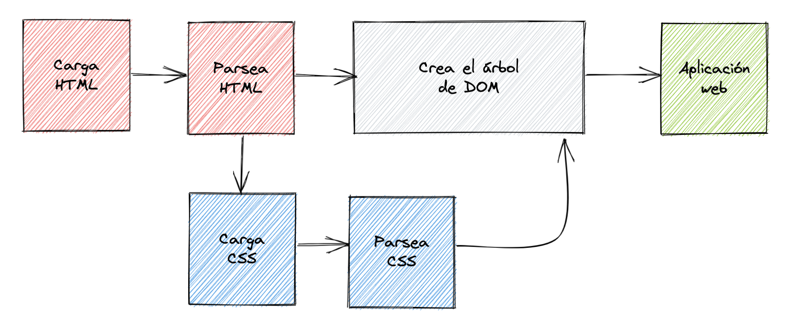

<div style="text-align: center;">
  
</div>

# Comportamiento del navegador

La idea principal de implementar CSS en un documento HTML es mantener separado el contenido (datos y estructura) del estilado visual. Esto hace que sea más fácil trabajar y mantener la aplicación.

## ¿Por qué separar HTML y CSS?

---

1. **Claridad y mantenimiento:** Mantener el HTML y el CSS separados hace que tu código sea más limpio y fácil de mantener. No tendrás que buscar entre una mezcla de contenido y estilos para hacer cambios.
2. **Reutilización de estilos:** Puedes usar la misma hoja de estilos en múltiples páginas HTML, lo que ahorra tiempo y esfuerzo.
3. **Carga más rápida:** Los navegadores pueden almacenar en caché las hojas de estilo CSS, lo que puede hacer que las páginas se carguen más rápido en visitas posteriores.

## Estructura del proyecto

---

Para mantener todo organizado, podemos seguir una estructura de proyecto como esta:

```markdown
PROYECTO
		🟥 index.html
		🟦 style.css
```

Aquí, `index.html` contiene la estructura y el contenido de la página, mientras que `style.css` contiene todos los estilos aplicados a esa estructura.

## ¿Cómo se aplica CSS a través del navegador?

---

Cuando el navegador procesa una página web con un documento HTML y una hoja de estilos CSS, sigue estos pasos:

1. **Carga del documento HTML:** El navegador carga el archivo HTML.
2. **Conversión a DOM:** El HTML se convierte en el Document Object Model (DOM), que es una representación estructurada del documento.
3. **Recuperación de recursos:** El navegador descarga todos los recursos adicionales mencionados en el HTML, como imágenes, videos y hojas de estilo CSS.
4. **Parseo del CSS:** La hoja de estilos CSS se analiza y se aplican los estilos a los nodos del DOM.
5. **Renderización del DOM:** El árbol del DOM renderizado absorbe los estilos.
6. **Muestra de la aplicación:** El navegador combina todo y muestra la página web completa al usuario.



## Ventajas de este proceso

---

- **Modularidad:** Puedes modificar el estilo de tu aplicación sin tocar la estructura HTML.
- **Facilidad de Depuración:** Puedes inspeccionar elementos y estilos por separado, lo que facilita encontrar y corregir errores.
- **Desarrollo en Equipo:** Diferentes miembros del equipo pueden trabajar en el HTML y el CSS simultáneamente sin interferir unos con otros.

**Resumen**

1. **Estructurar Herramientas:** Cómo organizar correctamente los archivos en un proyecto web para facilitar el desarrollo y mantenimiento.
2. **Separación de Contenido y Estilo:** La importancia de diferenciar el contenido y la estructura de HTML de su estilado visual mediante CSS.
3. **Comportamiento del Navegador:** Entender el proceso que sigue el navegador para combinar el contenido HTML con los estilos CSS y mostrar una página web completa.

Al comprender estos conceptos, no solo facilitarás tu trabajo como desarrollador, sino que también mejorarás la eficiencia y la mantenibilidad de tus proyectos web.
