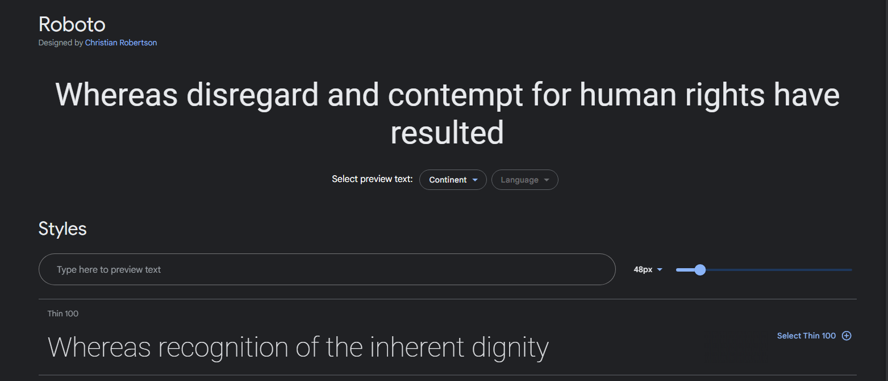
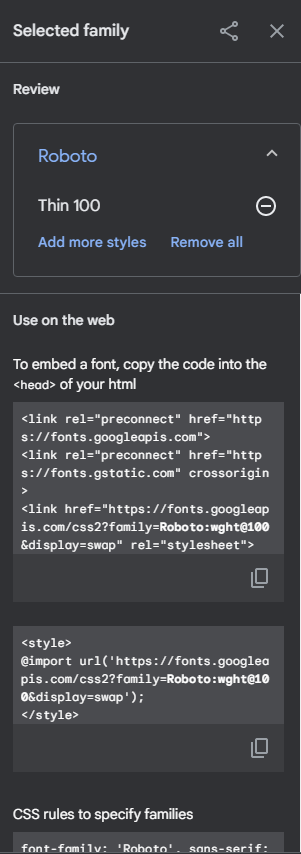

<div style="text-align: center;">
  
</div>

# Fuentes tipográficas

Las tipografías o fuentes son uno de los pilares del diseño web. La elección de una buena tipografía puede suponer mucho en una web.

Las fuentes tienen una serie de características como pueden ser si tiene o no serifa, que serán las fuentes que incorporan adornos en los bordes, paloseco, que son las que no tienen serifa y suelen acabar en Sans Serif, monoespaciada, que supone que cada una de las letras tendrá el mismo ancho y se suelen usar a la hora de insertar código en una página web.

Además, las fuentes tendrán propiedades CSS que harán que varíe la visualización de las mismas. Las más usadas serán:

**font-family**: indica el nombre de la fuente. Esta es la propiedad con la que podemos establecer que la fuente que queremos usar es una u otra. Es importante recalcar que solo se verán si el usuario tiene instalada dicha fuente en su local. Lo ideal es añadir más de una tipografía para que, en caso de que la primera no se visualice correctamente, se muestre otra que hayamos incluido como alternativa.

```css
div {
    font-family: Vegur, 'PT Sans', Verdana, sans-serif;
}
```

**font-size**: el tamaño de la fuente. Existen font-size absolutas que tienen un tamaño predefinido (xx-small | x-small | small | **medium** | large | x-large | xx-large), font-size relativas y font-size específicas, que serán las que se usarán en la mayoría de los casos ya que permiten mayor personalización y podremos expresarlas en píxeles, porcentajes, em, rem, etc.

```css
h2{
	font-size: '20px',
	font-size: '2em',
	font-size: '3rem',
}
```

**font-style**: indica el estilo y puede ser normal, italic… esta propiedad es muy útil a la hora de maquetar textos.

```css
h3 {
	font-style: 'normal'
}
```

**font-weight**: indica el grosor de la fuente y va de menos a más, es decir, un valor de 100 será la letra más fina y un valor de 800 la más gruesa.

```css
h4 {
	font-weight: 'bold'
}
```

Con todas estas propiedades podemos modificar nuestras fuentes.

## Importar fuentes

---

La mayor limitación de este tipo de uso de tipografías es principalmente lo que hemos comentado más arriba, que el usuario debe tenerla instalada en su local para que se visualice. Además, influye también el sistema operativo que tengamos y el navegador que se esté usando… por eso llegó la regla de CSS **@font-face**, que permitirá descargar una fuente o tipografía de una página y cargarla en el navegador.

Esta regla se suele usar al principio del archivo .css para avisar al navegador que estamos usando una font que es posible que no esté instalada.

```css
@font-face {
  font-family: 'Roboto';
  src: 
			local("Roboto"),
			url("./assets/fonts/Roboto/Roboto-Regular.ttf") format("truetype"),
			url("/fonts/rotobo.woff2") format("woff2"),
	    url("/fonts/roboto.woff") format("woff"),
  font-weight: normal;
  font-style: normal;
}
```

Con la propiedad src indicaremos el lugar en el que está almacenada nuestra fuente, por eso debemos insertar varias fuentes por si alguna no funcionase.

Esta fuente la podemos descargar de:

[Google Fonts: Roboto](https://fonts.google.com/specimen/Roboto)

Google fonts es un proveedor gratuito de fuentes, además es cómodo y rápido, por lo que es una opción muy recomendada a la hora de buscar fuentes para vuestra página web. Para ello entraremos en la fuente que deseamos y clickaremos en select this style



Una vez seleccionado, a la derecha debemos ver algo así:

Aquí tendremos las opciones de importar por css y de inclusión por HTML que nos permitirán usar dichas fuentes.

Existen varias opciones a la hora de insertar una fuente CSS en nuestra web:



## **Inclusión por CSS**

---

En caso de no querer descargar la fuente podemos usar **@import** en CSS y usarlo. Todas estas importaciones tienen que ir al principio de nuestro fichero CSS.

```css
@import url("https://fonts.googleapis.com/css2?family=Roboto:wght@100&display=swap");
```

Y para usarlo indicamos que nuestro documento usará dicha fuente con el selector general ***** para indicar que todo el contenido de nuestra aplicación queremos que se muestre con esa tipografía.

```css
@import url("https://fonts.googleapis.com/css2?family=Roboto:wght@100&display=swap");

* {
  font-family: "Roboto", sans-serif;
}
```

## **Inclusión por HTML**

---

Es la menos recomendada por ello la dejamos para el final, simplemente tienes que añadir dentro del head una serie de link. Debemos tener en cuenta que esto solo funciona si tenemos acceso a internet.

```html
<link rel="preconnect" href="https://fonts.googleapis.com">
<link rel="preconnect" href="https://fonts.gstatic.com" crossorigin>
<link href="https://fonts.googleapis.com/css2?family=Roboto:wght@700&display=swap" 
	rel="stylesheet">
```

## Recursos de fuentes

---

Por último os dejamos otras webs alternativas donde podéis encontrar más fuentes:

- [Adobe Fonts](https://fonts.adobe.com/) ofrece miles de fuentes con cualquier suscripción a Creative Cloud. Con otros servicios (que no se basan en fuentes de código abierto como Google Fonts, al menos), a menudo hay que preocuparse por las licencias. Estas fuentes están autorizadas para su uso en cualquier proyecto, personal o comercial.

- [Fonts.com](https://www.fonts.com/) tiene una amplia selección de fuentes tanto para el escritorio como para la web. Te proporcionan el código que necesitas para ponerlas en tu sitio. El problema es que hay varias licencias diferentes, y puede ser un poco confuso. El pago se basa en una cuota única o en un modelo de pago por uso.

- [TypeNetwork](http://www.typenetwork.com/) ofrece fuentes de alta calidad para proyectos serios con una variedad de opciones de licencia. Puedes comprar fuentes para escritorio, web, aplicaciones o ePub. Las fuentes web también tienen una opción adicional: alojadas o autoalojadas.

- Antes de que existiera Google Fonts, [Font Squirrel](https://www.fontsquirrel.com/) era el lugar donde encontrar fuentes gratuitas con licencia comercial para usar en cualquier proyecto. Tiene una gran selección, pero lamentablemente no hay opción de alojamiento de fuentes. Tendrás que descargar las fuentes y subirlas a tu sitio manualmente. Tampoco todas las fuentes están optimizadas para la web, pero puedes probar el [generador de fuentes web](https://www.fontsquirrel.com/tools/webfont-generator).

## **Reto Coding**

---

Dado el siguiente HTML

```html
<!DOCTYPE html>
<html>
<head>
  <meta charset="UTF-8">
  <title>Biografía de David Bowie</title>
  <link rel="stylesheet" href="estilos.css">
</head>
<body>
  <header>
    <h1>Biografía de David Bowie</h1>
  </header>

  <main>
    <h2>David Bowie</h2>
    
    <p>David Bowie (nacido como David Robert Jones) fue un músico, actor y compositor británico, conocido por sus innovadoras contribuciones a la música popular y su constante reinvención de su imagen pública. Bowie comenzó su carrera en el mundo del rock a principios de la década de 1960 y se convirtió en uno de los músicos más influyentes y exitosos de la historia de la música popular.</p>
    <p>Durante su carrera, Bowie lanzó más de 20 álbumes de estudio y vendió más de 140 millones de discos en todo el mundo. Algunos de sus éxitos más conocidos incluyen "Space Oddity", "Changes", "Ziggy Stardust" y "Let's Dance". Además de su trabajo como músico, Bowie también tuvo éxito como actor, apareciendo en películas como "The Man Who Fell to Earth" y "Labyrinth".</p>
  </main>

  <footer>
    <p>Copyright David Bowie</p>
  </footer>
</body>
</html>
```

Importa en la hoja de estilos la fuente “Open Sans” de Google Fonts y aplícale a los párrafos dicha fuente.

Una vez realizada la primera importación, crear una font-face con la siguiente fuente llamada “Bergdool” y aplicarla a los h1 y h2 del documento.

**Fuente:**

[bergdool.zip](https://s3-us-west-2.amazonaws.com/secure.notion-static.com/f5d8b605-6c09-4b2a-89fd-a8836cc3235b/bergdool.zip)

**Solución Reto Coding**

Vamos a importar la fuente "Open Sans" desde Google Fonts y aplicarla a los párrafos. Además, crearemos una font-face para la fuente "Bergdool" y la aplicaremos a los encabezados h1 y h2.

**Paso 1**: Importar la fuente "Open Sans" desde Google Fonts

1. Ve a [Google Fonts](https://fonts.google.com/).
2. Busca "Open Sans".
3. Copia el enlace de importación proporcionado por Google Fonts.

**Paso 2**: Descargar y descomprimir la fuente "Bergdool"

1. Descarga el archivo [bergdool.zip](https://s3-us-west-2.amazonaws.com/secure.notion-static.com/f5d8b605-6c09-4b2a-89fd-a8836cc3235b/bergdool.zip).
2. Descomprime el archivo y obtén el archivo de fuente "Bergdool".

**Paso 3**: Modificar el archivo `estilos.css`

1. Importar la fuente "Open Sans" desde Google Fonts.
2. Crear una font-face para "Bergdool".
3. Aplicar "Open Sans" a los párrafos.
4. Aplicar "Bergdool" a los encabezados h1 y h2.

```css
/* Importar la fuente Open Sans desde Google Fonts */
@import url("https://fonts.googleapis.com/css2?family=Open+Sans:wght@400;600&display=swap");

/* Crear una font-face para Bergdool */
@font-face {
  font-family: "Bergdool";
  src: url("bergdool.woff2") format("woff2"),
    url("bergdool.woff") format("woff");
  font-weight: normal;
  font-style: normal;
}

/* Aplicar Open Sans a los párrafos */
body {
  font-family: "Open Sans", sans-serif;
}

p {
  font-family: "Open Sans", sans-serif;
}

/* Aplicar Bergdool a los encabezados h1 y h2 */
h1,
h2 {
  font-family: "Bergdool", serif;
}

/* Otros estilos base */
* {
  box-sizing: border-box;
  margin: 0;
  padding: 0;
}

header {
  background-color: #333;
  color: white;
  padding: 1rem;
  text-align: center;
}

main {
  padding: 2rem;
}

footer {
  background-color: #333;
  color: white;
  padding: 1rem;
  text-align: center;
}
```

**Paso 4**: Verificar la estructura del proyecto | Asegúrate de que la estructura del proyecto sea la siguiente:

```markdown
proyecto/
│
├── index.html
├── estilos.css
└── fuentes/
    ├── bergdool.woff2
    └── bergdool.woff
```

**Paso 5:** 

Asegúrate de que todos los archivos estén en la ubicación correcta. Abre `index.html` en tu navegador para verificar que los estilos se aplican correctamente. Los párrafos deberían utilizar "Open Sans" y los encabezados h1 y h2 deberían utilizar "Bergdool".