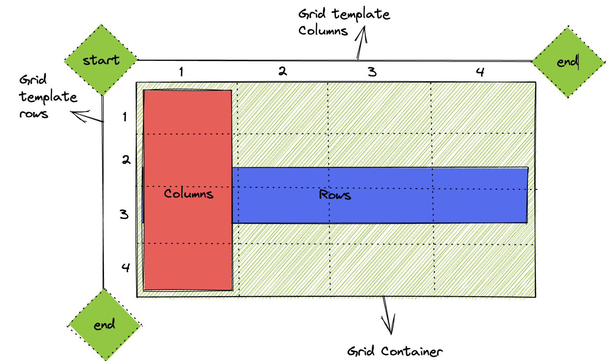
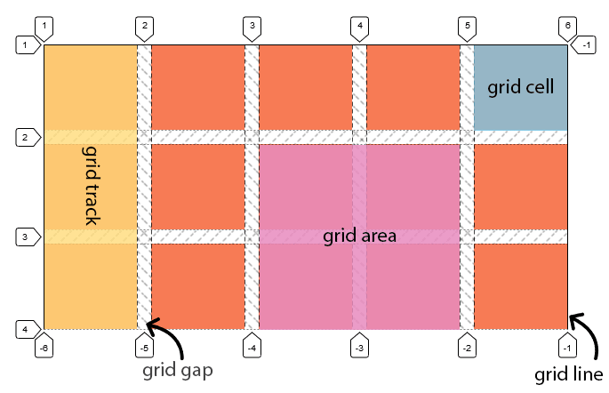
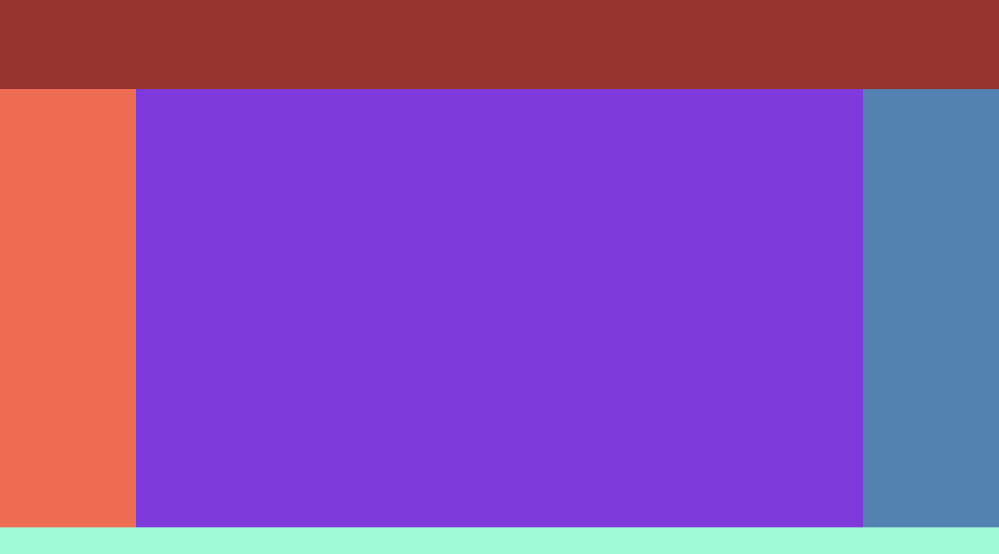
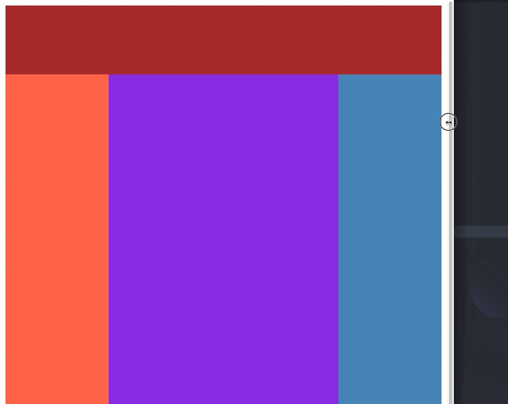

<div style="text-align: center;">
  
</div>

# Display: Grid
Una de las formas más populares de maquetar es a través de un **grid**, o grilla. Este sistema de maquetación nos permite dividir una vista de una aplicación web en filas y columnas, de manera que podamos colocar los elementos de una manera más ordenada y estructurada sin tener que recurrir a sistemas anticuados como las tablas.

Este sistema **bidimensional** transformará nuestro documento en una cuadricula en la cual trabajaremos sobre elementos padres para posicionar a sus hijos.

Veamos un ejemplo básico definiendo un contenedor que será el encargado de envolver a todos los elementos que queremos colocar mediante **grid**.

```html
<div class="grid-container">
  <!-- elementos de la grilla -->
</div>
```

```css
.grid-container {
  display: grid;
}
```

Como podemos ver, hemos definido un div con una clase llamada grid-container y le hemos aplicado este sistema mediante **display: grid**. 

## **Filas y columnas**

---

Una vez tenemos nuestro primer **grid** vamos a especificar las filas y las columnas que queremos en nuestra cuadricula. Para ello podemos utilizar las propiedades **grid-template-rows** y **grid-template-columns**. 



Estas dos propiedades nos permitien definir el tamaño y la cantidad de filas y columnas de nuestro grid.

```css
.grid-container {
  display: grid;
  grid-template-rows: 50px 100px; /* dos filas, una de 50px y otra de 100px */
  grid-template-columns: 25% 50%; /* dos columnas, una de 25% y otra de 50% */
}
```

Una vez tengamos nuestro número de filas y columnas definido, además de sus tamaños, podemos empezar a colocar elementos en el grid. Para ello haremos uso de las propiedades **grid-row** y **grid-column,** con las cuales especificaremos en qué fila y columna queremos que se encuentre un elemento determinado.

```html
<div class="grid-container">
  <div class="grid-item">Elemento 1</div>
  <div class="grid-item">Elemento 2</div>
  <div class="grid-item">Elemento 3</div>
</div>
```

```css
.grid-item {
  grid-row: 1; /* primer fila */
  grid-column: 1; /* primera columna */
}
```

Además de esto, podemos establecer el espacio que tiene que haber entre los elementos mediante **grid-gap.**

```css
.grid-container {
  display: grid;
  grid-template-rows: 50px 100px; 
  grid-template-columns: 25% 50%; 
	grid-gap: 1em; /* La separación de los elementos será de 1em */
}
```

Entendiendo estos conceptos, veamos un ejemplo práctico con todo lo que acabamos de ver a la vez:

```html
<!DOCTYPE html>
<html>
  <head>
    <link rel="stylesheet" type="text/css" href="style.css" />
    <title>Galería de Cómics de Marvel</title>
  </head>
  <body>
    <div class="grid">
      
      
      
      
      
      
    </div>
  </body>
</html>
```

```css
.grid {
  display: grid;
  grid-template-columns: 1fr 1fr 1fr;
  grid-gap: 20px;
}

img {
  box-shadow: 2px 2px 6px rgba(0, 0, 0, 0.403);
  width: 100%;
}
```


## **¿Qué es fr?**

---

**Fr**, o fracción, es una unidad de longitud relativa adicional para crear vías (o tracks) en grid. 

Esta representa una porción del espacio disponible en el contenedor de la grilla. 

Cuando definimos las columnas y las filas de un contenedor, automáticamente se definen líneas, las cuales nos orientarán a la hora de definir el tamaño de las vías.



## **Posicionamiento de elementos**

---

Hemos visto como **grid** nos permite colocar “automáticamente” los elementos en una cuadrícula, pero gracias a ciertas propiedades podremos definir el número de columnas o filas que queremos que ocupe cada uno de nuestros elementos.

Viendo el esquema de arriba, al generar 5 columnas vemos como se generan 6 líneas, y de la misma forma, al generar 4 filas se generan sus respectivas 5 líneas. Gracias a estas líneas podremos ver de dónde a dónde llegarán nuestros elementos.

Esta “personalización” la podremos efectuar gracias a las propiedades **grid-column**-**start, grid-column-end, grid-row-start** y **grid-row-end.**

Actualmente se utiliza de forma abreviada **grid-column** y **grid-row,** especificando en sus valores el número de columna o fila inicial y el final. 

Es muy **importante** tener en cuenta que para que un elemento “crezca” entre columnas y filas, estas tienen que ser **correlativas**. Un elemento jamás puede ir en diagonal o, pese a ser imposible, saltar de una columna a otra no-correlativa.

Veamos un ejemplo de una galería de imágenes personalizada, en la cual cada una de ellas ocupa un espacio definido de la cuadrícula.

```html
<!DOCTYPE html>
<html lang="en">
  <head>
    <meta charset="UTF-8" />
    <meta http-equiv="X-UA-Compatible" content="IE=edge" />
    <meta name="viewport" content="width=device-width, initial-scale=1.0" />
    <link rel="stylesheet" href="style.css" />
    <title>Document</title>
  </head>
  <body>
    <main>
      <div class="item-a">
        
      </div>
      <div>
        
      </div>
      <div class="item-b">
        
      </div>
      <div>
        
      </div>
      <div class="item-c">
        
      </div>
      <div>
        
      </div>
      <div>
        
      </div>
      <div class="item-d">
        
      </div>
    </main>
  </body>
</html>
```

```css
main {
  max-width: 900px;
  padding: 1rem;
  margin: 0 auto;
  display: grid;
  grid-template-columns: 200px 200px 200px 200px;
  grid-template-rows: 200px 200px 200px;
  grid-gap: 1rem;
}

img {
  object-fit: cover;
  width: 100%;
  height: 100%;
}

.item-a {
  grid-row: 1 / 3;
}

.item-b {
  grid-column: 3 / 5;
}

.item-c {
  grid-row: 2 / 4;
}

.item-d {
  grid-column: 3 / 5;
}
```


## **Grid-template-area**

---

Hay unos métodos avanzados que nos facilitan la tarea de plantear layouts de una forma flexible e intuitiva. 

Veamos este término a través de uno de los layouts más comúnes en web, el Holy Grail. Este layout consiste en un header, una sección central dividida en navegación, main y siderbar y un footer abajo. Este layout tan popular, por consenso, se realiza muchísimo mejor mediante grid.


Vamos a crear los elementos de nuestro layout dentro de un contenedor:

```html
<!DOCTYPE html>
<html lang="en">
  <head>
    <meta charset="UTF-8" />
    <meta http-equiv="X-UA-Compatible" content="IE=edge" />
    <meta name="viewport" content="width=device-width, initial-scale=1.0" />
    <link rel="stylesheet" href="styles.css" />
    <title>Document</title>
  </head>
  <body class="container">
    <header class="hg__header"></header>
    <main class="hg__main"></main>
    <aside class="hg__left"></aside>
    <aside class="hg__right"></aside>
    <footer class="hg__footer"></footer>
  </body>
</html>
```

Y ahora, a través de la propiedad **grid-area** vamos a darles un nombre a cada una de las etiquetas aplicándole una regla a cada una:

```css
.hg__header {
  grid-area: header;
  background-color: brown;
}
.hg__footer {
  grid-area: footer;
  background-color: aquamarine;
}
.hg__main {
  grid-area: main;
  background-color: blueviolet;
}
.hg__left {
  grid-area: navigation;
  background-color: tomato;
}
.hg__right {
  grid-area: ads;
  background-color: steelblue;
}.container {
  display: grid;
  grid-template-areas:
    "header header header"
    "navigation main ads"
    "footer footer footer";
  grid-template-columns: 150px 1fr 150px;
  grid-template-rows:
    100px
    1fr
    30px;
  min-height: 100vh;
}
```

Acabamos de marcar cada uno de nuestros bloques con un nombre para poder posicionarlos a través de **grid-template-area** de una manera completamente visual, utilizando estos mismos para colocarlos como si fuera una cuadrícula de texto:

```css
.container {
  display: grid;
  grid-template-areas:
    "header header header"
    "navigation main ads"
    "footer footer footer";
  grid-template-columns: 150px 1fr 150px;
  grid-template-rows:
    100px
    1fr
    30px;
  min-height: 100vh;
}
```



Vamos a hacerlo responsive cambiándole el “template” y la disposición de filas con una media-query:

```css
@media screen and (max-width: 600px) {
	.hg {
		grid-template-areas: "header"
		                     "navigation"
		                     "main"
		                     "ads"
		                     "footer";
		grid-template-columns: 100%;
		grid-template-rows: 100px 
							50px 
							1fr
							50px 
							30px;
	}
}
```



## **Repeat**

---

Habiendo visto los grid-templates nos surge una pregunta: ¿qué ocurre si tenemos 20 columnas de una fracción cada una?

En principio no habría problema en indicar 20 veces 1fr, pero sería un trabajo muy tedioso con un código casi inteligible, por lo que grid nos ofrece la función **repeat** para indicarle a través de su primer argumento el número de repeticiones que necesita su unidad indicada en el segundo argumento:

```css
grid-template-columns: repeat(20, 1fr);
```

## **Auto-fit**

---

El valor **auto-fit** en **grid-template-columns** le indica al elemento contenedor que cree tantas columnas como quepan en el ancho disponible. 

```css
grid-template-columns: repeat(auto-fit, minmax(200px, 1fr))
```

En este ejemplo, cada columna tendrá un tamaño mínimo de **200px** y un tamaño máximo de **1fr**. Esto significa que si hay suficiente espacio disponible, las columnas ocuparán una fracción igual del espacio disponible; de lo contrario, las columnas se ajustarán al tamaño mínimo de **200px**.

Por ejemplo, si el elemento contenedor tiene un ancho de 1000px, se crearán cinco columnas de 200px cada una. Si el ancho del elemento contenedor cambia a 800px, se crearán cuatro columnas de 200px cada una. Si el ancho del elemento contenedor cambia a 600px, se crearán tres columnas de 200px cada una.

```css
.container {
  display: grid;
  grid-template-columns: repeat(auto-fit, minmax(200px, 1fr));
}
```

## **Auto-fill**

---

El valor **auto-fill** en **grid-template-columns** es similar al valor **auto-fit**, pero en lugar de ajustar el número de columnas al ancho disponible, **auto-fill** crea tantas columnas como quepan en el ancho disponible sin ajustar el tamaño de ninguna de ellas. Esto significa que si hay suficiente espacio disponible, las columnas ocuparán una fracción igual del espacio disponible; de lo contrario, el espacio disponible se dividirá entre las columnas existentes sin ajustar su tamaño.

Por ejemplo, si el elemento contenedor tiene un ancho de 1000px y se establece **grid-template-columns: repeat(auto-fill, minmax(200px, 1fr))**, se crearán cinco columnas de 200px cada una. 

```css
**grid-template-columns: repeat(auto-fill, minmax(200px, 1fr))**
```

Si el ancho del elemento contenedor cambia a 800px, las columnas existentes no se ajustarán de tamaño y seguirán ocupando un ancho de 200px cada una.

## Recursos Adicionales

---

Para practicar y aprender más sobre Grid, aquí tienes algunos recursos adicionales:

[CSS Garden](https://cssgridgarden.com/#es)

[Grid Attack](https://codingfantasy.com/games/css-grid-attack)

[Grid Critters](https://gridcritters.com/)

## Contenido asociado
---
- [Video: Terminología básica](https://vimeo.com/872708043/7399f37b8e)
- [Video: Propiedades de un contenedor Grid](https://vimeo.com/872705629/56229401d4)
- [Video: Propiedades de un elemento Grid](https://vimeo.com/872705827/1df7537131)
- [Video: Herramientas para mejorar el aprendizaje en Grid](https://vimeo.com/873032616/caee6cceea?share=copy)
