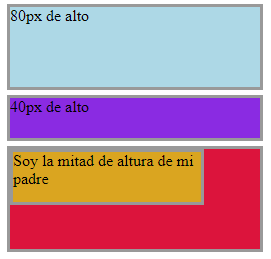

<div style="text-align: center;">
  
</div>

# Modelo de caja

Un modelo de caja es un sistema del navegador para interpretar estos elementos “caja”, que serán elementos HTML con unas características concretas.

La representación básica del **modelo de cajas** se basa en:

- El **borde**, que será el límite que separa el interior del exterior del elemento.
- El **márgen** (*margin*), se representa en color naranja y es la parte exterior del elemento, por fuera del borde.
- El **relleno** (*padding*), se representa en color verde y es la parte interior del elemento, entre el contenido y el borde.
- El **contenido *(content)***, se representa en color azul y es la parte interior del elemento, excluyendo el relleno.

Todas estas características pueden cambiar con propiedades que establezcamos para nuestra web. Así, cada elemento del HTML como un <div> podrá tener su propio margin, border, padding…

[El modelo de caja - Aprende sobre desarrollo web | MDN](https://developer.mozilla.org/es/docs/Learn/CSS/Building_blocks/The_box_model)

## **Propiedades de tamaño y contenido**

---

Cuando queremos controlar los elementos que definen el tamaño de nuestra caja y el comportamiento de su contenido usamos las propiedades de Contenido como: box-sizing, overflow, overflow-x y overflow-y y propiedades de Tamaño como height, width, max-height, max-width, min-height y min-width.

Algunas de las propiedades más importantes serán width y height, relativas al ancho y alto respectivamente. En el caso de indicar el valor **`auto`**a estas propiedades, el navegador se encargará de darle el tamaño, siempre dependiendo de su contenido. Es el valor por defecto, por lo que no es necesario especificarlo. *Importante: el tamaño auto por defecto dependerá del elemento HTML al que se lo indiquemos, no es lo mismo un elemento de bloque que de línea.*

```html
<div id="lightblue" class="height-example">
<span>80px de alto</span>
</div>
<div id="blueviolet" class="height-example">
<span>40px de alto</span>
</div>
<div id="parent" class="height-example">
<div id="child" class="height-example">
  <span>Soy la mitad de altura de mi padre</span>
</div>
</div>
```

```css
.height-example {
    width: 250px;
    margin-bottom: 5px;
    border: 3px solid #999999;
  }
  
  #lightblue {
    height: 80px;
    background-color: lightblue;
  }
  
  #blueviolet {
    height: 40px;
    background-color: blueviolet;
  }
  
  #parent {
    height: 100px;
    background-color: crimson;
  }
  
  #child {
    height: 50%;
    width: 75%;
    background-color: goldenrod;
  }
```



A través de estas dos propiedades **width** y **height** indicamos al navegador que queremos que el ancho y alto sea el valor introducido y no el “auto” por defecto. Pero además existen algunas variaciones de estas dos propiedades:

| Propiedad | Descripción |
| --- | --- |
| max-width | Ancho máximo que puede ocupar un elemento. |
| min-width | Ancho mínimo que puede ocupar un elemento. |
| max-height | Alto máximo que puede ocupar un elemento. |
| min-height | Alto mínimo que puede ocupar un elemento. |

```css
div {
  width: 300px;
  height: 100px;
  background: whitesmoke;
  max-width: 500px;
}
```

Así, indicaremos unos máximos y mínimos donde el ancho y el alto podrá variar pero no superar por arriba o por abajo los valores indicados.


Otra de las utilidades que os vendrá bien saber es la relativa a las zonas de un elemento, que son propiedades que hacen referencia a una zona concreta del elemento. Estas serán top, bottom, right, left y center. Su propio nombre indica la zona a la que hacen referencia, por lo que serán bastante sencillas de entender.

También existen propiedades que hacen referencia al propio contenido que insertamos. Estas serán muy útiles cuando tengamos cajas con un ancho definido pero el contenido sobrepase este ancho… lo que hará que el contenido sea más grande que la caja y tenga que salir por algún lado. 

La propiedad más importante aquí será overflow, que además tendrá variantes x o y para indicar el comportamiento de cada eje por separado.

Los valores que puede tomar esta propiedad serán:

- visible: se mostrará el contenido que sobresalga, por lo que se desbordará.
- hidden: todo el contenido que no entre en la caja se ocultará.
- scroll: se introducirán barras de scroll verticales y horizontales para que todo el contenido esté visible. No hay desbordamiento y todo el contenido se podrá ver.
- auto: se colocarán barras de scroll cuando sea necesario.

```html
<p class="overflow-visible">
      Valor visible. Lorem ipsum dolor sit amet, consectetur adipisicing elit.
      Tempora, expedita? Tempora aut tempore est nemo sint porro sequi optio vel
      ex amet. Nihil impedit ipsa cupiditate unde asperiores, dignis
    </p>
    <br />
    <p class="overflow-hidden">
      overflow-hidden. Lorem ipsum dolor sit, amet consectetur adipisicing elit.
      Doloremque architecto quis neque, ea vel distinctio at numquam, sit, fuga
      asperiores aut? Reprehenderit ea hic est ducimus deleniti iure ex i
    </p>
    <br />
    <p class="overflow-scroll">
      Se muestra un scroll cuando el contenido se desborde. Lorem ipsum dolor
      sit amet consectetur adipisicing elit. Vero cupiditate ea doloribus
      perspiciatis, perferendis enim id sit accusamus dicta dolor maxime
      eligendi odit harum opti
    </p>

    <br />
    <p class="overflow-auto">
      Overflow auto. Lorem ipsum dolor sit amet consectetur adipisicing elit.
      Neque accusantium sunt laudantium ullam cupiditate esse, quas aperiam
      saepe cumque reprehenderit consequatur culpa libero placeat provident eum
      quibusdam, dicta veritatis ipsam. Lorem ipsum dolor sit amet, consectetur
      adipisicing elit
    </p>
```

```css
.overflow-visible {
    height: 2em;
    width: 12em;
    border: 3px dotted orange;
    margin-bottom: 100px;
    overflow: visible; /* dibuja barras si es necesario */
  }
  
  .overflow-hidden {
    width: 12em;
    height: 2em;
    border: 3px dotted orange;
    overflow: hidden; /* No Scroll*/
  }
  
  .overflow-scroll {
    width: 12em;
    height: 2em;
    border: 3px dotted orange;
    overflow: scroll; /* Scroll */
  }
  
  .overflow-auto {
    width: 12em;
    height: 2em;
    border: 3px dotted orange;
    overflow: auto; /* auto */
  }
```


Como podemos ver en el resultado, el comportamiento dependerá del valor de esta propiedad overflow.

Con todo lo que hemos ido contando se puede entender de forma sencilla el modelo de caja, pero tenemos que entender que cuando trabajemos con una aplicación muy grande puede ocurrir que tengamos numerosas cajas y se pueden dar comportamientos que a priori no esperábamos, ¡por eso hay que estar preparados!

Por defecto, cuando añadimos un borde, padding, etc, estas dimensiones se añadirán a las del contenido. Es decir, por defecto cuando asignamos un width y height a un elemento se lo asignamos en realidad al contenido, y todo lo “extra” le irá añadiendo tamaño. 

Esto puede resultar frustrante cuando habíamos asignado, por ejemplo, 200px de width y al meter padding vemos que el elemento acaba ocupando mucho más. 

Para evitar estos cálculos mentales existe la propiedad box-sizing, que por defecto tendrá un valor de content-box, que significa lo que comentábamos, las propiedades width y height se referirán únicamente al contenido. El otro valor que puede tener esta propiedad es border-box, que sí que incluirá en el width y height que asignemos espacio para propiedades como border, padding, etc.

Vamos a poner un ejemplo de código:

```html
<div class="content-box">Contenido de la caja</div>
<br>
<div class="border-box">Borde de la caja</div>
```

```css
div {
  width: 250px;
  height: 75px;
  padding: 25px;
  border: 5px solid black;
  background: lightblue;
}

.content-box {
  box-sizing: content-box;
  /* Ancho  total: 250px + (2 * 25px) + (2 * 5px) = 310px
     Altura total: 75px + (2 * 25px) + (2 * 5px) = 135px
     Ancho de la caja de contenido: 250px
     Altura de la caja de contenido: 75px */
}

.border-box {
  box-sizing: border-box;
  /* Ancho total: 250px
     Altura total: 75px
     Ancho de la caja de contenido: 250px - (2 * 25px) - (2 * 5px) = 190px
     Altura de la caja de contenido: 75px - (2 * 25px) - (2 * 5px) = 10px */
}
```

Lo que estamos haciendo aquí es, en el <div> con el box-sizing en content-box, indicar que el width del CONTENIDO será 250 y a esto se le tendrá que añadir el padding y el border.

Por otro lado, en el <div> con el box-sizing en border-box estamos indicando que el ancho total de la CAJA será 250px, por lo que el espacio que tendrá el contenido serán esos 250px menos lo asignado al padding y border.

## **Margin y padding**

---

En el modelo de cajas, los **márgenes** (*margin*) son los espacios exteriores de un elemento. Es decir, el espacio que hay entre el borde de un elemento y su exterior. El relleno (padding) será el espacio entre el borde del elemento y el contenido.

Para empezar debemos mencionar, recalcar y recordar siempre que los margin NO son lo mismo que los paddings. Los márgenes o margin implican espacio entre los bordes del elemento HTML con el que estemos trabajando y los bordes de otros elementos, por lo que hacen referencia a espaciados exteriores, mientras que el padding o relleno será espacio entre los bordes del elemento y el contenido del elemento, lo que supone espaciado interior.

En relación a los márgenes, se podrán alterar de forma general o de forma específica en cada lado del elemento (arriba, derecha, abajo e izquierda). Estas propiedades serán:

| Propiedad | Descripción |
| --- | --- |
| margin-top | Establece un tamaño de margen superior. |
| margin-left | Establece un tamaño de margen a la izquierda. |
| margin-right | Establece un tamaño de margen a la derecha. |
| margin-bottom | Establece un tamaño de margen inferior. |

Si queremos **centrar horizontalmente un elemento en pantalla fácilmente existen tips, como por ejemplo** aplicar un ancho fijo al contenedor:(*por ejemplo* **`width: 200px`**) y luego aplicar un **`margin: auto`**. 

Así, el navegador sabrá que ese elemento tiene un tamaño concreto repartirá los márgenes de manera igual en izquierda y derecha, y centraremos el elemento.

```html
<div class="margin-example">Este es un ejemplo de centrar un div</div>
```

```css
.margin-example{
    width: 800px;
    margin: auto;
    height: 100;
    background-color: cornflowerblue;
    color: whitesmoke;
}
```

En relación al relleno o padding, tendrá las mismas propiedades que el margin:

| Propiedad | Descripción |
| --- | --- |
| padding-top | Aplica un relleno interior en el espacio superior de un elemento. |
| padding-left | Aplica un relleno interior en el espacio izquierdo de un elemento. |
| padding-right | Aplica un relleno interior en el espacio derecho de un elemento. |
| padding-bottom | Aplica un relleno interior en el espacio inferior de un elemento. |

Por defecto el relleno es 0, deberá modificarse para ver el padding aplicado.

```html
<div class="margin-example">Este es un ejemplo de centrar un div con padding</div>
```

```css
.margin-example{
    width: 800px;
    margin: auto;
    height: 100;
		padding: 20px;
    background-color: cornflowerblue;
    color: whitesmoke;
}
```


Como hemos comentado, existen 4 lados (top, right, bottom y left) en los que aplicar margin/padding, pero no existen atajos o maneras sencillas para no tener que definir los 4 lados. Veámoslo en una tabla:

| Propiedad | Descripción |
| --- | --- |
| margin o padding  | 1 parámetro. Aplica el mismo margen a todos los lados. |
| margin o padding  | 2 parámetros. Aplica margen top/bottom y left/right. |
| margin o padding  | 3 parámetros. Aplica margen top, left/right y bottom. |
| margin o padding  | 4 parámetros. Aplica margen top, right, bottom e left. |

Separados por // encontraremos los diferentes valores posibles de margin/padding dependiendo de lo que queramos conseguir.

```html
<div class="margin-example">Este es un ejemplo de centrar un div con todas las posibilidades de padding</div>
```

```css
.margin-example{
    width: 200px;
    margin: auto;
		padding: 10px // 10px 5px // 10px 5px 8px // 10px 5px 8px 2px; 
    background-color: cornflowerblue;
    color: whitesmoke;
}
```

## **Propiedades de bordes**

---

En CSS es posible especificar el aspecto que tendrán los **bordes** de cualquier elemento HTML, pudiendo incluso, dar diferentes características a zonas particulares del borde.

Los bordes son una parte esencial del modelo de caja. La mayoría de webs que usáis en vuestro día a día contienen estos bordes que “encierran” el contenido y le dan un toque a nuestras cajas. Tendremos estas propiedades a la hora de modificar los bordes:

- border-color: especifica el color que se usará en el borde.
- border-width: especificará un tamaño para el grosor del borde.
- border-style: define el estilo a usar en dicho borde. Dentro de esta propiedad tendremos distintas variantes:
    
    
    | Valor | Descripción |
    | --- | --- |
    | hidden | Oculto. Idéntico a none, salvo para conflictos con tablas. |
    | dotted | Establece un borde basado en puntos. |
    | dashed | Establece un borde basado en rayas (línea discontínua). |
    | solid | Establece un borde sólido (línea contínua). |
    | double | Establece un borde doble (dos líneas contínuas). |
    | groove | Establece un borde biselado con luz desde arriba. |
    | ridge | Establece un borde biselado con luz desde abajo. Opuesto a groove. |
    | inset | Establece un borde con profundidad «hacia dentro». |
    | outset | Establece un borde con profundidad «hacia fuera». Opuesto a inset. |
    
    ```html
    <div>Este es un ejemplo de aplicación de bordes</div>
    ```
    
    ```css
    div {
      border-color: gray;
      border-width: 1px;
      border-style: dotted;
    }
    ```
    
    

    

Como vemos, en nuestro ejemplo se ha aplicado el borde con el estilo dotted a nuestro diseño. El borde más usado es solid.

Una vez visto esto, podemos avanzar a los atajos, que nos vienen a solucionar la vida. Principalmente se crearon para hacer este tipo de inserciones más sencillas y que no tengamos que escribir muchas líneas de código para diseñar nuestros bordes. Existe así la propiedad border a la que podremos aplicarle en una sola línea todos los valores. El ejemplo anterior se podía condensar en:

```css
div {
  border:1px solid gray;
}
```

Por último, debemos mencionar que se pueden aplicar bordes a los distintos lados de nuestra caja, con las propiedades border-top, border-right, border-bottom y border-left respectivamente.

Y, si lo que queremos es algo más avanzado… podemos incluso redondear las esquinas para dar una sensación mucho más vistosa. Este tipo de redondeces se hacen sobre todo a la hora de crear botones, y para ello podemos usar la propiedad border-radius, que tendrá valores numéricos o en porcentaje.

```html
<div>Este es un ejemplo de aplicación de bordes redondeados</div>
```

```css
div {
   border:2px solid blue;
	 border-radius: 8px;
}
```
   


## Propiedades de sombras

---

Se denominan **sombras sobre cajas** a las sombras en CSS que se pueden crear en una etiqueta o elemento HTML. Para ello, se utiliza la propiedad **box-shadow.**

Las sombras se pueden crear en una etiqueta o elemento HTML para darle efecto a nuestras cajas. Para ello tenemos la propiedad box-shadow, que por defecto están desactivadas o con valor none y con el color negro sin difuminar. La sombra se podrá extender o desplazar en horizontal y/o vertical. Además podremos difuminar, desenfocar, aplicar crecimiento… todo ello dependerá de cómo juguemos con la propiedad box-shadow. Vamos a ver cada posibilidad:

- Desplazamiento: los dos primeros parámetros que son obligatorios en la propiedad box-shadow indicamos el desplazamiento de la sombra en el eje x e y. Si queremos desplazar la sombra a la derecha y abajo, podríamos hacer lo siguiente:

```css
.element {
  box-shadow: 10px 10px;
}
/* Desplazamientos izquierda y arriba, ponemos valores negativos*/
.element {
  box-shadow: -5px -5px;
}
```

- Desenfoque: este será el tercer parámetro que podemos pasarle a la propiedad, e indica la cantidad de desenfoque o difuminado que queremos en nuestra sombra. Por defecto es 0, que quiere decir que no estará difuminada.

```css
.element {
  box-shadow: 5px 5px 0;      /* Sombra sin desenfoque */
  box-shadow: 5px 5px 2px;    /* Sombra con ligero desenfoque */
  box-shadow: 5px 5px 10px;   /* Sombra desenfocada */
  box-shadow: 5px 5px 40px;   /* Sombra con un desenfoque casi disipado */
}
```

- Factor de crecimiento: es el cuarto parámetro que admite la propiedad y es opcional, y hará crecer la sombra en todos sus lados.

```css
.element {
  box-shadow: 0 0 10px 5px;
}
```

- Color: es el último parámetro admitido y normalmente se suele usar el cuarto ya que el factor de crecimiento no es muy habitual.

Ahora bien, hasta ahora hemos hablado mucho de sombras pero no hemos mencionado que por defecto la sombra será exterior y se colocará por fuera del elemento. Si queremos una sombra interior e invertir los valores por defecto tenemos la palabra clave inset. 

Al invertir los valores debemos tener en cuenta que ahora los valores que eran positivos en el eje x deberán ser negativos. Vamos a ver mejor un ejemplo de código:

```css
.element {
  /* Sombra exterior que se desplaza hacia la zona inferior-derecha */
  box-shadow: 10px 10px 5px black;

  /* Sombra interior que se desplaza hacia la zona inferior-derecha */
  box-shadow: -10px -10px 5px black inset;
}
```

Vamos a mostraros un ejemplo completo de código para que veáis de lo que estamos hablando:

```html
<div class="shadow-example">Este es un ejemplo de aplicación de sombras en un div. Lorem ipsum dolor sit amet, consectetur adipisicing elit. Modi magni temporibus, eaque et praesentium quidem, iste veritatis, tenetur itaque similique voluptatem quae doloribus maxime dolores blanditiis ex ut illum aut?. Lorem ipsum dolor sit amet consectetur adipisicing elit. Ducimus quibusdam nam sint. Dolor repellendus dolorum reprehenderit voluptate ullam vel sed, accusantium similique quae atque cupiditate fuga, id quam eos nulla! Lorem ipsum, dolor sit amet consectetur adipisicing elit. Molestiae sint est aliquam perferendis aspernatur doloribus quo dolorem quos dicta molestias nemo possimus eius hic culpa modi, quia vero accusamus. Quis.</div>
```

```css
.shadow-example {
    box-shadow: 10px 10px 5px black;
    width: 500px;
    margin: auto;
    height: 100%;
 }
```
 
Como podéis ver se ha aplicado la sombra a nuestra caja. Podéis jugar con los valores de la propiedad box-shadow para ver cómo cambia la sombra!

Si queréis practicar más las sombras os dejamos esta web en la que podéis interactuar directamente para que podáis entenderlo mejor:

[Box Shadow](https://www.cssmatic.com/box-shadow)

## **Reto Coding**

---

Dado el siguiente documento index.html

```html
<!DOCTYPE html>
<html>
  <head>
    <title>Naruto Uzumaki</title>
    <link rel="stylesheet" type="text/css" href="style.css" />
  </head>
  <body>
    <header>
      <div class="container">
        
      </div>
    </header>
    <nav>
      <div class="container">
        <ul>
          <li><a href="#about">Sobre Naruto</a></li>
          <li><a href="#skills">Habilidades y técnicas</a></li>
        </ul>
      </div>
    </nav>
    <main>
      <div class="container">
        <section id="about">
          <h2>Sobre Naruto</h2>
          
          <p>
            Naruto Uzumaki es el protagonista de la serie de manga y anime
            "Naruto". Es un ninja joven y impulsivo con un gran potencial y un
            gran corazón. Su sueño es convertirse en Hokage, el ninja más
            poderoso y respetado de su aldea, para que así todos lo reconozcan y
            lo valoren. A lo largo de su aventura, Naruto se hace amigo de
            muchos otros ninjas y aprende muchas técnicas y habilidades
            poderosas.
          </p>
        </section>
        <section id="skills">
          <h2>Habilidades y técnicas</h2>
          <ul>
            <li>Sello del Demonio</li>
            <li>Modo Sabio</li>
            <li>Modo Kurama</li>
            <li>Rasengan</li>
            <li>Bola de Fuego del Dragón</li>
          </ul>
        </section>
      </div>
    </main>
    <footer>
      <div class="container">
        <p>&copy; Todos los derechos reservados</p>
      </div>
    </footer>
  </body>
</html>
```

Y el siguiente documento styles.css

```css
/* Estilos generales */
body {
  font-family: Arial, sans-serif;
  line-height: 1.6;
  margin: 0;
  padding: 0;
  background-color: #f4f4f4;
}

.container {
 /* Añade tu código */
}

/* Estilos de cabecera */
header {
  background: #333;
  color: #fff;
  padding: 20px 0;
  /* Añade tu código */
}

header > .container {
	max-width: 300px;
}

header img {
  max-width: 100%;
  height: auto;
}

/* Estilos de navegación */
nav {
  background: #444;
  color: #fff;
  padding: 10px 0;
}

nav ul {
  padding: 0;
  list-style: none;
  display: flex;
  justify-content: center;
}

nav ul li {
  /* Añade tu código */
}

nav ul li a {
  color: #fff;
  text-decoration: none;
}

/* Estilos del contenido principal */
main {
  padding: 20px 0;
}

main h2 {
  color: #333;
  border-bottom: 2px solid #444;
  padding-bottom: 10px;
}

main img {
  /* Añade tu código */
}

main p {
  margin: 20px 0;
}

#skills ul {
  padding: 0;
  list-style: none;
}

#skills ul li {
  /* Añade tu código */
}

/* Estilos del pie de página */
footer {
  /* Añade tu código */
}

```

Haz uso de las propiedades del modelo de caja para conseguir la siguiente maquetación:


Siéntete libre de cambiar la paleta de colores, la fuente o incluso la cantidad de información siempre y cuando la disposición de elementos se corresponda con el ejemplo. Siempre teniendo en cuenta los siguientes puntos:

1. **Estilos Generales**: Se establecen fuentes, colores de fondo, y se eliminan márgenes y rellenos predeterminados para el cuerpo.
2. **Container**: Se centra el contenido y se ajusta el ancho al 80% del contenedor.
3. **Header**: Se aplica un fondo oscuro, color de texto blanco y se centra el contenido. La imagen del logo se ajusta al ancho máximo del contenedor.
4. **Nav**: Se estiliza el menú de navegación con un fondo oscuro, color de texto blanco y se centra el menú. Los elementos de la lista se muestran en línea y se les aplica márgenes para separar los enlaces.
5. **Main**: Se establecen estilos para los encabezados y el contenido principal. Las imágenes se ajustan al ancho máximo del contenedor y se centran. Los párrafos tienen márgenes superiores e inferiores para separar el texto.
6. **Skills**: Se estiliza la lista de habilidades con un fondo amarillo, bordes redondeados y márgenes entre los elementos de la lista.
7. **Footer**: Se aplica un fondo oscuro, color de texto blanco y se centra el texto del pie de página.

**Solución reto coding**

Para lograr la maquetación indicada utilizando el documento index.html proporcionado, vamos a aplicar estilos CSS que estructuren y decoren adecuadamente el contenido. Usaremos las propiedades del modelo de caja para asegurarnos de que los elementos estén alineados y espaciados correctamente.

```css
/* Estilos generales */
body {
  font-family: Arial, sans-serif;
  line-height: 1.6;
  margin: 0;
  padding: 0;
  background-color: #f4f4f4;
}

.container {
  width: 80%;
  margin: 0 auto;
  overflow: hidden;
}

/* Estilos de cabecera */
header {
  background: #333;
  color: #fff;
  padding: 20px 0;
  text-align: center;
}

header > .container {
	max-width: 300px;
}

header img {
  max-width: 100%;
  height: auto;
}

/* Estilos de navegación */
nav {
  background: #444;
  color: #fff;
  padding: 10px 0;
}

nav ul {
  padding: 0;
  list-style: none;
  display: flex;
  justify-content: center;
}

nav ul li {
  margin: 0 20px;
}

nav ul li a {
  color: #fff;
  text-decoration: none;
}

/* Estilos del contenido principal */
main {
  padding: 20px 0;
}

main h2 {
  color: #333;
  border-bottom: 2px solid #444;
  padding-bottom: 10px;
}

main img {
  max-width: 100%;
  height: auto;
  display: block;
  margin: 0 auto 20px;
}

main p {
  margin: 20px 0;
}

#skills ul {
  padding: 0;
  list-style: none;
}

#skills ul li {
  background: #ffeb3b;
  color: #333;
  margin: 5px 0;
  padding: 10px;
  border-radius: 5px;
}

/* Estilos del pie de página */
footer {
  background: #333;
  color: #fff;
  text-align: center;
  padding: 10px 0;
  position: relative;
  bottom: 0;
  width: 100%;
}
```

## Contenido asociado
---
- [Video: Modelo caja](https://vimeo.com/751185987/f387c0b14a)
