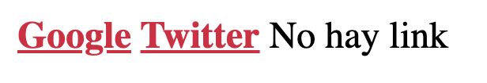

<div style="text-align: center;">
  
</div>

# Pseudoclases

Las pseudoclases son un tipo de selectores que nos permiten captar elementos en base a la información de estado de los mismos. 

A través del caracter “:” podremos indicar el estado especial del elemento para seleccionarlo, por ejemplo, si indicamos a:hover estaremos aplicando ciertas reglas siempre y cuando el usuario esté haciendo hover sobre el anchor.

En pseudoclases veremos todas las compatibles actualmente con webs en producción, habiendo muchas más que no forman parte de los estándares contempladas en la documentación oficial:

[Pseudo-classes - CSS | MDN](https://developer.mozilla.org/es/docs/Web/CSS/Pseudo-classes)

**Pseudoclases:active:** La pseudoclase :active nos permite recuperar un elemento que está siendo activado por el usuario (normalmente, durante el click de un ratón hasta soltarlo). Esta pseudoclase se utiliza mucho en los elementos anchor y button.

```html
<!DOCTYPE html>
<html lang="en">
  <head>
    <meta charset="UTF-8" />
    <meta http-equiv="X-UA-Compatible" content="IE=edge" />
    <meta name="viewport" content="width=device-width, initial-scale=1.0" />
    <link rel="stylesheet" href="style.css" />
    <title>Pseudoclases</title>
  </head>
  <body>
    <main>
      <button>Haz click aquí</button>
    </main>
  </body>
</html>
```

```css
button:active {
  color: orange;
  font-weight: bold;
}
```


**Pseudoclases:any-link:**  La pseudoclase :any-link nos permite recuperar un elemento link que haya sido visitado o no, siempre y cuando tenga un valor en su href.

```html
<!DOCTYPE html>
<html lang="en">
  <head>
    <meta charset="UTF-8" />
    <meta http-equiv="X-UA-Compatible" content="IE=edge" />
    <meta name="viewport" content="width=device-width, initial-scale=1.0" />
    <link rel="stylesheet" href="style.css" />
    <title>Pseudoclases</title>
  </head>
  <body>
    <main>
      <a href="www.google.com">Google</a>
      <a href="www.twitter.com">Twitter</a>
      <a>No hay link</a>
    </main>
  </body>
</html>
```

```css
a:any-link {
  color: crimson;
  font-weight: bold;
}
```



**Pseudoclases:checked:**  La pseudoclase :checked nos permite recuperar cualquier elemento checkbox, radio u option que esté marcado o con el atributo checked activo.

```html
<!DOCTYPE html>
<html lang="en">
  <head>
    <meta charset="UTF-8" />
    <meta http-equiv="X-UA-Compatible" content="IE=edge" />
    <meta name="viewport" content="width=device-width, initial-scale=1.0" />
    <link rel="stylesheet" href="style.css" />
    <title>Pseudoclases</title>
  </head>
  <body>
    <main>
      <div>
        <input type="radio" name="my-input" id="yes" />
        <label for="yes">Yes</label>

        <input type="radio" name="my-input" id="no" checked />
        <label for="no">No</label>
      </div>
    </main>
  </body>
</html>
```

```css
input:checked + label {
  color: crimson;
}
```


**Pseudoclases:default :** La pseudoclase :default nos permite recuperar cualquier elemento que esté en su estado predeterminado dentro de un formulario. Esta pseudoclase se utiliza mucho en elementos button, checkbox, radio y option que tengan una opción marcada desde el principio.

```html
<!DOCTYPE html>
<html lang="en">
  <head>
    <meta charset="UTF-8" />
    <meta http-equiv="X-UA-Compatible" content="IE=edge" />
    <meta name="viewport" content="width=device-width, initial-scale=1.0" />
    <link rel="stylesheet" href="style.css" />
    <title>Pseudoclases</title>
  </head>
  <body>
    <main>
      <input type="radio" name="hero" id="spiderman" checked />
      <label for="spiderman">Spiderman</label>

      <input type="radio" name="hero" id="ironman" />
      <label for="ironman">Iron Man</label>

      <input type="radio" name="hero" id="daredevil" />
      <label for="daredevil">Daredevil</label>

      <input type="radio" name="hero" id="hulk" />
      <label for="hulk">Hulk</label>
    </main>
  </body>
</html>
```

```css
input:default + label {
  color: green;
}
```


**Pseudoclases:disabled:** La pseudoclase :disabled nos permite recuperar un elemento deshabilitado o con el atributo disabled activo.

```html
<!DOCTYPE html>
<html lang="en">
  <head>
    <meta charset="UTF-8" />
    <meta http-equiv="X-UA-Compatible" content="IE=edge" />
    <meta name="viewport" content="width=device-width, initial-scale=1.0" />
    <link rel="stylesheet" href="style.css" />
    <title>Pseudoclases</title>
  </head>
  <body>
    <main>
      <button>Activado</button>
      <button disabled>Desactivado</button>
    </main>
  </body>
</html>
```

```css
button:disabled {
  color: red;
}
```


**Pseudoclases:enabled:**  La pseudoclase :enabled nos permite recuperar cualquier elemento habilitado en el documento, diferenciando asi a los deshabilitados.

```html
<!DOCTYPE html>
<html lang="en">
  <head>
    <meta charset="UTF-8" />
    <meta http-equiv="X-UA-Compatible" content="IE=edge" />
    <meta name="viewport" content="width=device-width, initial-scale=1.0" />
    <link rel="stylesheet" href="style.css" />
    <title>Pseudoclases</title>
  </head>
  <body>
    <main>
      <button>Activado</button>
      <button disabled>Desactivado</button>
    </main>
  </body>
</html>
```

```css
button:disabled {
  color: red;
}

button:enabled {
  color: green;
}
```


**Pseudoclases:first-child:** La pseudoclase :first-child nos devuelve el primer elemento de un grupo de elementos hermanos con el mismo padre.

```html
<!DOCTYPE html>
<html lang="en">
  <head>
    <meta charset="UTF-8" />
    <meta http-equiv="X-UA-Compatible" content="IE=edge" />
    <meta name="viewport" content="width=device-width, initial-scale=1.0" />
    <link rel="stylesheet" href="style.css" />
    <title>Pseudoclases</title>
  </head>
  <body>
    <main>
      <ul>
        <li>Primero</li>
        <li>Segundo</li>
        <li>Tercero</li>
      </ul>
    </main>
  </body>
</html>
```

```css
li:first-child {
  color: crimson;
}
```


**Pseudoclases:focus:**  La pseudoclase :focus representa los elementos que han activado su foco al usuario interactuar con ellos o al haber entrado en uno de los elementos. Normalmente se le aplican a los elementos input.

```html
<!DOCTYPE html>
<html lang="en">
  <head>
    <meta charset="UTF-8" />
    <meta http-equiv="X-UA-Compatible" content="IE=edge" />
    <meta name="viewport" content="width=device-width, initial-scale=1.0" />
    <link rel="stylesheet" href="style.css" />
    <title>Pseudoclases</title>
  </head>
  <body>
    <main>
      <input type="text" name="username" placeholder="username" />
      <input type="text" name="email" placeholder="email@email.com" />
    </main>
  </body>
</html>
```

```css
input:focus {
  background-color: burlywood;
}
```


**Pseudoclases:hover :**  La pseudoclase :hover nos permite recuperar un elemento que ha sido activado por el usuario durante el desplazamiento del cursor sobre él. No es necesario que el usuario active el elemento para que esta pseudoclase sea activada.

```html
<!DOCTYPE html>
<html lang="en">
  <head>
    <meta charset="UTF-8" />
    <meta http-equiv="X-UA-Compatible" content="IE=edge" />
    <meta name="viewport" content="width=device-width, initial-scale=1.0" />
    <link rel="stylesheet" href="style.css" />
    <title>Pseudoclases</title>
  </head>
  <body>
    <main>
      <div></div>
    </main>
  </body>
</html>
```

```css
div {
  width: 100px;
  height: 100px;
  background-color: blueviolet;
}

div:hover {
  background-color: crimson;
}
```


**Pseudoclases:invalid :** La pseudoclase :invalid nos permitirá recuperar un elemento que haya tenido un error de campo a la hora de validarlo dentro de un formulario.

```html
<!DOCTYPE html>
<html lang="en">
  <head>
    <meta charset="UTF-8" />
    <meta http-equiv="X-UA-Compatible" content="IE=edge" />
    <meta name="viewport" content="width=device-width, initial-scale=1.0" />
    <link rel="stylesheet" href="style.css" />
    <title>Pseudoclases</title>
  </head>
  <body>
    <main>
      <form>
        <label for="name">Ingresa tu nombre:</label>
        <input type="text" id="name" />
        <label for="email">Introduzca una dirección de e-mail:</label>
        <input type="email" id="email" required />
      </form>
    </main>
  </body>
</html>
```

```css
input:invalid {
  background-color: crimson;
}
```


**Pseudoclases:last-child:**  La pseudoclase :last-child nos devuelve el último elemento de un grupo de elementos hermanos con el mismo padre.

```html
<!DOCTYPE html>
<html lang="en">
  <head>
    <meta charset="UTF-8" />
    <meta http-equiv="X-UA-Compatible" content="IE=edge" />
    <meta name="viewport" content="width=device-width, initial-scale=1.0" />
    <link rel="stylesheet" href="style.css" />
    <title>Pseudoclases</title>
  </head>
  <body>
    <main>
      <ul>
        <li>Primero</li>
        <li>Segundo</li>
        <li>Tercero</li>
      </ul>
    </main>
  </body>
</html>
```

```css
li:last-child {
  color: crimson;
}
```


**Pseudoclases:link:**  La pseudoclase :link nos devuelve los elementos que aún no han sido visitados y que incluyan el atributo href, normalmente utilizado con las etiquetas anchor, area o link.

```html
<!DOCTYPE html>
<html lang="en">
  <head>
    <meta charset="UTF-8" />
    <meta http-equiv="X-UA-Compatible" content="IE=edge" />
    <meta name="viewport" content="width=device-width, initial-scale=1.0" />
    <link rel="stylesheet" href="style.css" />
    <title>Pseudoclases</title>
  </head>
  <body>
    <main>
      <ul>
        <li>
          <a href="http://www.google.com">Visitado</a>
        </li>
        <li>
          <a href="http://www.google.com">Visitado</a>
        </li>
        <li>
          <a href="http://www.twitter.com">No Visitado</a>
        </li>
      </ul>
    </main>
  </body>
</html>
```

```css
a:link {
  color: red;
}
```


**Pseudoclases:not:**  La pseudoclase :not nos devuelve los elementos que no coincidan con el selector indicado, es decir, negamos los elementos. Se le conoce también como la pseudoclase de negación.

```html
<!DOCTYPE html>
<html lang="en">
  <head>
    <meta charset="UTF-8" />
    <meta http-equiv="X-UA-Compatible" content="IE=edge" />
    <meta name="viewport" content="width=device-width, initial-scale=1.0" />
    <link rel="stylesheet" href="style.css" />
    <title>Pseudoclases</title>
  </head>
  <body>
    <main>
      <h1>Soy un h1</h1>
      <h2>Soy un h2</h2>
      <h2>Soy otro h2</h2>
    </main>
  </body>
</html>
```

```css
main :not(h1) {
  color: orange;
}
```


**Pseudoclases:nth-child:**  La pseudoclase :nth-child nos devuelve los elementos que coincidan con la posición indicada entre una lista de elementos hermanos. Esta posición se le indicará mediante el número y una “n”.

```html
<!DOCTYPE html>
<html lang="en">
  <head>
    <meta charset="UTF-8" />
    <meta http-equiv="X-UA-Compatible" content="IE=edge" />
    <meta name="viewport" content="width=device-width, initial-scale=1.0" />
    <link rel="stylesheet" href="style.css" />
    <title>Pseudoclases</title>
  </head>
  <body>
    <main>
      <ul>
        <li>Primero</li>
        <li>Segundo</li>
        <li>Tercero</li>
        <li>Cuarto</li>
      </ul>
    </main>
  </body>
</html>
```

```css
li:nth-child(3n) {
  color: orange;
}
```


**Pseudoclases:nth-last-child:**  La pseudoclase :nth-last-child nos devuelve los elementos que coincidan con la posición indicada entre una lista de elementos hermanos contando desde el final hasta el comienzo. Esta posición se le indicará mediante el número y una “n”.

```html
<!DOCTYPE html>
<html lang="en">
  <head>
    <meta charset="UTF-8" />
    <meta http-equiv="X-UA-Compatible" content="IE=edge" />
    <meta name="viewport" content="width=device-width, initial-scale=1.0" />
    <link rel="stylesheet" href="style.css" />
    <title>Pseudoclases</title>
  </head>
  <body>
    <main>
      <ul>
        <li>Primero</li>
        <li>Segundo</li>
        <li>Tercero</li>
        <li>Cuarto</li>
      </ul>
    </main>
  </body>
</html>
```

```css
li:nth-last-child(3n) {
  color: orange;
}
```


**Pseudoclases:only-child:** La pseudo-clase :only-child nos devuelve los elementos que no tengan hermanos, es decir, encuentra a los hijos de los elementos que sean únicos sin formar parte de una lista de elementos paralelos.

```html
<!DOCTYPE html>
<html lang="en">
  <head>
    <meta charset="UTF-8" />
    <meta http-equiv="X-UA-Compatible" content="IE=edge" />
    <meta name="viewport" content="width=device-width, initial-scale=1.0" />
    <link rel="stylesheet" href="style.css" />
    <title>Pseudoclases</title>
  </head>
  <body>
    <main>
      <ul>
        <li>Primero</li>
        <li>Segundo</li>
        <li>Tercero</li>
        <li>Cuarto</li>
      </ul>
      <ul>
        <li>Esta lista solo tiene un elemento</li>
      </ul>
    </main>
  </body>
</html>
```

```css
ul :only-child {
  color: orange;
}
```


**Pseudoclases:read-only:**  La pseudo-clase :read-only nos devuelve los elementos que no son editables por el usuario, normalmente son aquellos inputs que incluyen el atributo “read-only” o etiquetas normales no editables.

```html
<!DOCTYPE html>
<html lang="en">
  <head>
    <meta charset="UTF-8" />
    <meta http-equiv="X-UA-Compatible" content="IE=edge" />
    <meta name="viewport" content="width=device-width, initial-scale=1.0" />
    <link rel="stylesheet" href="style.css" />
    <title>Pseudoclases</title>
  </head>
  <body>
    <main>
      <input type="text" value="Este campo es editable." />
      <input type="text" value="Este campo es solo de lectura" readonly />
    </main>
  </body>
</html>
```

```css
input:read-only {
  color: crimson;
}

input {
  width: 100%;
}
```


**Pseudoclases:read-write:**  La pseudo-clase :read-write nos devuelve los elementos editables por el usuario, normalmente suele aplicarse a inputs o etiquetas que incluyan el atributo “contenteditable”.

```html
<!DOCTYPE html>
<html lang="en">
  <head>
    <meta charset="UTF-8" />
    <meta http-equiv="X-UA-Compatible" content="IE=edge" />
    <meta name="viewport" content="width=device-width, initial-scale=1.0" />
    <link rel="stylesheet" href="style.css" />
    <title>Pseudoclases</title>
  </head>
  <body>
    <main>
      <input type="text" value="Este campo es editable." />
      <input type="text" value="Este campo es solo de lectura" readonly />
    </main>
  </body>
</html>
```

```css
input:read-write {
  color: crimson;
}

input {
  width: 100%;
}
```


**Pseudoclases:required:**  La pseudo-clase :required nos devuelve los elementos que contengan el atributo “required”, normalmente se aplica a las etiquetas “input”.

```html
<!DOCTYPE html>
<html lang="en">
  <head>
    <meta charset="UTF-8" />
    <meta http-equiv="X-UA-Compatible" content="IE=edge" />
    <meta name="viewport" content="width=device-width, initial-scale=1.0" />
    <link rel="stylesheet" href="style.css" />
    <title>Pseudoclases</title>
  </head>
  <body>
    <main>
      <form>
        <input type="text" placeholder="Username" required />
        <input type="text" placeholder="Position" />
        <input type="password" placeholder="Password" required />
      </form>
    </main>
  </body>
</html>
```

```css
input:required::placeholder {
  color: crimson;
}

input {
  width: 100%;
}
```


**Pseudoclases:root :**La pseudo-clase :root nos devuelve el elemento raíz del documento para tener una mayor especificidad incluso que la etiqueta html. Se utiliza mucho para declarar variables en nuestra hoja de estilos.

```css
:root{
	font-size: 16px;
	font-family: "Roboto", sans-serif;
	--primary: crimson;
	--secondary: red;
	--background: grey;
	--border-radius: 1.2rem;
}
```

**Resumen**
Las pseudoclases son selectores que nos permiten aplicar estilos a los elementos en base a su estado o posición en el documento. Utilizamos el carácter `:` seguido del nombre de la pseudoclase para indicar el estado especial del elemento. Por ejemplo, `:hover` aplica estilos a un elemento cuando el usuario pasa el cursor sobre él.
