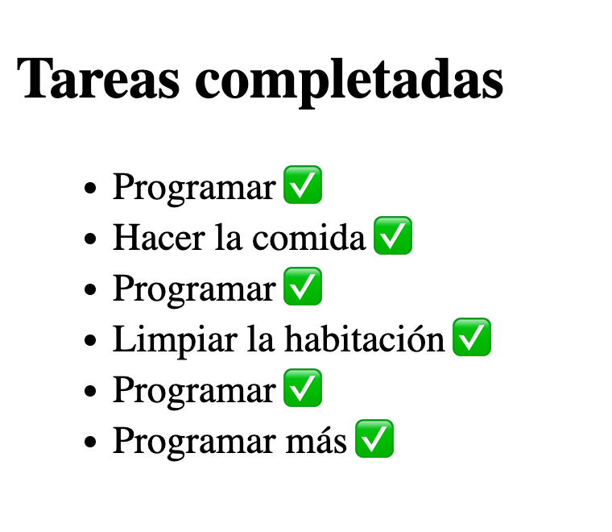
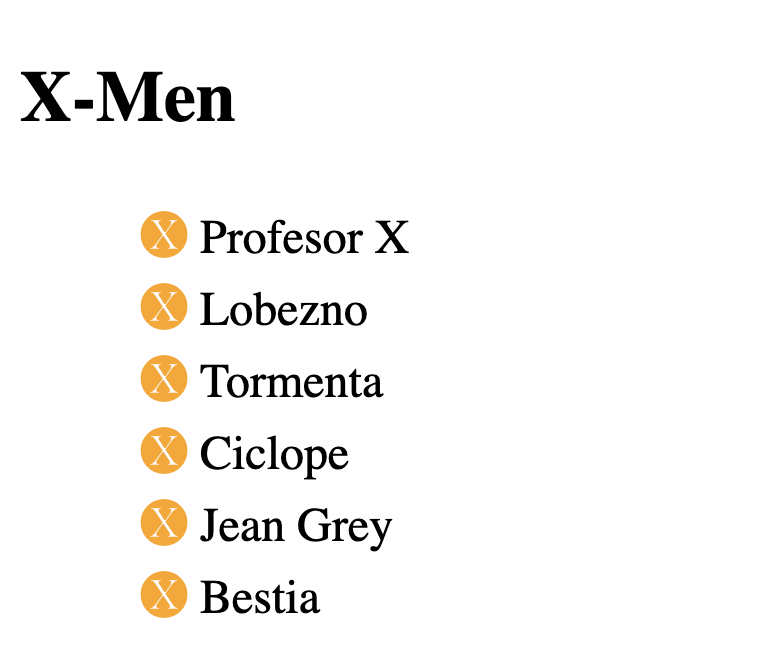
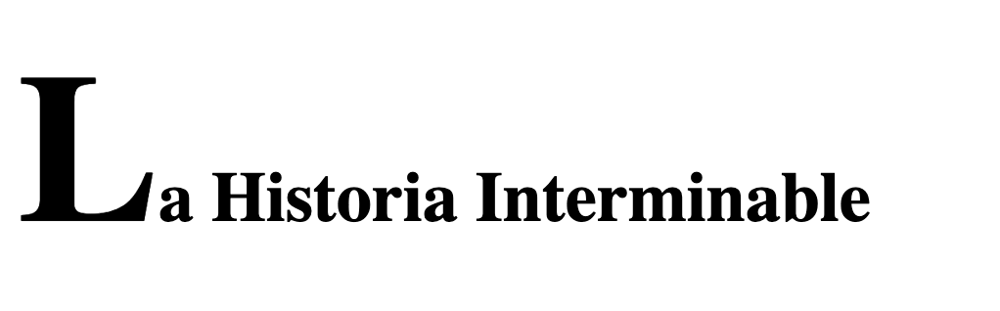
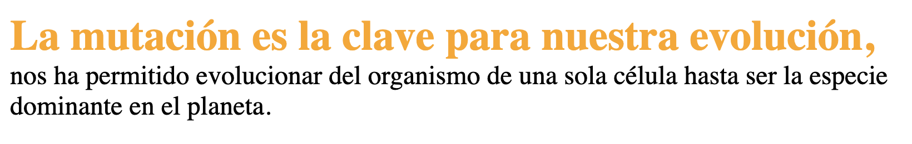
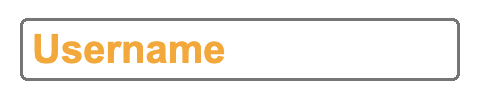
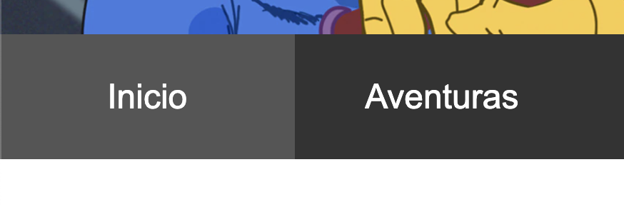
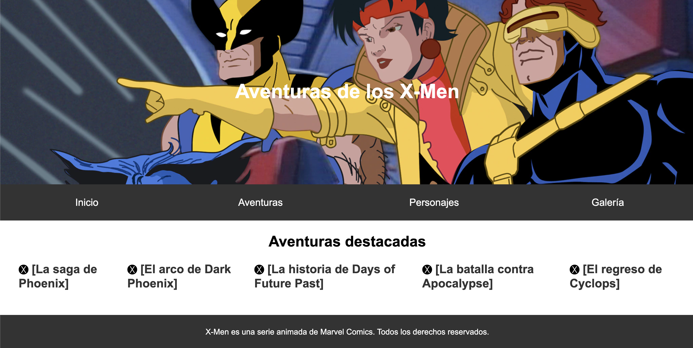

<div style="text-align: center;">
  
</div>

# Pseudoelementos

Los pseudoelementos nos permiten añadir estilos a una parte concreta del documento, creando elementos “extra” en ciertos lugares junto al elemento seleccionado. 

A través del caracter “::” indicaremos la parte concreta del documento en relación al elemento seleccionado. Por ejemplo, si seleccionamos div::after, nos estilará la parte posterior de los elementos div del documento.

En pseudoelementos veremos cómo añadir estilos a una parte específica de documento que reciben este nombre. La sintaxis de estos pseudoelementos se define con los caracteres “::” tras indicar el selector al que queremos implementarle este añadido.

[Pseudoelementos - CSS | MDN](https://developer.mozilla.org/es/docs/Web/CSS/Pseudo-elements)

**Pseudoelementos::after: ::after** crea un pseudoelemento, por defecto in-line, después del elemento a través de la propiedad “content”. Estos pseudoelementos serán contenidos por la caja del elemento.

```html
<!DOCTYPE html>
<html lang="en">
  <head>
    <meta charset="UTF-8" />
    <meta http-equiv="X-UA-Compatible" content="IE=edge" />
    <meta name="viewport" content="width=device-width, initial-scale=1.0" />
    <link rel="stylesheet" href="style.css" />
    <title>Pseudoelementos</title>
  </head>
  <body>
    <h2>Tareas completadas</h2>
    <ul>
      <li>Programar</li>
      <li>Hacer la comida</li>
      <li>Programar</li>
      <li>Limpiar la habitación</li>
      <li>Programar</li>
      <li>Programar más</li>
    </ul>
  </body>
</html>
```

```css
li::after {
  content: "✅";
  padding-left: 3px;
}
```



**Pseudoelementos::before : ::before** crea un pseudoelemento, por defecto in-line, antes del elemento a través de la propiedad “content”. Estos pseudoelementos serán contenidos por la caja del elemento.

```html
<!DOCTYPE html>
<html lang="en">
  <head>
    <meta charset="UTF-8" />
    <meta http-equiv="X-UA-Compatible" content="IE=edge" />
    <meta name="viewport" content="width=device-width, initial-scale=1.0" />
    <link rel="stylesheet" href="style.css" />
    <title>Pseudoelementos</title>
  </head>
  <body>
    <h2>X-Men</h2>
    <ul>
      <li>Profesor X</li>
      <li>Lobezno</li>
      <li>Tormenta</li>
      <li>Ciclope</li>
      <li>Jean Grey</li>
      <li>Bestia</li>
    </ul>
  </body>
</html>
```

```css
li::before {
  content: "🅧";
  padding-right: 4px;
  color: orange;
}

li {
  list-style-type: none;
}
```



**Pseudoelementos::first-letter: ::first-letter** aplica estilos a la primera letra de la primera linea del elemento siempre y cuando no sea precedida por una imagen, tabla o similares.

```html
<!DOCTYPE html>
<html lang="en">
  <head>
    <meta charset="UTF-8" />
    <meta http-equiv="X-UA-Compatible" content="IE=edge" />
    <meta name="viewport" content="width=device-width, initial-scale=1.0" />
    <link rel="stylesheet" href="style.css" />
    <title>Pseudoelementos</title>
  </head>
  <body>
    <h2>La Historia Interminable</h2>
  </body>
</html>
```

```css
h2::first-letter {
  font-size: 300%;
}
```



**Pseudoelementos::first-line : ::first-line** aplica estilos a la primera linea de un bloque de texto, sabiendo que puede depender de el ancho del bloque, el documento o la propia fuente del texto en cuestión.

```html
<!DOCTYPE html>
<html lang="en">
  <head>
    <meta charset="UTF-8" />
    <meta http-equiv="X-UA-Compatible" content="IE=edge" />
    <meta name="viewport" content="width=device-width, initial-scale=1.0" />
    <link rel="stylesheet" href="style.css" />
    <title>Pseudoelementos</title>
  </head>
  <body>
    <p>
      La mutación es la clave para nuestra evolución, nos ha permitido
      evolucionar del organismo de una sola célula hasta ser la especie
      dominante en el planeta.
    </p>
  </body>
</html>
```

```css
p::first-line {
  font-weight: bold;
  font-size: 1.6rem;
  color: orange;
}
```



**Pseudoelementos::placeholder: ::placeholder** nos permite modificar los estilos por defecto de los elementos provisionales de los elementos “input” o “textarea”.

```html
<!DOCTYPE html>
<html lang="en">
  <head>
    <meta charset="UTF-8" />
    <meta http-equiv="X-UA-Compatible" content="IE=edge" />
    <meta name="viewport" content="width=device-width, initial-scale=1.0" />
    <link rel="stylesheet" href="style.css" />
    <title>Pseudoelementos</title>
  </head>
  <body>
    <input type="text" placeholder="Username" />
  </body>
</html>
```

```css
input::placeholder {
  color: orange;
  font-weight: bold;
}
```



## **Reto coding**

---

Dado el siguiente HTML

```html
<!DOCTYPE html>
<html>
  <head>
    <title>Aventuras de los X-Men</title>
    <link rel="stylesheet" href="style.css" />
  </head>
  <body>
    <header>
      <h1>Aventuras de los X-Men</h1>
    </header>
    <nav>
      <ul>
        <li><a href="#">Inicio</a></li>
        <li><a href="#">Aventuras</a></li>
        <li><a href="#">Personajes</a></li>
        <li><a href="#">Galería</a></li>
      </ul>
    </nav>
    <main>
      <section>
        <h2>Aventuras destacadas</h2>
        <ul>
          <li><a href="#">La saga de Phoenix</a></li>
          <li><a href="#">El arco de Dark Phoenix</a></li>
          <li><a href="#">La historia de Days of Future Past</a></li>
          <li><a href="#">La batalla contra Apocalypse</a></li>
          <li><a href="#">El regreso de Cyclops</a></li>
        </ul>
      </section>
    </main>
    <footer>
      <p>
        X-Men es una serie animada de Marvel Comics. Todos los derechos
        reservados.
      </p>
    </footer>
  </body>
</html>
```

Aplicar los siguientes estilos haciendo uso de pseudoclases y pseudoelementos:

- Los enlaces de la navegación deben tener el formato "[nombre de la sección]". Hacer uso de pseudoelementos para insertar los corchetes.
- Al pasar el cursor sobre los enlaces de navegación superior o hacer click sobre ellos, deben cambiar a un tono más claro de gris el fondo.
    
    
    
- Al hacer click en los enlaces, deben cambiar a morado.
- Al darle foco a los enlaces (por ejemplo, con la tecla TAB), deben cambiar a morado y mostrar un borde morado alrededor de ellos.
- Al pasar por encima, los enlaces tienen que volverse rojos.
- Los elementos de aventuras en la lista tienen que sustituir el punto por el emoji "🅧" con un padding-left de 5 pixeles.



Este es el documento CSS base:

```css
* {
  box-sizing: border-box;
  margin: 0;
  padding: 0;
}

body {
  font-family: Arial, sans-serif;
}

header {
  background-image: url(https://lumiere-a.akamaihd.net/v1/images/pp_xmen1992_herobanner_21369_2ead90c7.jpeg?region=0,0,2048,878);
  background-size: cover;
  height: 300px;
  display: flex;
  align-items: center;
  justify-content: center;
}

header h1 {
  color: white;
  text-align: center;
  font-size: 2em;
}

nav {
  background-color: #333;
}

nav ul {
  display: flex;
  list-style: none;
}

nav li {
  flex: 1;
  text-align: center;
}

nav a {
  display: block;
  padding: 20px 0;
  color: white;
  text-decoration: none;
}

/*HOVER Y FOCUS AL NAV */

main {
  padding: 20px;
}

section {
  margin-bottom: 20px;
}

section h2 {
  text-align: center;
  margin-bottom: 20px;
}

section ul {
  display: flex;
  justify-content: space-around;
}

section li {
  margin: 0 10px;
  list-style-type: none;
}

/* SUSITUIR EL PUNTO DE LA LISTA POR LA X */

section a {
  color: #333;
  text-decoration: none;
  font-weight: bold;
  font-size: 1.2em;
}

/* AÑADIR CORCHETES A LOS ENLACES */

/* AÑADIR HOVER A LOS ENLACES */

/* AÑADIR FOCUS A LOS ENLACES */

footer {
  background-color: #333;
  color: white;
  padding: 20px;
  text-align: center;
}

footer p {
  margin: 0;
  font-size: 0.8em;
}
```

**Solución Reto Coding**

**Enlaces de navegación con corchetes:** Utilizamos los pseudoelementos `::before` y `::after` para añadir corchetes alrededor del texto del enlace.

```css
nav a::before {
  content: "[";
  position: absolute;
  left: 0;
}

nav a::after {
  content: "]";
  position: absolute;
  right: 0;
}
```

**Hover y focus en enlaces de navegación:** Aplicamos estilos `hover` y `focus` para cambiar el fondo a un tono más claro de gris y el borde a un color gris claro.

```css
nav a:hover, nav a:focus {
  background-color: #444;
  color: lightgray;
  border: 1px solid lightgray;
}
```

**Active en enlaces de navegación:** Cambiamos el color de fondo a morado cuando se hace clic en el enlace.

```css
cssCopiar código
nav a:active {
  background-color: purple;
  color: white;
}

```

**Sustituir el punto de la lista por un emoji:** Utilizamos el pseudoelemento `::before` para añadir el emoji "🅧" antes del contenido de cada `li`.

```css
section li::before {
  content: "🅧";
  position: absolute;
  left: -25px;
  padding-left: 5px;
}
```

**Hover en enlaces de aventuras:** Cambiamos el color del enlace a rojo cuando el usuario pasa el cursor sobre él.

```css
section a:hover {
  color: red;
}
```

**Focus en enlaces de aventuras:** Cambiamos el color del enlace a morado y añadimos un borde morado cuando el enlace recibe el foco.

```css
section a:focus {
  color: purple;
  border: 1px solid purple;
}
```

```css
* {
  box-sizing: border-box;
  margin: 0;
  padding: 0;
}

body {
  font-family: Arial, sans-serif;
}

header {
  background-image: url(https://lumiere-a.akamaihd.net/v1/images/pp_xmen1992_herobanner_21369_2ead90c7.jpeg?region=0,0,2048,878);
  background-size: cover;
  height: 300px;
  display: flex;
  align-items: center;
  justify-content: center;
}

header h1 {
  color: white;
  text-align: center;
  font-size: 2em;
}

nav {
  background-color: #333;
}

nav ul {
  display: flex;
  list-style: none;
}

nav li {
  flex: 1;
  text-align: center;
}

nav a {
  display: block;
  padding: 20px 0;
  color: white;
  text-decoration: none;
  position: relative;
}

/* AÑADIR CORCHETES A LOS ENLACES */
nav a::before {
  content: "[";
  position: absolute;
  left: 0;
}

nav a::after {
  content: "]";
  position: absolute;
  right: 0;
}

/* HOVER Y FOCUS AL NAV */
nav a:hover,
nav a:focus {
  background-color: #444;
  color: lightgray;
  border: 1px solid lightgray;
}

nav a:active {
  background-color: purple;
  color: white;
}

main {
  padding: 20px;
}

section {
  margin-bottom: 20px;
}

section h2 {
  text-align: center;
  margin-bottom: 20px;
}

section ul {
  display: flex;
  justify-content: space-around;
}

section li {
  margin: 0 10px;
  list-style-type: none;
  position: relative;
}

/* SUSTITUIR EL PUNTO DE LA LISTA POR LA X */
section li::before {
  content: "🅧";
  position: absolute;
  left: -25px;
  padding-left: 5px;
}

section a {
  color: #333;
  text-decoration: none;
  font-weight: bold;
  font-size: 1.2em;
}

/* AÑADIR HOVER A LOS ENLACES DE LAS AVENTURAS */
section a:hover {
  color: red;
}

/* AÑADIR FOCUS A LOS ENLACES DE LAS AVENTURAS */
section a:focus {
  color: purple;
  border: 1px solid purple;
}

footer {
  background-color: #333;
  color: white;
  padding: 20px;
  text-align: center;
}

footer p {
  margin: 0;
  font-size: 0.8em;
}
```

## Contenido asociado
---
- [Video: Pseudos](https://vimeo.com/751191269/874e4071a3)
