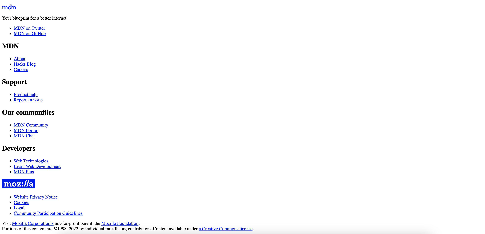
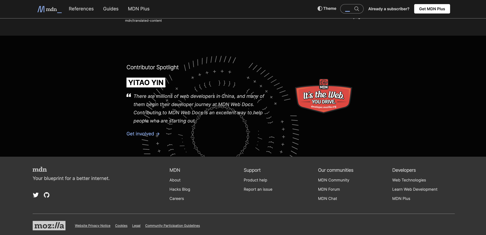

  

# ¿Qué es CSS?

CSS, que significa **Cascading Style Sheets** (Hojas de Estilo en Cascada), no es un lenguaje de programación como JavaScript, pero es crucial para el desarrollo web. CSS se utiliza para definir los estilos de una aplicación web y es un lenguaje basado en reglas. A lo largo de los últimos 28 años, CSS ha evolucionado hasta su versión actual, **CSS3**, añadiendo nuevos métodos y reglas mientras mantiene su función original.

## ¿Qué significa "Hojas de estilo en cascada"?

---

Las "Hojas de Estilo en Cascada" nos indican cómo se aplican los estilos. El término "en cascada" se refiere a la forma en que el código CSS se genera, lee y procesa en el navegador, de arriba hacia abajo. Esto significa que las reglas definidas más abajo en el archivo CSS pueden sobrescribir las definidas anteriormente, dependiendo de su especificidad.

## Ejemplo visual del efecto de CSS3

---

Para entender mejor el impacto de CSS3, vamos a ver un ejemplo visual. A continuación, se muestra una aplicación web, como MDN, en su versión "vanilla" (solo HTML) y con CSS aplicado.

**Versión Vanilla (Solo HTML):**

**Versión con CSS Aplicado:**

¡Mucho mejor, verdad? CSS transforma una página HTML básica en una interfaz atractiva y profesional.

## Inspección de elementos en navegadores

---

Dentro de cualquier aplicación web, podemos inspeccionar o analizar (y manipular temporalmente) los elementos para ver los estilos y reglas aplicadas en cada una de las secciones. Esto es útil para aprender y entender cómo funcionan los estilos en una página web.

**Ejemplo de inspección de elementos:**

## Atajos para abrir el Inspector de Elementos

---

Puedes abrir el inspector de elementos en tu navegador usando los siguientes atajos:

- **Control + Shift + J** en Windows
- **⌘ + Option + I** en Mac
- **F12** en Windows y Mac

Estos atajos abrirán las herramientas de desarrollo de tu navegador, donde puedes inspeccionar y modificar temporalmente el HTML y CSS de cualquier página web.

**Resumen**

Aprender CSS es esencial para el desarrollo web, ya que permite dar estilo y formato a las páginas web, haciendo que sean más atractivas y fáciles de usar. Con CSS3, puedes aprovechar nuevas características y métodos para mejorar aún más tus proyectos web. Utiliza el inspector de elementos en tu navegador para ver y aprender cómo otros desarrolladores han estilizado sus páginas y para experimentar con tus propios estilos en tiempo real.