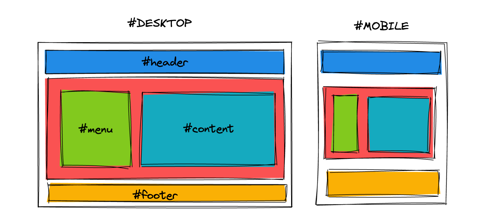

<div style="text-align: center;">
  
</div>

# Responsive & Adaptative

El primero de ellos es la diferencia entre **diseño responsivo**
 y **diseño adaptativo**. Como se puede ver en la imagen a continuación, un diseño **responsive** responde en todo momento a las dimensiones del dispositivo, mientras que un diseño adaptable es aquel que se adapta, pero no necesariamente responde en todo momento.


Por otro lado, para trabajar correctamente en diseños **responsive** hay que tener en cuenta que debemos trabajar con unidades relativas e intentar evitar las unidades fijas o estáticas, las cuales no responden a la adaptación de nuestros diseños flexibles.


Otra forma interesante de trabajar esa respuesta de los diseños **responsive** es utilizar propiedades como **min-width** o **max-width**, donde definimos tamaños mínimos o máximos, para que los elementos de nuestra página puedan ampliar o reducirse según sea necesario dependiendo de la pantalla del dispositivo utilizado.

Con estas propiedades podemos crear diseños que aprovechen al máximo toda la pantalla de dispositivos pequeños (*como móviles o tablets*), mientras que establecemos unos máximos en pantallas de dispositivos grandes, para crear unos espacios visuales que hacen que el diseño sea más agradable.


Otro concepto, que a la misma vez es una característica muy atractiva en nuestros diseños responsive es la de mantener el flujo de los elementos cuando cambian de tamaño y evitar que estos se solapen unos con otros.

Si estamos habituados a trabajar en diseños más estáticos que no están preparados para móviles, suele ser duro hacer ese cambio. Sin embargo, una vez lo conseguimos, todo resulta mucho más fácil y conseguiremos transmitir una buena respuesta y fluidez visual.


Esto último va muy de la mano del sistema habitual de recolocación de elementos que se suele seguir en los diseños **Responsive Design**. Como se puede ver en la siguiente imagen, en un diseño responsive se utilizan ciertos «puntos de control».

Por ejemplo, se suele pensar que en una resolución de escritorio queremos mostrar la información dentro de una cuadrícula (*grid*) de 4 ó 5 celdas de ancho, mientras que en la versión de tablet será sólo de 3 celdas de ancho (*el resto se desplazará a la siguiente fila*) y en móviles será una sola celda de ancho, mostrándose el resto de celdas haciendo scroll hacia abajo:


Esta forma de trabajar nos proporciona múltiples ventajas:

- Es mucho más sencillo mostrar la misma información desde diseños de pantalla grande.
- Ayuda a evitar la mala práctica de ocultar bloques de información en dispositivos móviles.
- Incentiva a diseñar siguiendo buenas prácticas para facilitar la creación responsive.

## **Estrategias de diseño**

---

Por último, es aconsejable decidirse por una estrategia de diseño antes de comenzar. Aunque existen otras estrategias, las dos vertientes principales más populares son las siguientes.

**Mobile first -** Primero nos enfocamos en dispositivos móviles y luego pensamos en otros.

**Desktop first -** Primero nos enfocamos en dispositivos de escritorio, y luego pensamos en otros.

## **Bases del Responsive Design**

---

Hay ciertos conceptos que hay que tener claros antes de comenzar con el **Responsive Design**. En esta sección vamos a ver como llevarlos a la práctica con código.

El primer paso para crear un diseño que se adapte correctamente, es comenzar a familiarizarse con un tipo de unidades relativas: **los porcentajes**. Recordemos que los porcentajes son relativos al contenedor padre, por lo que si especificamos un porcentaje a un elemento, el navegador va a tomar dicho porcentaje del contenedor.

Podemos comenzar usando porcentajes con las propiedades **width**
 en un ejemplo sencillo. Si establecemos por un lado un ancho de **100%**
 a los elementos **azules**, **rojos** y **amarillos**, y por otro lado al elemento **verde** un **30%** y al turquesa un **70%** podemos tener un diseño responsive. 



```html
<div id="header"></div>
<div id="page">
  <div id="menu"></div>
  <div id="content"></div>
</div>
<div id="footer"></div>
```

Estamos utilizando **id** en este ejemplo, aunque habíamos comentado que lo ideal quizás sería utilizar clases.

```css
div {
  /* Ponemos un alto mínimo, por defecto es 0 */
  min-height: 200px;
  /* Dibujamos un borde para ver límites */
  border: 2px solid black;
}

#header,
#page,
#footer {
  background: grey;
}

#menu,
#content {
  /* Necesario para que los elementos estén en horizontal */
  display: inline-block;
}

#menu {
  background: blue;
  width: 30%;
}

#content {
  background: lightgrey;
  width: 70%;
}
```

Sin embargo, utilizar porcentajes no nos garantiza un diseño adaptativo de calidad, hay que comprender otros detalles. El primer problema que encontraremos será que si sumamos el tamaño de los elementos (*70% + 30%*) junto a los bordes (*2px por cada lado*), la suma es superior al 100% del contenedor padre, por lo que **no cabe en su interior** y el segundo elemento se desplaza a la zona inferior, descuadrando todo el diseño. Lo mismo puede ocurrir si intentamos añadir **margin** o **padding**. Esto es algo muy habitual en CSS. Y frustrante al principio.

Hay varias formas de solucionar esto:

- Eliminar los bordes y reducir los porcentajes hasta que quepan en el 100% del padre.
- Usar **box-sizing: border-box** para cambiar el modo en el que se gestionan los tamaños.
- Utilizar un sistema moderno como Flexbox o Grid (*recomendado*).

Una forma simple de solucionar el problema en el ejemplo anterior, es hacer los siguientes cambios en el CSS del documento.

```css
/* Eliminamos este bloque */
#menu, #content {
  display: inline-block;
}

/* Añadimos este */
#page {
  display: flex;
}
```

De esta forma, conseguimos que nuestro diseño se adapte de forma adecuada a la página, sin necesidad de tener que ajustar los márgenes, rellenos, bordes o tamaño de los contenidos.

## **min-width y max-width**

---

Si buscamos un cierto grado de control aún mayor, podríamos recurrir a las propiedades **max-width** y **min-width** , con las que podemos indicar el ancho de un elemento como máximo y el ancho de un elemento como mínimo respectivamente, consiguiendo así garantizar cierto control del diseño.

```css
.picture {
  min-height: 200px;    /* Por defecto, height es 0 */
  background: grey;     /* Simplemente, para verlo visualmente */

  max-width: 1024px;
  min-width: 800px;
}
```

En este caso, el elemento tiene un tamaño máximo de 1024 píxeles, y un tamaño mínimo de 800 píxeles, por lo que si ajustamos el ancho de la ventana del navegador, dicho elemento iría variando en un rango de 800 a 1024 píxeles, nunca haciéndose más pequeño de 800 o más grande de 1024.

Con las imágenes, videos y contenidos multimedia, se puede hacer lo mismo, consiguiendo así que las imágenes se escalen y adapten al formato especificado o incluso al tamaño de pantalla de los diferentes dispositivos utilizados.

```css
img,
video,
object,
embed {
    max-width: 100%;
    height: auto;
}
```

## V**iewport**

---

En muchos casos puede que oigas hablar del **viewport** del navegador. Esa palabra hace referencia a la **región visible del navegador**, o sea, la parte de la página que está visualizándose actualmente en el navegador. Los usuarios podemos redimensionar la ventana del navegador para reducir el tamaño del viewport y simular que se trata de una pantalla y dispositivo más pequeño.

Si queremos editar ciertos comportamientos del viewport del navegador, podemos editar el documento HTML para especificar el siguiente campo meta, antes de la parte del **</head>**

```css
<meta name="viewport" content="initial-scale=1, width=device-width">
```

Con esta etiqueta **<meta>**, estamos estableciendo unos parámetros de comportamiento para el **viewport** del navegador. Veamos qué significan y cuales más existen.

| Propiedad | Valor | Significado |
| --- | --- | --- |
| width | device-width |  Indica un ancho para el viewport. |
| height | device-height | Indica un alto para el viewport. |
| initial-scale | 1 | Escala inicial con la que se visualiza la página web. |
| minimum-scale | 0.1 | Escala mínima a la que se puede reducir al hacer zoom. |
| maximum-scale | 10 | Escala máxima a la que se puede aumentar al hacer zoom. |
| user-scalable | no/fixed | yes/zoom | Posibilidad de hacer zoom en la página web. |

Las propiedades **initial-scale** , **minimum-scale** y **maximum-scale** permiten valores desde el **0.1** al **10** , aunque ciertos valores se traducen automáticamente a ciertos números determinados:

- yes = 1
- no = 0.1
- device-width = 10
- device-height = 10

Por otra parte, **user-scalable** permite definir si es posible que el usuario pueda «pellizcar» la pantalla para ampliar o reducir el zoom.