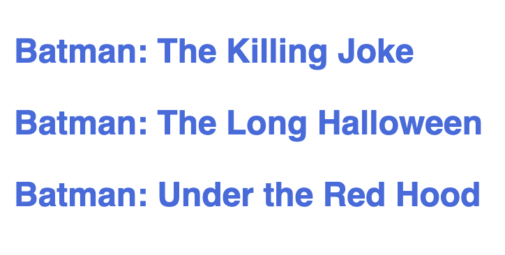
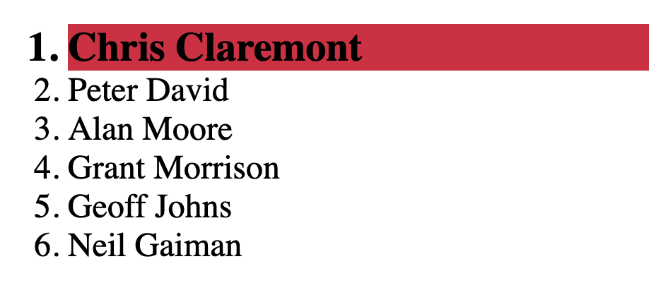
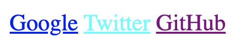

<div style="text-align: center;">
  
</div>

# Selectores

En CSS, un selector define a qué elemento o elementos se aplicarán las reglas de estilo. Vamos a explorar desde los selectores más básicos hasta los avanzados y ver cómo utilizarlos en ejemplos prácticos.

## **Selectores básicos**

---

En selectores básicos contemplaremos los métodos para definir a qué elementos aplicarles reglas de CSS en base a su **etiqueta,** atributo **id** o **clase**.

**Selector de tipo o etiqueta:** Este selector definirá **todos** los elementos coincidentes en base a un nombre de **etiqueta**, a los cuales se le aplicarán las reglas correspondientes.

```html
<!DOCTYPE html>
<html lang="en">
  <head>
    <meta charset="UTF-8" />
    <meta http-equiv="X-UA-Compatible" content="IE=edge" />
    <meta name="viewport" content="width=device-width, initial-scale=1.0" />
    <link rel="stylesheet" href="style.css" />
    <title>Document</title>
  </head>
  <body>
    <main>
      <p>Batman: The Killing Joke</p>
      <p>Batman: The Long Halloween</p>
      <p>Batman: Under the Red Hood</p>
    </main>
  </body>
</html>
```

```css
p {
  font-family: "Segoe UI", sans-serif;
  font-weight: 800;
  color: royalblue;
}
```



En este ejemplo le estamos aplicando una serie de reglas a **todos** los elementos <p/> del documento HTML. 

**Selector de clase**: Este selector define todos los elementos que contengan el valor coincidente en su atributo **clase**. La sintaxis de este selector se compondrá con el carácter ‘**.’** más el nombre de la clase.

```html
<!DOCTYPE html>
<html lang="en">
  <head>
    <meta charset="UTF-8" />
    <meta http-equiv="X-UA-Compatible" content="IE=edge" />
    <meta name="viewport" content="width=device-width, initial-scale=1.0" />
    <link rel="stylesheet" href="style.css" />
    <title>Document</title>
  </head>
  <body>
    <main>
      <ul>
        <li class="highlight">Watchmen</li>
        <li class="highlight">The Sandman</li>
        <li>Bone</li>
        <li>Doom Patrol</li>
        <li>Mister Miracle</li>
        <li class="highlight">From Hell</li>
      </ul>
    </main>
  </body>
</html>
```

```css
.highlight {
  font-style: italic;
  color: crimson;
}
```


En este ejemplo le estamos aplicando una serie de reglas a todos los elementos que contengan la clase “highlight”.

**Selector de id:**  Este selector define un elemento que contenga el valor coincidente en su atributo **id**. A nivel semántico, en nuestro documento solo puede haber un solo elemento con un determinado **id**. La sintaxis de este selector se compondrá con el carácter ‘#’ más el nombre del id.

```html
<!DOCTYPE html>
<html lang="en">
  <head>
    <meta charset="UTF-8" />
    <meta http-equiv="X-UA-Compatible" content="IE=edge" />
    <meta name="viewport" content="width=device-width, initial-scale=1.0" />
    <link rel="stylesheet" href="style.css" />
    <title>Document</title>
  </head>
  <body>
    <main>
      <ol>
        <li id="best">Chris Claremont</li>
        <li>Peter David</li>
        <li>Alan Moore</li>
        <li>Grant Morrison</li>
        <li>Geoff Johns</li>
        <li>Neil Gaiman</li>
      </ol>
    </main>
  </body>
</html>
```

```css
#best {
  font-weight: bolder;
  font-size: 1.2rem;
  background-color: crimson;
}
```



En este ejemplo le estamos aplicando una serie de reglas al elemento que contiene el id “best”.

## **Selectores avanzados**

---

En selectores avanzados contemplaremos los métodos para definir a qué elementos aplicarles reglas de CSS en base a sus atributos o seleccionar todos los elementos del documento con restricciones opcionales.

**Selector universal:** Este selector nos permitirá definir todos los elementos del documento. La sintaxis de este selector se compondrá con el caracter “*”.  Opcionalmente, tras el caracter “*” podremos indicar el nombre de una etiqueta, una clase o un atributo para seleccionar todos los elementos coincidentes en un determinado rango.

El selector universal es muy utilizado para resetear los estilos por defecto de todas las etiquetas, ya que muchas de ellas tienen un box-sizing, padding o margin predeterminados.

```css
*{
	padding: 0;
	margin: 0;
	box-sizing: border-box;
 }
```

En este ejemplo le estamos aplicando una serie de reglas a todos los elementos del documento HTML.

**Selector de atributo:** Este selector nos permitirá definir todos los elementos del documento que coincidan con un atributo predeterminado. Este selector suele ir precedido del nombre de la etiqueta cuyo atributo denominaremos a través de los caracteres “[ ]” y su valor tras el caracter “=”.

```html
<!DOCTYPE html>
<html lang="en">
  <head>
    <meta charset="UTF-8" />
    <meta http-equiv="X-UA-Compatible" content="IE=edge" />
    <meta name="viewport" content="width=device-width, initial-scale=1.0" />
    <link rel="stylesheet" href="style.css" />
    <title>Document</title>
  </head>
  <body>
    <main>
      <a href="www.google.com">
Google</a>
      <a href="www.twitter.com">Twitter</a>
      <a href="www.github.com">GitHub</a>
    </main>
  </body>
</html>
```

```css
a[href="www.google.com"] {
  color: blue;
}

a[href="www.twitter.com"] {
  color: aqua;
}

a[href="www.github.com"] {
  color: purple;
}
```



En este ejemplo le estamos aplicando una regla diferente a los diferentes anchor’s especificando su atributo href y su distinto valor, pudiendo variar el color dependiendo del valor del atributo.

## **Reto Coding**

---

Dato el siguiente HTML

```html
<!DOCTYPE html>
<html lang="en">
  <head>
    <meta charset="UTF-8" />
    <meta http-equiv="X-UA-Compatible" content="IE=edge" />
    <meta name="viewport" content="width=device-width, initial-scale=1.0" />
    <link rel="stylesheet" href="style.css" />
    <title>Selectores</title>
  </head>
  <body>
    <main>
      <p>😸 Haz click aquí para ver más fotos de <a href="#">gatetes</a>.</p>
      

      <section>
        <h3>😻 Likes gatunos:</h3>
        <ul>
          <li class="like">Hierba gatuna</li>
          <li class="like">Punteros laser</li>
          <li class="like">Lasaña</li>
        </ul>
        <h3>😾 Top 3 dislikes gatunos:</h3>
        <ol>
          <li>Agua</li>
          <li class="thunder">Tormentas</li>
          <li>Otros gatos</li>
        </ol>
      </section>
    </main>
  </body>
</html>
```

Aplicar los siguientes estilos haciendo un uso correcto de selectores:

- Todos los elementos del documento tienen que tener un padding 0 y un margin 0.
- Todos los elementos del documento tienen que tener un font-family: "Segoe UI", Tahoma, Geneva, Verdana, sans-serif.
- El cuerpo del documento debe de tener un color de fondo “lightcyan”.
- La etiqueta main tiene que tener un padding-top y un padding-left de 1 rem y el color del texto “black”.
- Tanto el ul como el ol deben tener un padding-left de 2rem.
- Los elementos con la clase like deben de tener un color “green”.
- Los li de la ol deben de tener el color “crimson”.
- Particularmente, el elemento con la clase thunder debe de tener el color “purple”.
- El anchor tiene que tener un color “plum” y un font-style: italic.
- Los h3 deben de tener también el font-style: italic.
- La imagen debe de tener un border-radius de 1 rem.

**Solución Reto Coding**

1. **Selector Universal `*`**:
    - Se utiliza para aplicar un `padding` y `margin` de 0 a todos los elementos, eliminando así los márgenes y rellenos predeterminados.
2. **Selector de Tipo `body`**:
    - Aplica un `font-family` global y un `background-color` a todo el documento.
3. **Selector de Tipo `main`**:
    - Aplica un `padding-top` y `padding-left` de 1rem y un color de texto `black` a la etiqueta `<main>`.
4. **Selector de Tipo `ul, ol`**:
    - Aplica un `padding-left` de 2rem a todas las listas no ordenadas (`<ul>`) y ordenadas (`<ol>`).
5. **Selector de Clase `.like`**:
    - Aplica un color `green` a todos los elementos que tienen la clase `like`.
6. **Selector de Tipo con Restricción `ol li`**:
    - Aplica un color `crimson` a todos los elementos `<li>` dentro de una lista ordenada (`<ol>`).
7. **Selector de Clase Específico `.thunder`**:
    - Aplica un color `purple` al elemento con la clase `thunder`.
8. **Selector de Tipo `a`**:
    - Aplica un color `plum` y un `font-style` italic a todos los enlaces (`<a>`).
9. **Selector de Tipo `h3`**:
    - Aplica un `font-style` italic a todos los encabezados de nivel 3 (`<h3>`).
10. **Selector de Tipo `img`**:
    - Aplica un `border-radius` de 1rem a todas las imágenes (``).

Aquí está tu archivo `style.css`:

```css
/* Selector Universal */
* {
  padding: 0;
  margin: 0;
  box-sizing: border-box;
}

/* Fuente global */
body {
  font-family: "Segoe UI", Tahoma, Geneva, Verdana, sans-serif;
  background-color: lightcyan;
}

/* Estilo para main */
main {
  padding-top: 1rem;
  padding-left: 1rem;
  color: black;
}

/* Estilo para listas ul y ol */
ul, ol {
  padding-left: 2rem;
}

/* Estilo para elementos con la clase like */
.like {
  color: green;
}

/* Estilo para li dentro de ol */
ol li {
  color: crimson;
}

/* Estilo para elemento con la clase thunder */
.thunder {
  color: purple;
}

/* Estilo para enlaces */
a {
  color: plum;
  font-style: italic;
}

/* Estilo para h3 */
h3 {
  font-style: italic;
}

/* Estilo para imágenes */
img {
  border-radius: 1rem;
}
```

Abre el archivo `index.html` en tu navegador para ver los cambios aplicados por el archivo `style.css`. ¡Buen trabajo!

## Contenido asociado
---
- [Video: Selectores](https://vimeo.com/742645691/072b430765)
