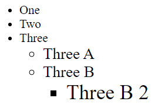
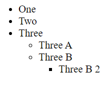

<div style="text-align: center;">
  
</div>

# Unidades

Antes de comenzar a utilizar propiedades que utilicen medidas, es conveniente conocer los tipos de unidades que pueden utilizarse. Existen varios tipos, por lo que vamos a desglosarlas en grupos y explicar cada una de ellas.

## **Unidades absolutas**

---

Serán aquellas definidas por sí solas, es decir, que su valor no depende de otro factor. Se utilizan sobre todo en contextos en los que las medidas no varían, pero no son muy adecuadas para webs, ya que no se adaptan a los diferentes tamaños de pantalla existentes, por lo que hoy en día, con la numerosa cantidad de tipos de pantallas y dispositivos existentes no serán muy útiles.

| Unidad | Significado | Medida aproximada |
| --- | --- | --- |
| in | Pulgadas | 1in = 25.4mm |
| cm | Centímetros | 1cm = 10mm |
| pc | Picas | 1pc = 4.23mm |
| mm | Milímetros | 1mm = 1mm |
| pt | Puntos | 1pt = 0.35mm |
| px | Píxels | 1px = 0.26mm |

```css
/* Ejemplo de in o pulgadas */
h1 { margin-bottom: 1in; }

/* Ejemplo de cm o centímetros. */
h2 { line-height: 2cm; }

/* Ejemplo de mm o milímetros */
h3 { letter-spacing: 14mm; }

/* Ejemplo de pt o puntos */
h4 { padding: 5pt }

/* Ejemplo de pc o picas */
h5 { font-size: 0.5pc }
```

**Unidades absolutas: Unidad px (píxel) -** Es una de las unidades más extendidas y recomendadas. Esto es así debido a su sencillez (fácil de entender y conocida).

```css
/* Ejemplo de px o píxeles */
h6 { font-size: 16px }
```

## **Unidades relativas**

---

Son mucho más habituales en una web que las unidades absolutas. La principal diferencia es que las relativas, como su nombre indica, dependerán de algún otro factor a la hora de mostrar medidas. Estos factores pueden ser la resolución, tamaño de letra… en definitiva son más usados debido a su versatilidad.

| Unidad | Descripción |
| --- | --- |
| em | Tamaño de letra del elemento padre, en el caso de propiedades tipográficas como https://developer.mozilla.org/es/docs/Web/CSS/font-size, y tamaño de la fuente del propio elemento en el caso de otras propiedades, como https://developer.mozilla.org/es/docs/Web/CSS/width |
| ex | 1ex será la mitad del tamaño por defecto de 16px = 8px o 0.5em |
| rem | el tamaño de letra del elemento raíz |
| % (porcentaje) | Se establecen en relación con otro valor. Por ejemplo, si lo estableces en un font-size, será un porcentaje del font-size del padre. |
| vw | 1% del ancho de la ventana gráfica. |
| vh | 1% de la altura de la ventana gráfica. |
| vmin | 1% de la dimensión más pequeña de la ventana gráfica. |
| vmax | 1% de la dimensión más grande de la ventana gráfica. |

**Unidades relativas: Unidad em -** Se utiliza para hacer referencia al **tamaño actual de la fuente** en ese elemento HTML. Su valor por defecto es 16px. Por lo tanto, 1em serán 16px por defecto, 2em = 32px, etc.

```html
<!DOCTYPE html>
<html lang="en">
<head>
    <meta charset="UTF-8">
    <meta http-equiv="X-UA-Compatible" content="IE=edge">
    <meta name="viewport" content="width=device-width, initial-scale=1.0">
    <link rel="stylesheet" href="styles.css" />
    <title>Document</title>
</head>
<body>
    <ul class="ems">
        <li>One</li>
        <li>Two</li>
        <li>Three
          <ul>
            <li>Three A</li>
            <li>Three B
              <ul>
                <li>Three B 2</li>
              </ul>
            </li>
          </ul>
        </li>
      </ul>
</body>
</html>
```

```css
html {
  font-size: 16px;
}

.ems li {
  font-size: 1.3em;
}
```



**Unidades relativas: Unidad ex -** Su definición es similar a la de em, pero en este caso 1ex = 0.5em = 8px por defecto. Esto supone que 1ex es la mitad del tamaño de la fuente establecida por el navegador del usuario.

**Unidades relativas: Unidades rem -** Este tipo de unidad toma la idea de lo que es un em, pero permite además establecer un tamaño por defecto personalizado.

```css
:root {
  font-size: 10px;    /* Tamaño base */
}

h1 {
  font-size: 2rem;    /* El doble del tamaño base: 20px */
}
```

Como vemos en el ejemplo, con :root establecemos el tamaño por defecto de la letra y haremos el código en base a esa medida. Esto da la ventaja de poder cambiar todos los tamaños de texto de nuestra web rápidamente y tener unos tamaños a escala.

```html
<ul class="rems">
        <li>One</li>
        <li>Two</li>
        <li>Three
          <ul>
            <li>Three A</li>
            <li>Three B
              <ul>
                <li>Three B 2</li>
              </ul>
            </li>
          </ul>
        </li>
</ul>
```

```css
html {
  font-size: 16px;
}

.rems li {
  font-size: 1.3rem;
}
```



**Unidades relativas: Porcentajes -** Un porcentaje está formado por un valor numérico seguido del símbolo **%** y siempre está referenciado a otra medida. Los porcentajes se pueden utilizar por ejemplo para establecer el valor del tamaño de letra de los elementos.

```css
body { font-size: 1em; }
h1 { font-size: 200%; }
h2 { font-size: 150%; }
```

Esto indicará que los <h1> tendrán una medida de 2em y los <h2> de 1.5em.

Las que nos quedan por explicar (vw, vh, vmin y vmax) se consideran unidades flexibles o de viewport, pero seguirán siendo relativas. Estad unidades dependen de la “región visible de la web en el navegador”, o lo que es lo mismo, del viewport. Se utilizan los porcentajes a la hora de hablar de este tipo de unidades.

**VW** significa viewport width, y, por ejemplo, si definimos 20vw estamos haciendo referencia a que queremos que se ocupe un 20% del ancho total del navegador. 1/100 de la anchura del viewport.

**VH** significa viewport height y hace referencia a la altura total del viewport. 20vh hará referencia a que queremos que el elemento ocupe el 20% del alto del navegador. 1/100 de la altura del viewport.

Por último existen las unidades **vmin** y **vmax**, que serán viewport minimum y maximum. Estas medidas harán referencia al valor más grande/pequeño entre el tamaño del ancho y el tamaño del alto del viewport del navegador. Estas medidas pueden ser útiles a la hora de diseñar elementos adaptables.

## **Reto Coding**

---

Dado el siguiente HTML

```html
<!DOCTYPE html>
<html>
  <head>
    <meta charset="utf-8" />
    <title>NASA</title>
    <link rel="stylesheet" href="style.css" />
  </head>
  <body>
    <header>
      <h1>NASA</h1>
      
    </header>
    <main>
      <h2>Welcome to our website about NASA!</h2>
      <p>
        NASA (National Aeronautics and Space Administration) is a U.S.
        government agency responsible for the nation's civilian space program
        and for aeronautics and space research. Since its establishment in 1958,
        NASA has made many significant contributions to our understanding of the
        universe and our place in it.
      </p>
      <h3>Notable NASA Missions</h3>
      <ul>
        <li>Apollo 11: First manned mission to land on the moon (1969)</li>
        <li>Space Shuttle: First reusable spacecraft (1981-2011)</li>
        <li>
          International Space Station: Collaborative space station with multiple
          countries (1998-present)
        </li>
        <li>Mars Curiosity Rover: Exploration of Mars (2012-present)</li>
      </ul>
      <h3>Recent NASA Science Discoveries</h3>
      <ul>
        <li>Evidence of water on Mars (2015)</li>
        <li>Detection of gravitational waves (2016)</li>
        <li>Discovery of seven Earth-sized exoplanets (2017)</li>
        <li>Discovery of a new type of aurora on Jupiter (2019)</li>
      </ul>
      <h3>NASA Technology</h3>
      <p>
        NASA's work in science and exploration has also led to many
        technological advancements that have had a significant impact on
        everyday life. Some examples include:
      </p>
      <ul>
        <li>Memory foam</li>
        <li>Scratch-resistant eyeglasses</li>
        <li>Water filtration systems</li>
        <li>LED lighting</li>
      </ul>
    </main>
    <footer>
      <p>Copyright 2021 NASA</p>
    </footer>
  </body>
</html>
```

Completar los estilos con las siguientes indicaciones haciendo uso de unidades de medidas.


- La fuente por defecto del documento tiene que tener 16px.
- El h1 tiene que tener un tamaño de fuente el doble de lo que hay por defecto en el documento.
- El ancho máximo del main tiene que ser de 1000px.
- El padding del main y del footer tiene que ser el tamaño por defecto estipulado en el documento de 16px, pero utilizando una unidad relativa.
- El alto de la imagen tiene que ajustarse con unidades absolutas a lo mostrado en el ejemplo.

```css
* {
  box-sizing: border-box;
  margin: 0;
  padding: 0;
}

body {
  font-size: ?;
  font-family: sans-serif;
  color: white;
  background-color: black;
}

header {
  display: flex;
  align-items: center;
  justify-content: space-between;
  background-color: #333;
  padding: 1rem 2%;
}

h1 {
  font-size: ?;
  margin: 0;
}

img {
  height: ?;
}

main {
  max-width: ?;
  margin: 0 auto;
  padding: ?;
  text-align: left;
}

h2,
h3 {
  margin: 1rem 0;
}

ul {
  list-style: none;
}

li {
  margin: 0.5rem 0;
}

footer {
  background-color: #999;
  padding: ?;
  text-align: center;
}
```

**Solución Reto Coding**

**Fuente por defecto del documento**

```css
body {
  font-size: 16px; /* Tamaño de fuente por defecto */
}
```

**Tamaño de fuente del h1**

```css
h1 {
  font-size: 2rem; /* Doble del tamaño de fuente por defecto */
}

```

**Ancho máximo del main**

```css
main {
  max-width: 1000px; /* Ancho máximo del main */
}
```

**Padding del main y del footer utilizando unidades relativas:** El tamaño por defecto estipulado en el documento es de 16px. Usando unidades relativas (`rem`), que son más flexibles y escalables, se mantiene una buena práctica.

```css
main, footer {
  padding: 1rem; /* 1rem equivale a 16px */
}
```

**Alto de la imagen ajustado con unidades absolutas**

```css
img {
  height: 100px; /* Alto de la imagen ajustado a lo mostrado en el ejemplo */
}
```

**CSS Completo**

```css
* {
  box-sizing: border-box;
  margin: 0;
  padding: 0;
}

body {
  font-size: 16px; /* Tamaño de fuente por defecto */
  font-family: sans-serif;
  color: white;
  background-color: black;
}

header {
  display: flex;
  align-items: center;
  justify-content: space-between;
  background-color: #333;
  padding: 1rem 2%;
}

h1 {
  font-size: 2rem; /* Doble del tamaño de fuente por defecto */
  margin: 0;
}

img {
  height: 100px; /* Alto de la imagen ajustado a lo mostrado en el ejemplo */
}

main {
  max-width: 1000px; /* Ancho máximo del main */
  margin: 0 auto;
  padding: 1rem; /* Padding del main utilizando unidades relativas */
  text-align: left;
}

h2,
h3 {
  margin: 1rem 0;
}

ul {
  list-style: none;
}

li {
  margin: 0.5rem 0;
}

footer {
  background-color: #999;
  padding: 1rem; /* Padding del footer utilizando unidades relativas */
  text-align: center;
}
```