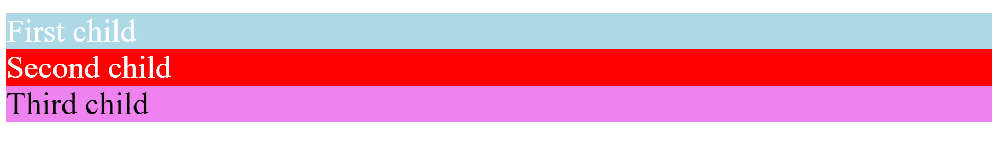

<div style="text-align: center;">
  
</div>

# Variables

Las denominadas **variables CSS** realmente no son variables, sino que solemos denominarlas así por su parecido con la programación y porque es más fácil comprender rápidamente lo que son, pero tienen sus diferencias. Lo adecuado sería llamarlas custom properties.

Estas custom properties son un mecanismo que nos permite dar un valor personalizado a las propiedades y guardarlo o almacenarlo. Esto nos evitará repetir código y recordarlo con un nombre adecuado. Esto además nos facilitará en un futuro los cambios, ya que solo habrá que modificar los valores en un lugar y los cambios se verán reflejados automáticamente en todos los elementos en los que se use la variable.

Para declarar custom properties (variables) usaremos un nombre que comience con dos guiones (`-`), y un valor que puede ser cualquier valor válido de CSS.

```css
elemento {
  --main-bg-color: red;
}
```

Aquí hay que tener en cuenta el scope o ámbito de aplicación de esta variable. Lo correcto sería declarar las variables globales de nuestra aplicación en un ámbito o scope global, para poder acceder a ellas desde cualquier punto. Esto se consigue con la pseudo-clase :root

```css
:root {
  --main-bg-color: red;
}
```

Ahora podremos acceder a esta custom property desde cualquier lugar de la app, como por ejemplo en los <p> de la aplicación:

```css
p {
  background-color: var(--main-bg-color);
}
```

Además, es conveniente añadir un valor de la propiedad por defecto por si la variable desapareciese o no fuese accesible desde nuestro scope. Imaginemos en el ejemplo anterior que, por lo que sea, la variable de :root desaparece, nuestro ejemplo se quedaría sin color de fondo, para solucionarlo podemos hacer lo siguiente:

```css
p {
  background: var(--background-color, red);
}
```

Es importante recalcar que se necesitará introducir la variable dentro de los () precedidos de la palabra clave var que indicará que se trata de una variable. Así, la palabra clave VAR recibirá 2 parámetros, la variable que queremos usar será el primero y un valor a modo de salvavidas por si la variable no funcionase.

Vamos a ver para terminar un ejemplo de ámbitos o scope porque al principio puede que os cueste un poco entenderlo, pero os será de mucha utilidad:

```html
<div class="parent">
  <div class="first child">First child</div>
  <div class="second child">Second child</div>
</div>
<div class="third child">Third child</div>
```



Aquí podéis ver el resultado, vamos a analizarlo.

```css
.parent {
  --background-color: red;
  color: white;
}

.first {
  --background-color: lightblue;
}

.child {
  background: var(--background-color, violet);
}
```

- En primer lugar, el primer div será de color lightblue debido a que, aunque en el padre que tiene la clase parent se indica la variable, en el propio div con el texto “First child” se indica otro valor para la variable que es lightblue en la clase first, lo que indica que tiene mayor prioridad y por lo tanto se sobreescribirá.
- El segundo div será de fondo rojo ya que en la clase second no se indica un valor distinto para la variable, por lo que prevalece el valor que tiene inicialmente la clase parent.
- Por último, el tercer div será de color violet debido a que, al no ser hijo del elemento con la clase parent, no puede acceder a ese ámbito o scope y, por lo tanto, no podrá acceder a ningún valor de la variable, con lo que se mostrará el color por defecto violet.

## Usos bien explicados de variables (Custom Properties)

---

Las variables CSS, también conocidas como custom properties, son una poderosa herramienta que permiten almacenar y reutilizar valores CSS a lo largo de un documento. Esto ayuda a mantener el código más limpio y fácil de mantener. Aquí te presento 10 ejemplos de uso de variables CSS con explicaciones detalladas.

**Definir y Utilizar Colores Globales**: Puedes definir colores globales en el scope `:root` y luego reutilizarlos en todo tu sitio web.

```css

:root {
  --primary-color: #3498db;
  --secondary-color: #2ecc71;
}

header {
  background-color: var(--primary-color);
}

footer {
  background-color: var(--secondary-color);
}
```

**Uso**: Define los colores principales de tu sitio en un solo lugar y aplícalos a diferentes elementos, facilitando el mantenimiento y los cambios de diseño.

**Cambiar Temas con Variables CSS**: Puedes cambiar temas fácilmente utilizando variables CSS.

```css
:root {
  --background-color: white;
  --text-color: black;
}

.dark-theme {
  --background-color: black;
  --text-color: white;
}

body {
  background-color: var(--background-color);
  color: var(--text-color);
}
```

**Uso**: Alternar entre temas claro y oscuro cambiando las variables en función de la clase aplicada al `body`.

**Definir Espaciados Uniformes**: Define tamaños de espaciado y márgenes uniformes.

```css
:root {
  --spacing-small: 8px;
  --spacing-medium: 16px;
  --spacing-large: 32px;
}

.container {
  padding: var(--spacing-medium);
}

.button {
  margin: var(--spacing-small);
}
```

**Uso**: Mantén la coherencia de espaciado y márgenes en todo el sitio.

**Variables de Fuentes**: Define y reutiliza familias de fuentes y tamaños de fuente.

```css
:root {
  --main-font: 'Arial, sans-serif';
  --heading-font-size: 2em;
  --body-font-size: 1em;
}

h1 {
  font-family: var(--main-font);
  font-size: var(--heading-font-size);
}

p {
  font-family: var(--main-font);
  font-size: var(--body-font-size);
}
```

**Uso**: Centraliza la definición de fuentes para mantener la coherencia y facilitar los cambios.

**Variables para Transiciones y Animaciones**: Define duraciones de transiciones y animaciones.

```css
:root {
  --transition-duration: 0.3s;
  --animation-duration: 1s;
}

.button {
  transition: background-color var(--transition-duration);
}

@keyframes fadeIn {
  from { opacity: 0; }
  to { opacity: 1; }
}

.element {
  animation: fadeIn var(--animation-duration);
}
```

**Uso**: Asegura que todas las transiciones y animaciones tengan una duración coherente.

**Variables para Valores de Z-Index**: Gestiona capas y niveles de apilamiento con variables.

```css
:root {
  --z-index-header: 1000;
  --z-index-modal: 2000;
}

header {
  z-index: var(--z-index-header);
}

.modal {
  z-index: var(--z-index-modal);
}

```

**Uso**: Facilita el manejo de niveles de apilamiento en diseños complejos.

**Variables en Media Queries**: Utiliza variables para mantener consistencia en breakpoints.

```css
:root {
  --mobile-breakpoint: 480px;
  --tablet-breakpoint: 768px;
}

@media (max-width: var(--mobile-breakpoint)) {
  .container {
    padding: 10px;
  }
}

@media (min-width: var(--tablet-breakpoint)) {
  .container {
    padding: 20px;
  }
}
```

**Uso**: Mantén los breakpoints centralizados y consistentes a lo largo del CSS.

**Variables para Opacidades**: Define niveles de opacidad para diferentes elementos.

```css
:root {
  --opacity-high: 0.9;
  --opacity-medium: 0.6;
  --opacity-low: 0.3;
}

.overlay-high {
  opacity: var(--opacity-high);
}

.overlay-medium {
  opacity: var(--opacity-medium);
}

.overlay-low {
  opacity: var(--opacity-low);
}
```

**Uso**: Facilita la gestión de opacidades en elementos superpuestos.

**Variables para Bordes y Sombras**: Centraliza la configuración de bordes y sombras.

```css
cssCopiar código
:root {
  --border-radius: 5px;
  --box-shadow: 0 4px 6px rgba(0, 0, 0, 0.1);
}

.card {
  border-radius: var(--border-radius);
  box-shadow: var(--box-shadow);
}

```

**Uso**: Mantén la coherencia en el estilo de bordes y sombras.

**Variables para Gradientes**: Define gradientes reutilizables.

```css
cssCopiar código
:root {
  --primary-gradient: linear-gradient(45deg, #f06, #f9a);
}

.button {
  background: var(--primary-gradient);
}

```

**Uso**: Centraliza los estilos de gradientes para reutilizarlos en diferentes elementos.

**Conclusión**

Las variables CSS son una herramienta poderosa para mejorar la mantenibilidad y coherencia de los estilos en tu sitio web. Al definir valores centralizados y reutilizables, puedes facilitar los cambios de diseño y asegurar una experiencia de usuario consistente.

