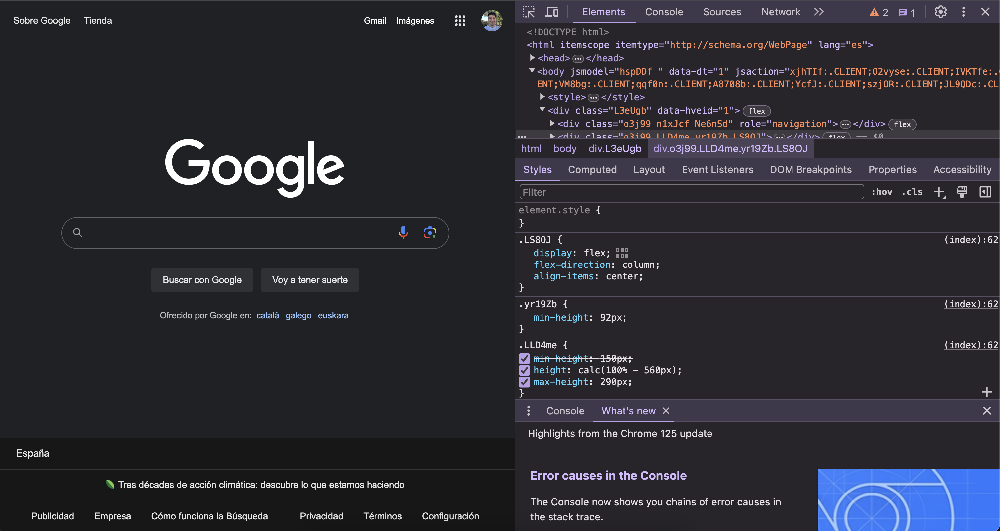
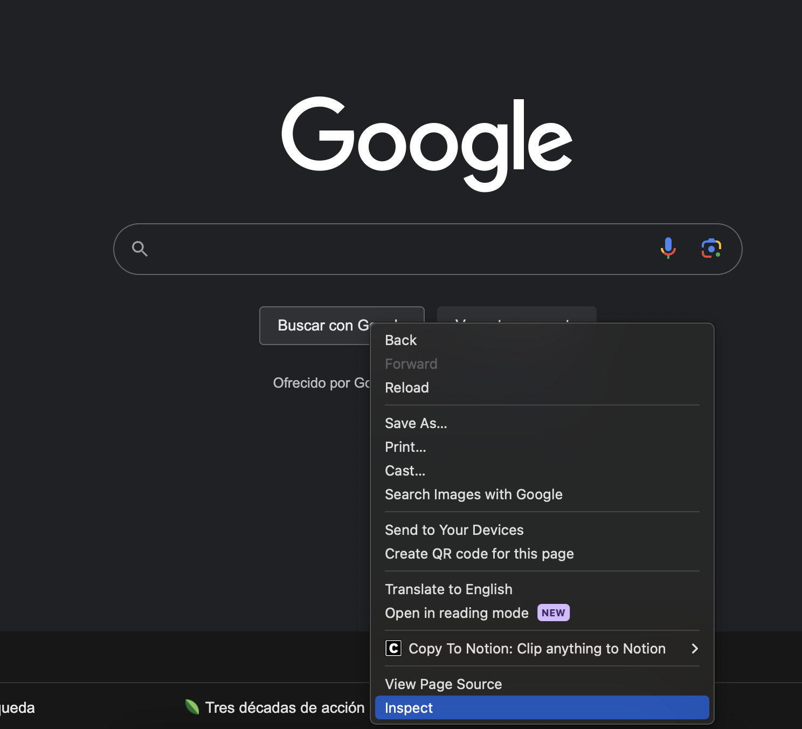

  

# ¿Qué ocurre cuando accedemos a una aplicación web?
Cuando introduces una URL en tu navegador web (como Chrome, Firefox o Edge), el navegador realiza una serie de pasos para mostrar la página en tu pantalla. Este proceso incluye la solicitud de un documento de texto a la máquina (servidor) donde está alojada esa página. Este documento de texto es el código fuente de la página web, generalmente escrito en HTML (HyperText Markup Language). El navegador interpreta este documento y lo muestra en tu pantalla de manera visual, transformando el texto y las etiquetas de HTML en imágenes, texto formateado y otros elementos interactivos.

## Proceso de carga de una página web

---

**1. Introducción de la URL:**

Cuando introduces una dirección web (**URL**) en la barra de direcciones del navegador (como [www.ejemplo.com](http://www.ejemplo.com/)), el navegador comienza a trabajar. Piensa en la URL como la dirección de una casa a la que quieres enviar una carta. El navegador necesita saber a dónde enviar la carta para recibir una respuesta.

**2. Resolución de DNS**

El navegador no entiende directamente las direcciones como [www.ejemplo.com](http://www.ejemplo.com/). Primero, necesita convertir esta dirección en algo que las computadoras entiendan, que es una dirección **IP** (una serie de números, como 192.168.1.1). Para hacer esto, el navegador consulta un "libro de direcciones" especial llamado **servidor DNS**. Este servidor traduce la URL (la dirección web) en una dirección IP que el navegador puede usar.

**3. Solicitud HTTP/HTTPS**

Con la dirección IP obtenida del servidor DNS, el navegador sabe a dónde enviar su solicitud. Envía una "carta" (llamada **solicitud HTTP o HTTPS**) al servidor donde está alojada la página web. Esta solicitud dice algo así como "Hola, quiero ver la página que está en [www.ejemplo.com](http://www.ejemplo.com/)".

**4. Respuesta del Servidor**

El servidor recibe la solicitud y busca la página web que se ha solicitado. Luego, el servidor responde enviando de vuelta el **documento** que contiene el código **HTML** de la página web. Es como si el servidor enviara un sobre con una carta de respuesta que contiene toda la información necesaria para mostrar la página web.

**5. Interpretación del HTML**

El navegador(Chrome, Firefox o Edge) recibe el documento HTML del servidor y comienza a leerlo. El HTML es un lenguaje que le dice al navegador cómo debe mostrarse la página. Es como leer las instrucciones de un mueble de IKEA; el navegador sigue estas instrucciones para saber dónde colocar los textos, imágenes, enlaces y otros elementos.

**6. Renderizado**

Finalmente, el navegador toma toda la información del documento HTML y la "dibuja" en tu pantalla. Este proceso se llama **renderizado**. El navegador convierte el código HTML en una página web visual que puedes ver y con la que puedes interactuar. Así es como la dirección web que introdujiste al principio se convierte en la página web completa que ves en tu pantalla.

### Resumen

- **Introducción de la URL**: Escribir la dirección web.
- **Resolución de DNS**: Convertir la dirección web en una dirección IP.
- **Solicitud HTTP/HTTPS**: Enviar una solicitud al servidor.
- **Respuesta del Servidor**: El servidor envía el código de la página web.
- **Interpretación del HTML**: El navegador lee el código.
- **Renderizado**: El navegador muestra la página en la pantalla.

## Inspeccionando elementos en el navegador

---

Cuando ves una página web, lo que ves en tu pantalla es el resultado del código HTML, CSS y JavaScript que el navegador interpreta. Para ver y modificar este código, los navegadores modernos tienen una herramienta llamada "Inspeccionar elementos".

### ¿Qué es la herramienta "Inspeccionar Elementos"?

La herramienta "Inspeccionar elementos" te permite ver el código que está detrás de la página web que ves en tu pantalla. Con esta herramienta, puedes ver cómo está estructurada la página (HTML), cómo se ve (CSS) y cómo se comporta (JavaScript). Es como mirar detrás del escenario en una obra de teatro para ver cómo se organiza todo.

### Cómo abrir el Inspector de elementos

Para usar esta herramienta, sigue estos pasos según el sistema operativo que utilices:

1. **Windows**: Presiona las teclas `Ctrl + Shift + J` al mismo tiempo.
2. **Mac**: Presiona las teclas `⌘ + Opción + I` al mismo tiempo.

Al hacer esto, se abrirá una nueva ventana o panel en tu navegador que muestra el código fuente de la página web.

### ¿Qué puedes ver en el Inspector de elementos?

Una vez que hayas abierto el inspector de elementos, verás varias secciones:

1. **Elements | HTML**: Esta es la estructura de la página. Verás etiquetas como `
`, `
`, `<h1>`, etc. Cada etiqueta define un elemento diferente en la página.
2. **Styles | CSS**: Este es el estilo de la página. El CSS (Cascading Style Sheets) define cómo se ve la página: colores, fuentes, tamaños, etc. Puedes ver y modificar estos estilos en tiempo real.
3. **Console | Javascript**: Aquí puedes ver mensajes de error, advertencias y también ejecutar comandos JavaScript. Es muy útil para depurar problemas en la página.

Imagina que estás en una página web y quieres ver cómo se ha hecho un botón en particular. Con el inspector de elementos, puedes hacer clic derecho en el botón y seleccionar "Inspeccionar". Esto abrirá el inspector de elementos y resaltará el código HTML y CSS correspondiente a ese botón. Podrás ver exactamente cómo está construido y estilizado.

### Resumen
**Inspector de Elementos**: Herramienta para ver y modificar el código fuente de una página web.

- **HTML**: Estructura de la página.
- **CSS**: Estilos de la página.
- **Consola**: Lugar para ver errores y ejecutar comandos JavaScript.

Usar el inspector de elementos es una excelente manera de aprender cómo están hechas las páginas web y de experimentar con cambios en tiempo real.

## Reto coding

---

Utilizar el inspector de elementos para ver el código fuente de cualquier página web.

### **Instrucciones:**

1. Abre tu navegador y ve a cualquier página web.
2. Abre el inspector de elementos (`Ctrl + Shift + J` en Windows o `⌘ + Opción + I` en Mac).
3. Examina el código HTML y encuentra las etiquetas `<head>`, `<body>`, `<h1>`, y `
`.