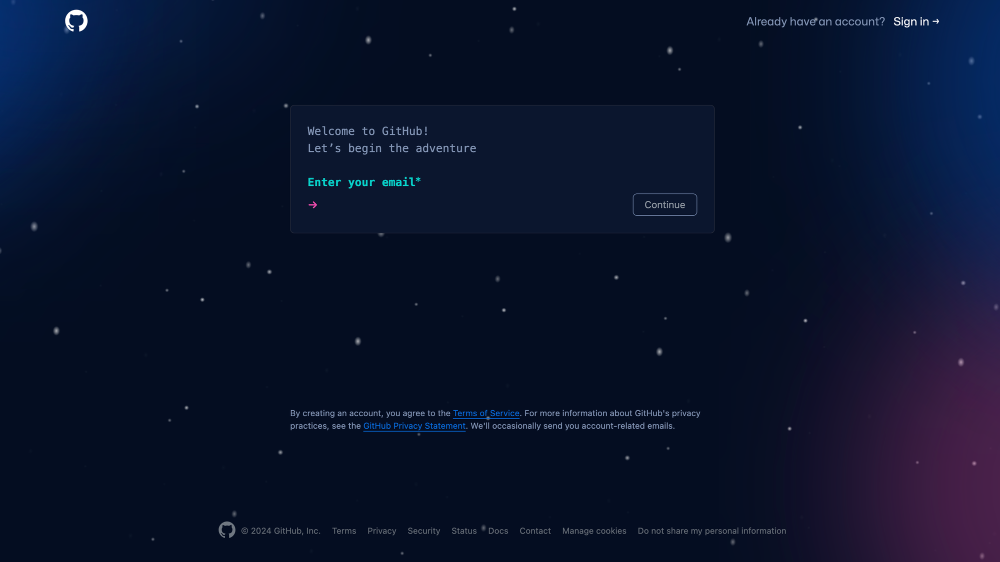
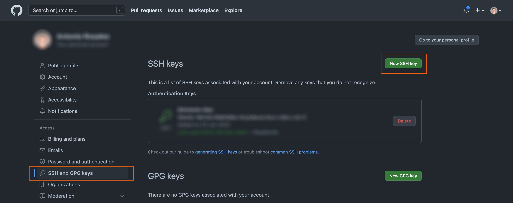
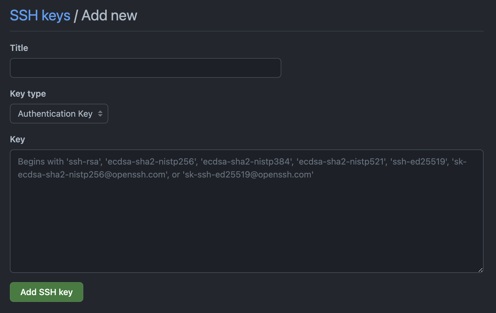

<div style="text-align: center;">
  
</div>

# GitHub Account

## ¿Qué es GitHub?

---

**GitHub** es una plataforma de desarrollo colaborativo que utiliza el sistema de control de versiones **Git**.

Permite a los desarrolladores y desarrolladoras trabajar en proyectos de forma conjunta, realizar un seguimiento de los cambios, colaborar en el código y gestionar proyectos de manera eficiente.

## ¿Para qué se utiliza GitHub?

---

GitHub se utiliza para diversas tareas relacionadas con el desarrollo de aplicaciones web, incluyendo:

1. Control de versiones: Permite gestionar y controlar los cambios en el código fuente de un proyecto. Podremos “viajar en el tiempo” por nuestro código y ver en qué momento se han subido cambios o correcciones al mismo.
2. Colaboración: Facilita la colaboración entre desarrolladores, permitiendo trabajar en equipo y fusionar cambios de forma sencilla y controlada.
3. Seguimiento de problemas: Proporciona un sistema para realizar un seguimiento de problemas, errores y solicitudes de mejora.
4. Despliegue y alojamiento: Permite alojar proyectos y desplegar aplicaciones de forma sencilla y rápida.

## Cómo crear una cuenta en GitHub paso a paso

---



Sigue estos pasos para crear una cuenta en GitHub:

1. Abre tu navegador y accede a la web principal de GitHub: [https://github.com](https://github.com/).
2. Haz clic en el botón "Sign up" (Registrarse). Puede aparecer como un input para introducir nuestro e-mail y empezar el proceso. En este caso, utilizaremos el e-mail que tengamos para tareas profesionales o el personal, ya que el perfil que generaremos no será exclusivo de la formación, si no para el resto de nuestra evolución como desarrolladores y desarrolladoras.
3. Completa el formulario de registro con tu nombre de usuario, dirección de correo electrónico y contraseña.
4. Selecciona el tipo de cuenta que deseas: una cuenta gratuita (Free) o una cuenta de pago (Pro). En nuestro caso utilizaremos la gratuita (Free).
5. Resuelve el desafío o puzzle de verificación si es necesario.
6. Haz clic en el botón "Create account" (Crear cuenta).
7. ¡Listo! Ahora tienes tu cuenta de GitHub.

Ahora puedes explorar esta aplicación y acabarás utilizando GitHub para tus proyectos, ya que en un tiempo tendremos un portfolio de trabajos realizados con el que mostrar nuestro avance con los demás. Además de esto, os animamos a que curioseéis los proyectos de otros desarrolladores y desarrolladoras, ya que es muy común encontrarnos con trabajos open-source que nos sirvan de inspiración, ejemplo y hasta de punto de partida.


## Enlazando nuestro equipo a la cuenta de GitHub

---

Con las claves SSH podemos conectarnos a GitHub sin necesidad de proporcionar el nombre de usuario o el access token desde nuestro equipo y tendremos una via segura de conexión e identificación con nuestros repositorios**.** 

Para enlazar nuestro equipo a la cuenta de GitHub tendremos que ir a **Settings** globales y a la sección **SSH and GPG Keys.**



Una vez estemos en esta sección veremos un botón llamado **New SSH key,** el cual nos mostrará un sencillo formulario que nos pide una clave y un nombre para dicha clave.



Esta clave SSH la tendremos que generar en nuestro equipo, y dependiendo del sistema operativo tendremos que seguir unos pasos u otros:

## Windows

---

Abrimos **Git Bash** (la instalación de Git lo incluye) y ejecutamos el siguiente comando sustituyendo el e-mail por el que hemos utilizado para crear la cuenta en GitHub (importante respetar las comillas antes de lanzar el comando). 

```bash
ssh-keygen -t ed25519 -C "your_email@example.com"
```

Pulsamos enter en todas las opciones hasta que nos salga un mapa de caracteres y nos deje seguir escribiendo la terminal.

Tras la ejecución de este comando ejecutaremos este otro para guardar en el portapapeles el código generado:

```bash
clip < ~/.ssh/id_ed25519.pub
```

Con el código copiado en nuestro portapapeles gracias a este comando podemos volver a la pantalla, pegarlo en el input llamado **Key** y denominar el titulo de la clave con, por ejemplo, “Equipo de sobremesa” o cualquier titulo identificativo de la misma.

## Mac

---

Abrimos la terminal de Mac y ejecutamos el siguiente comando sustituyendo el e-mail por el que hemos utilizado para crear la cuenta en GitHub (importante respetar las comillas antes de lanzar el comando). 

```bash
ssh-keygen -t ed25519 -C "your_email@example.com"
```

Pulsamos enter en todas las opciones hasta que nos salga un mapa de caracteres y nos deje seguir escribiendo la terminal.

Tras la ejecución de este comando ejecutaremos este otro para guardar en el portapapeles el código generado:

```bash
pbcopy < ~/.ssh/id_ed25519.pub
```

Con el código copiado en nuestro portapapeles gracias a este comando podemos volver a la pantalla, pegarlo en el input llamado **Key** y denominar el titulo de la clave con, por ejemplo, “Equipo de sobremesa” o cualquier titulo identificativo de la misma.

## Comprobando la conexión SSH

---

Si hemos realizado todos los pasos correctamente podremos comprobar que la conexión se ha realizado correctamente. 

Haciendo uso de la consola o terminal pertinente dependiendo de nuestro sistema operativo realizaremos las siguientes comprobaciones:

```bash
ssh -T git@github.com
```

Este comando nos devolverá el siguiente mensaje:

```bash
> La autenticidad del host 'github.com (DIRECCIÓN IP)' no se puede establecer.
> La clave de huella digital RSA es SHA256:nThbg6kXUpJWGl7E1IGOCspRomTxdCARLviKw6E5SY8.
> ¿Estás seguro de que quieres continuar conectado (sí/no)?
```

Si la clave digital que aparece en el segundo mensaje es la misma que hemos generado anteriormente y que aparece en la sección de nuestras claves SSH pulsaremos y o si y nos debería devolver el mensaje siguiente:

```bash
> Hi username! You've successfully authenticated, but GitHub does not
> provide shell access.
```

De esta forma estaremos conectados con GitHub y podemos empezar a trabajar en nuestros repositorios o colaborar en proyectos externos.

Puedes consultar la documentación oficial de Git para obtener más información sobre cómo utilizar Git y sus características:

https://docs.github.com/es/authentication/connecting-to-github-with-ssh/generating-a-new-ssh-key-and-adding-it-to-the-ssh-agent

