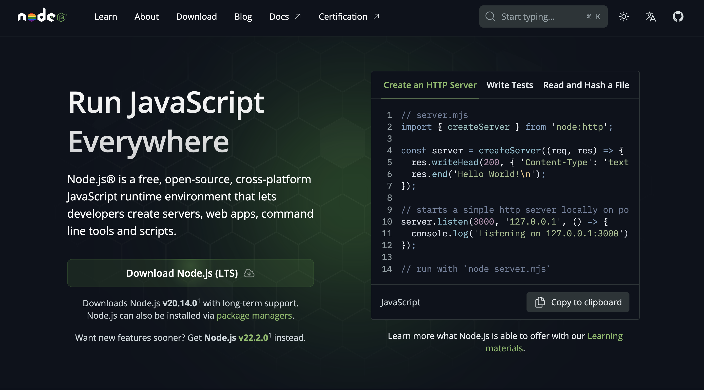

<div style="text-align: center;">
  
</div>

# Node.js

**Node.js** es un entorno de tiempo de ejecución de JavaScript que nos permite ejecutar código JavaScript en el lado del servidor, es decir, en nuestro equipo. A diferencia de JavaScript en el navegador, que se ejecuta en el cliente, Node.js nos da la capacidad de crear aplicaciones web y servidores utilizando JavaScript de manera aislada.

Esto significa que con Node.js podemos utilizar el mismo lenguaje de programación, JavaScript, tanto en el frontend como en el backend de nuestras aplicaciones. Esto simplifica el desarrollo y nos permite compartir código entre el cliente y el servidor. 

Gracias a su escalabilidad, Node.js puede manejar una gran cantidad de conexiones simultáneas sin agotar los recursos del sistema. Esto lo hace ideal para aplicaciones de tiempo real, como aplicaciones de chat o sistemas de transmisión en vivo. Node.js también cuenta con una comunidad activa de desarrolladores y una amplia variedad de módulos y bibliotecas disponibles, lo que facilita el desarrollo de aplicaciones y la resolución de problemas.

En resumen, nuestro equipo también va a aprender JavaScript una vez instalemos esta herramienta.

## Instalación de Node.js en Windows y MacOS

---



Sigue estos pasos para instalar Node.js en tu equipo con Windows o macOS:

1. Ve al sitio web oficial de Node.js en https://nodejs.org/.
2. Descarga el instalador de Node.js para Windows o macOS desde el botón de la landing.
3. Ejecuta el instalador y sigue las instrucciones del asistente de instalación. Simplemente hay que seguir los pasos hasta el último sin modificar los valores por defecto.
4. Una vez completada la instalación, abre una terminal y verifica la instalación de Node.js ejecutando el siguiente comando
    
    ```
    node --version
    ```
    

Deberías ver la versión de Node.js instalada en el equipo.

¡Ahora estás listo para comenzar a desarrollar con Node.js en tu equipo!

Documentación oficial

https://nodejs.org/docs/latest/api/
