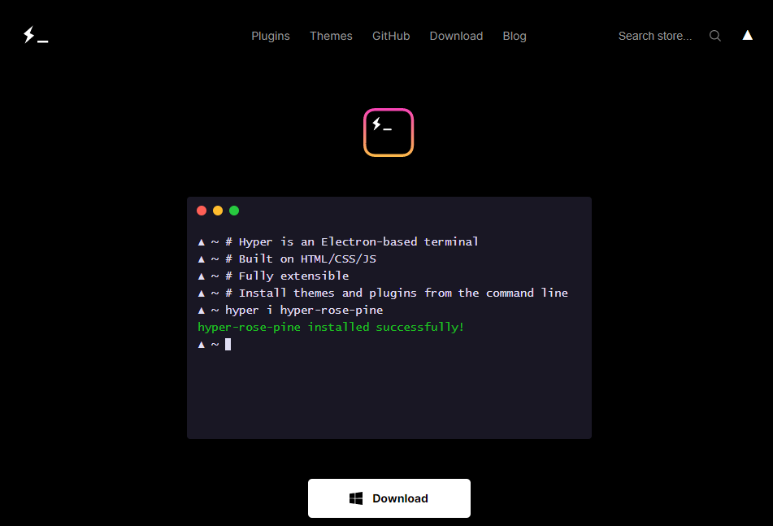
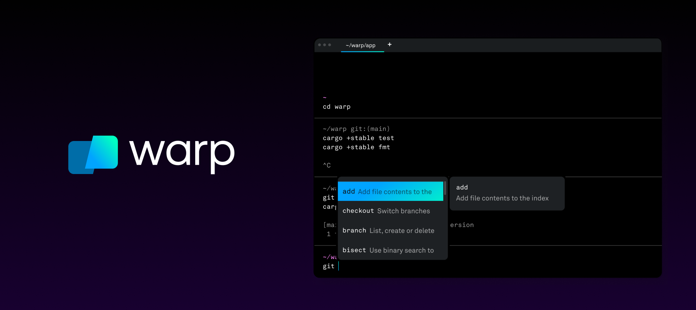

  

# Terminales externas
La terminal de comandos es una herramienta poderosa para realizar tareas en tu equipo. A continuación, te mostramos cómo utilizarla para realizar tareas básicas en diferentes sistemas operativos.

Tanto en Windows como en macOS podremos acceder a ella buscando “Terminal” o “Terminal de Comandos” en nuestras aplicaciones.

## Terminales externas

---

Os recomendamos unas terminales adicionales para que el desarrollo y el uso diario sea un poco más ameno y resolutivo:

- **Terminal Hyper para Windows:** Hyper es una terminal altamente personalizable y fácil de usar para Windows. Puedes descargarla desde su [sitio web oficial](https://hyper.is/) y aprovechar su amplia gama de temas y extensiones para personalizar tu flujo de trabajo.

- **Terminal Warp para macOS:** Warp es una terminal moderna y elegante diseñada específicamente para macOS. Puedes descargarla desde su [sitio web oficial](https://www.warp.dev/) y disfrutar de características como la navegación por pestañas, el desplazamiento rápido y la búsqueda con IA para mejorar la productividad.

¡Explora estas terminales y encuentra la que mejor se adapte a tus necesidades!