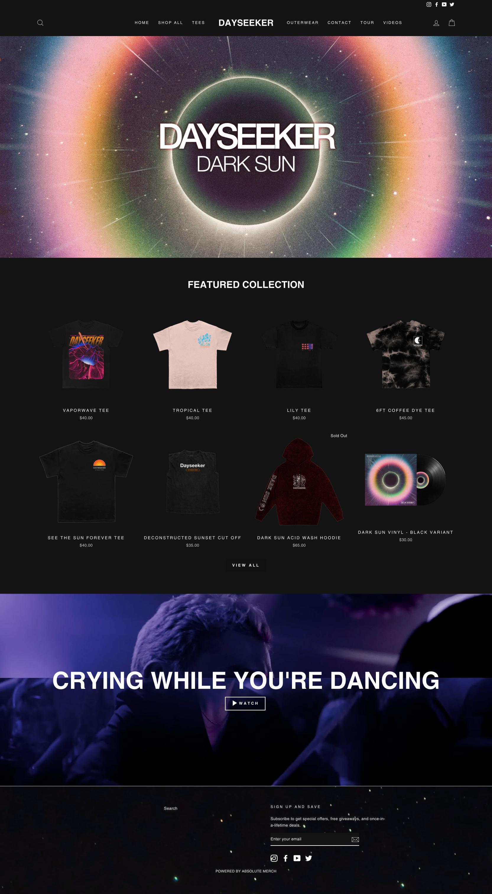
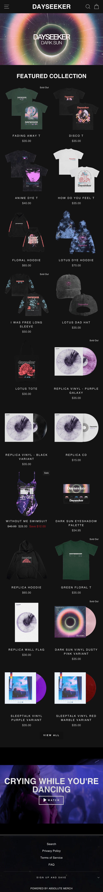

  

# Project 0 - HTML + CSS

Esta práctica consiste en replicar con HTML y CSS la web de la banda “Dayseeker” con la mayor exactitud posible. Pondrás a prueba todo lo aprendido tanto en HTML como CSS, no dudes en consultar los conceptos a lo largo de la elaboración del proyecto.

## Requisitos
- Se deben utilizar correctamente las etiquetas HTML para que toda la aplicación sea semánticamente correcta. No te guíes por lo que encuentres en el Inspeccionador, dale a entender al documento la semántica que consideres más correcta.
- Los colores se pueden capturar mediante una extensión ColorPicker de Chrome.
- Se puede utilizar tanto flexbox en el navegador, como grid para los productos. 
- Elige la mejor opción para cada uno de los elementos. 
- La fuente utilizada en la web es “Helvetica”.
- Todo el contenido debe de ser visual, no hay enlaces a otras páginas ni los botones son funcionales, aunque se pueden implementar animaciones similares a las de la web.
- La imagen del album en la parte superior tiene una animación de inicio.
- Encontrarás todos los recursos en los contenidos asociados.
- Recuerda que la entrega se realizará mediante la plataforma online.

## Contenido asociado
---
- [Video: Resolución](https://vimeo.com/967731986/c76fabc48f?share=copy)
- [Assets](./assets.zip)
- [Web original](https://dayseeker.band/)
