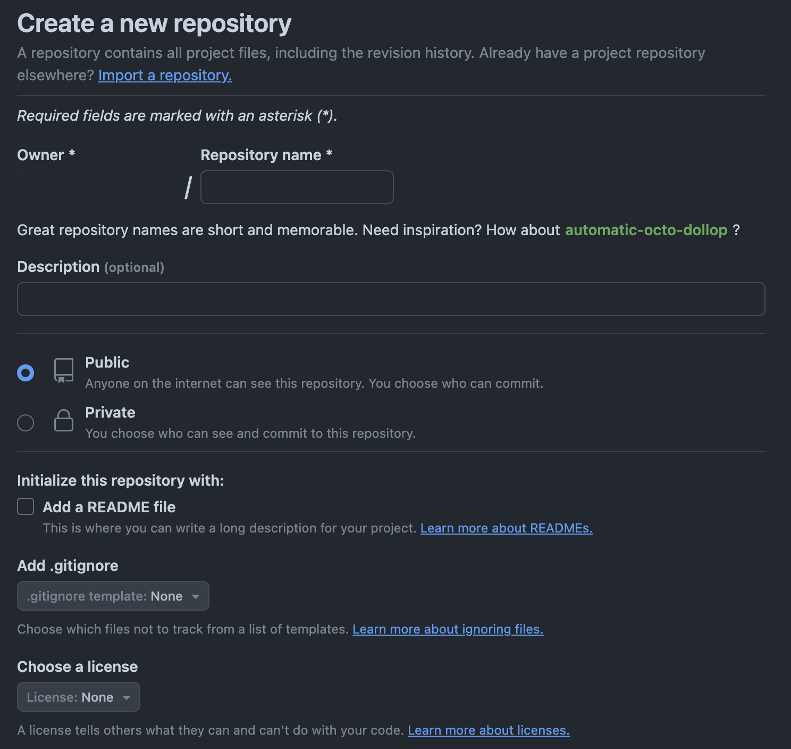

<div style="text-align: center;">
  
</div>

# Crear repositorio
## Crear un repositorio en GitHub

---

**Pasos para crear un repositorio en GitHub:**

1. Inicia sesión en tu cuenta de GitHub.
2. Haz clic en el botón `New` en la barra de la izquierda para crear un nuevo repositorio, también puedes acceder desde la sección Repositorios.
3. Completa la información del repositorio:
    - Nombre del repositorio (e.g., `mi-repositorio`).
    - Descripción (opcional).
    - Configuración de privacidad (público o privado).
4. Haz clic en `Create repository`.



## Crear un repositorio localmente usando la Terminal

---

1. **Abrir la Terminal:**
    - En Windows, abre Command Prompt (`Win + R`, escribe `cmd`, y presiona `Enter`).
    - En macOS, abre Terminal (`Command + Espacio`, escribe `Terminal`, y presiona `Enter`).
2. **Navegar a la carpeta donde quieres crear el repositorio:**
    
    ```bash
    cd ruta/a/tu/carpeta
    ```
    
3. **Crear un nuevo repositorio Git:**
    
    ```bash
    git init
    ```
    
4. **Crear un fichero README.md:**
    
    ```bash
    echo "# Mi Repositorio" > README.md
    ```
    
5. **Añadir el fichero al repositorio:**
    
    ```bash
    git add README.md
    ```
    
6. **Hacer un commit inicial:**
    
    ```bash
    git commit -m "Commit inicial"
    ```
    

## Conectar el repositorio local con GitHub

---

1. **Obtener la URL del repositorio remoto:**
    - Ve a la página del repositorio en GitHub.
    - Copia la URL del repositorio (por ejemplo, `https://github.com/tuusuario/mi-repositorio.git`).
2. **Agregar el repositorio remoto y hacer push del commit inicial:**
    
    ```bash
    git remote add origin https://github.com/tuusuario/mi-repositorio.git
    git branch -M main
    git push -u origin main
    ```
    
    De esta manera seleccionaremos la rama main y empujaremos los cambios (el commit) a dicha rama, subiendo el primer commit al repositorio.