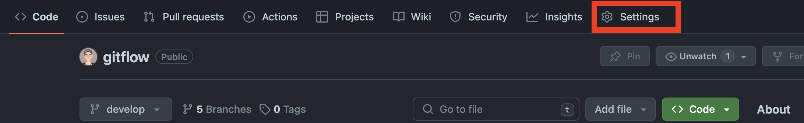
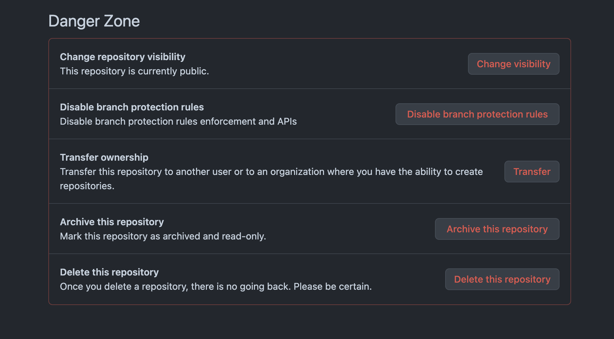

<div style="text-align: center;">
  
</div>

# Eliminar repositorio

## Eliminar repositorio localmente

---

La primera parte consiste en eliminar el repositorio de nuestro equipo, lo cual podemos hacer a mano a través del sistema operativo eliminando la carpeta local o a través de la terminal.

- En Windows:
  ```bash
  rmdir /s /q nombre_del_repositorio
  ```
- En macOS:
  ```bash
  rm -rf nombre_del_repositorio
  ```

## Eliminar repositorio de GitHub

---

Para eliminar el repositorio de GitHub tendremos que viajar hasta la URL del repositorio y entrar en el apartado Settings:



Si hacemos scroll hasta la parte de abajo de la página principal de Settings entraremos en la `Danger Zone`, donde además de cambiar la privacidad de nuestro repositorio, establecer reglas de subidas, transferir el repositorio a otra cuenta o archivarlo, podremos borrarlo en la última opción.



Tras unas preguntas de seguridad, como repetir el nombre del repositorio o introducir de nuevo nuestra contraseña habremos borrado con éxito nuestro repositorio de GitHub.

### Importante:

Borrar un repositorio de GitHub es irrecuperable, por lo que tenemos que estar 100% seguros de que es lo que queremos.

Siempre hay opciones alternativas para no perder definitivamente un repositorio como archivarlo o cambiarle la visibilidad a privado.
