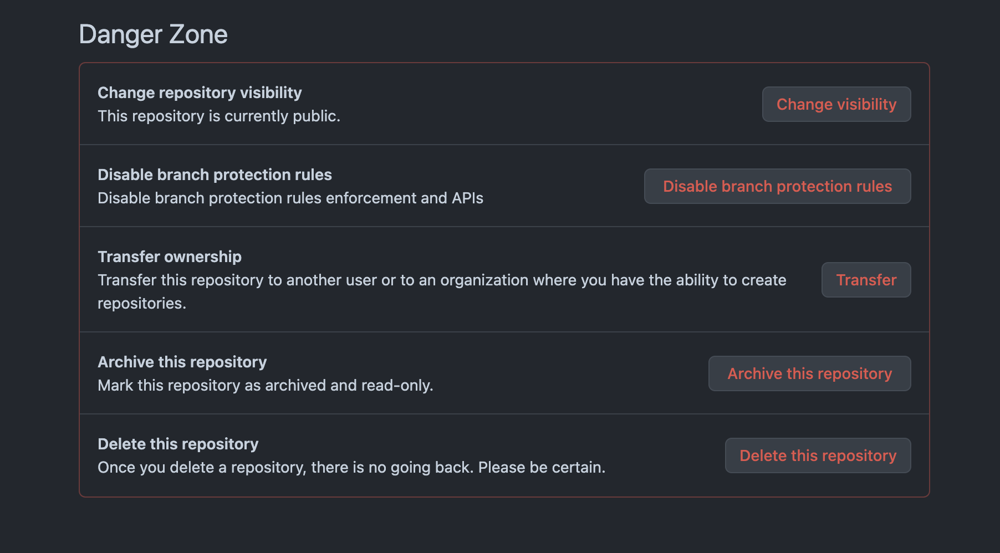
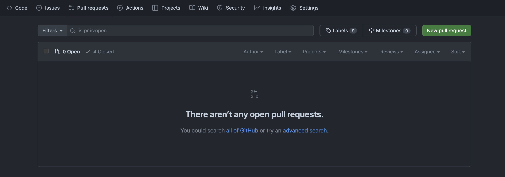

<div style="text-align: center;">
  
</div>

# Mergear ramas y pull requests

El merge en Git combina las actualizaciones de diferentes ramas en una sola rama. Esto es útil para integrar nuevas funcionalidades o correcciones en la rama principal o en otra rama de desarrollo.

## Preparación para el Merge

---

**1. Clonar el Repositorio desde GitHub (si aún no lo tienes localmente):**

```bash
git clone https://github.com/tuusuario/mi-repositorio.git
```

**2. Asegurarse de que la rama principal esté actualizada:**

```bash
git checkout main
git pull origin main
```

## Realizar un Merge entre ramas

---

**1. Cambiar a la rama donde deseas integrar los cambios:**

```bash
git checkout main
```

**2. Realizar el merge con la rama de origen:**

```bash
git merge nombre_de_la_rama_origen
```

## Resolver conflictos durante el Merge

---

**1. Si surgen conflictos, Git te notificará y marcará los archivos en conflicto:**

1. **Abrir los archivos en conflicto**:
    - Los conflictos se marcan con `<<<<<<< HEAD`, `=======`, y `>>>>>>> nombre_de_la_rama_origen`.
    - Edita los archivos para resolver los conflictos manualmente, eligiendo las partes correctas del código.
2. **Añadir los archivos resueltos al área de staging**:
    
    ```bash
    git add archivo_en_conflicto.txt
    ```
    
3. **Confirmar la resolución de los conflictos**:
    
    ```bash
    git commit -m "Resueltos conflictos del merge con nombre_de_la_rama_origen"
    ```
    

## Subir los cambios después del Merge

---

**1. Enviar los cambios al repositorio remoto**:

```bash
git push origin main
```

## Pull Requests

---

Un pull request (PR) permite revisar y discutir cambios antes de fusionarlos en la rama principal. Es una herramienta esencial para la colaboración en proyectos de software.

**1. Navegar al repositorio en GitHub:**

1. Inicia sesión en tu cuenta de GitHub.
2. Ve a la página del repositorio donde subiste la nueva rama.

**2. Crear el Pull Request:**

1. Haz clic en el botón `Compare & pull request` que aparece después de subir la nueva rama, o ve a la pestaña `Pull requests` y haz clic en `New pull request`.
2. Selecciona la rama base (por lo general, `main`) y la rama de comparación (la nueva rama que creaste).
3. Escribe un título y una descripción para el pull request.
4. Haz clic en `Create pull request`.
    
    
    

De esta forma, esta PR podrá ser vista por cualquier miembro del repositorio, aceptar la PR y automáticamente mergear los cambios en el proyecto. 



Hasta que no sea aceptada una PR los cambios no influirán en la rama, por lo que es un paso de gestión intermedio entre una rama y un merge bastante util para proyectos en grupo o equipos de desarrollo.

## Reto coding

---

1. **Clonar el repositorio** desde GitHub (si aún no lo tienes localmente):
2. **Crear y cambiar a una nueva rama** llamada `nueva-funcionalidad`:
3. **Realizar cambios en la nueva rama**:
    - Crear un archivo llamado `nueva_funcionalidad.txt`:
    - Añadir los cambios al área de staging:
    - Hacer un commit de los cambios:
    - Subir la rama al repositorio remoto en GitHub:
4. **Crear un pull request en GitHub**:
    - Navega al repositorio `mi-ejemplo` en GitHub.
    - Haz clic en `Compare & pull request` o ve a `Pull requests` > `New pull request`.
    - Selecciona `main` como la rama base y `nueva-funcionalidad` como la rama de comparación.
    - Escribe un título y una descripción para el pull request.
    - Haz clic en `Create pull request`.

  5. **Aceptar la Pull request comprobando que los anteriores pasos son correctos y las ramas de destino y origen son las adecuadas.**

## Contenido asociado
---
- [Video: Trabajo con ramas](https://vimeo.com/919094603/495ae0562b?share=copy)
