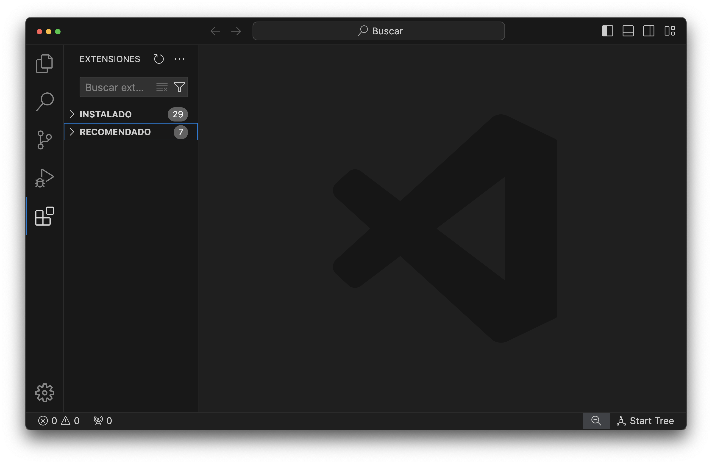
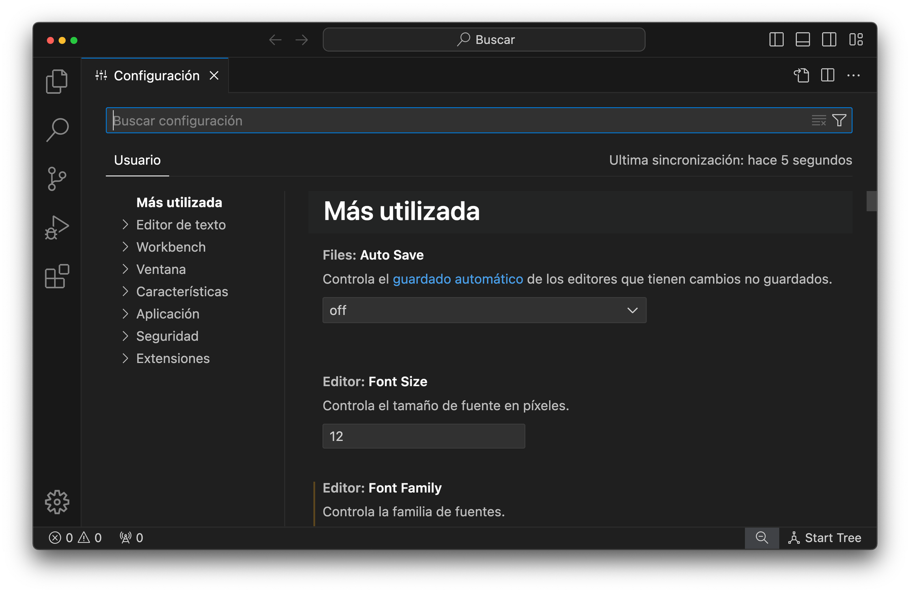
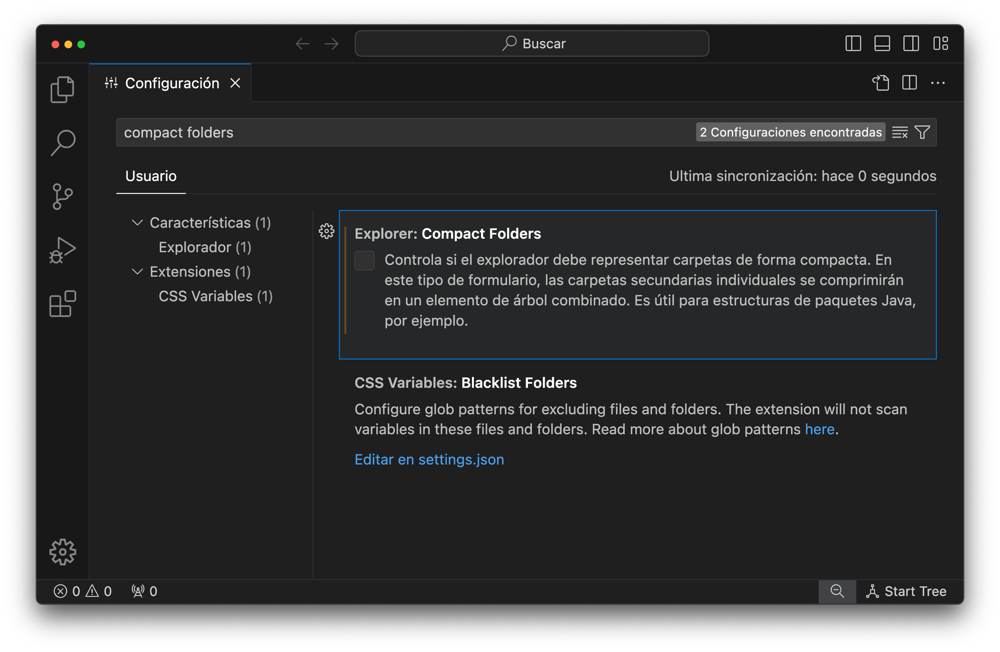
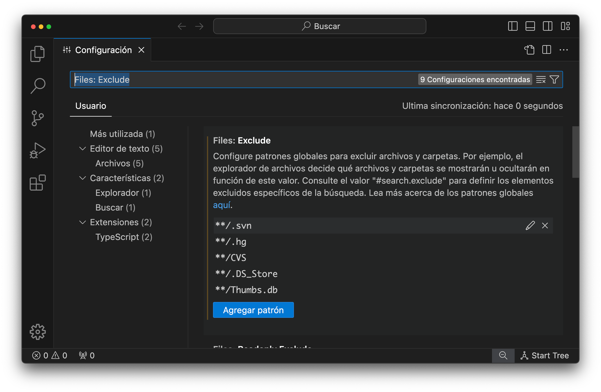
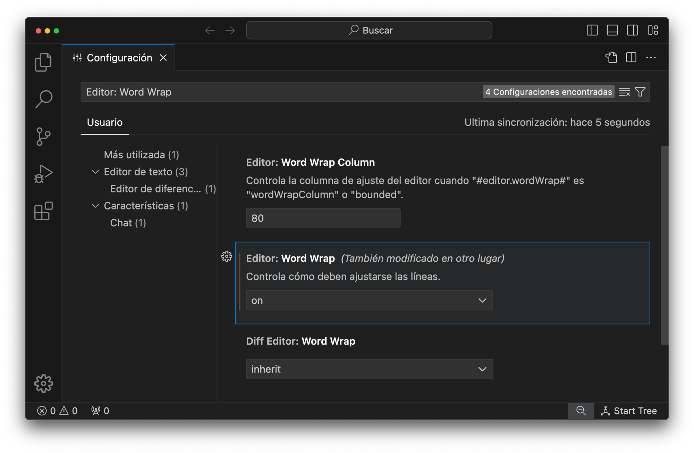
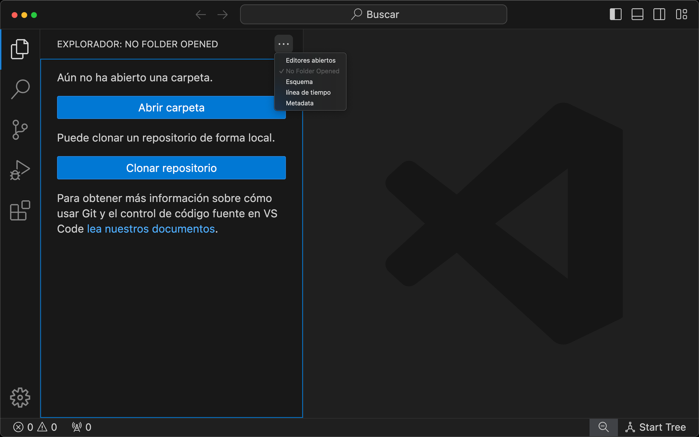

  

# Extensiones y puesta a punto

Para poner a punto Visual Studio Code, hay varias configuraciones y ajustes que se pueden realizar. A continuación, os presentamos algunos pasos comunes para optimizar tu experiencia de desarrollo:

1. Instalar extensiones útiles: Visual Studio Code tiene una amplia gama de extensiones disponibles en el Marketplace que pueden mejorar la funcionalidad y la productividad.
2. Personalizar la apariencia: Visual Studio Code permite personalizar la apariencia del editor según tus preferencias. Puedes ajustar temas, iconos, fuentes y otros aspectos visuales en la sección de configuración.
3. Conocer sus atajos de teclado: Visual Studio Code ofrece una amplia gama de atajos de teclado predeterminados, pero también puedes personalizarlos según tus necesidades. Esto te permitirá realizar acciones comunes de manera más rápida y eficiente.
4. Configurar linters y formateadores: Para mejorar la calidad del código, es recomendable configurar linters y formateadores en Visual Studio Code. Estas herramientas te ayudarán a identificar y corregir errores comunes de programación, así como a mantener un estilo de código consistente.

Vayamos paso a paso

## Extensiones

---

A continuación os dejamos un listado de extensiones útiles que recomendamos para potenciar el uso de Visual Studio Code:

- **DotENV** → Resalta la sintaxis en los archivos con formato .env.
- **Emotion Snippets** → Snippets de código para emotion.
- **Error Lens** → Resalta los errores en pantalla.
- **es6-string-html** → Resalta la sintaxis en strings creados con ES6.
- **ES7+ React/Redux/React-Native snippets** → Extensión con snippets de ES7,
React, Redux y React Native.
- **ESLint** → Esta extensión está activada de manera global.
- **Image preview** → Permite previsualizar las imágenes en miniaturas.

- **Import Cost** → Muestra el tamaño de los paquetes importados.
- **JavaScript (ES6) code snippets** → Snippets de código para sintáxis ES6
- **Live Server** → Nos permite montar en un servidor en vivo nuestros proyectos en
localhost.
- **Material Icon Theme** → Pack de iconos para los ficheros y carpetas.
- **One Monokai Theme** → Tema visual para los bloques de código con highlighting
en colores pastel.
- **Prettier - Code formatter** → Formateador de código.

## Configuraciones generales

---

- Compact Folders

Desactivaremos esta opción para que las carpetas aparezcan anidadas y no en formato de carpeta_padre/carpeta_hija.

- Files: Exclude

Eliminaremos con la X al final de la linea de .git para poder visualizar esta carpeta que, por defecto, nos aparecerá oculta cuando empecemos a crear repositorios.

- Editor: Word Wrap

Al activar esta opción le indicaremos al editor de código que no haga scroll lateral con el contenido para que podamos leer mejor el código sin estar navegando por el texto.

Por último, desactivaremos el resto de opciones en el Explorador para no tener ni areas de trabajo, ni lineas de tiempo ni otra opción que nos haga perder el foco de la carpeta de trabajo.

Con esto tendremos nuestro IDE listo para trabajar.
