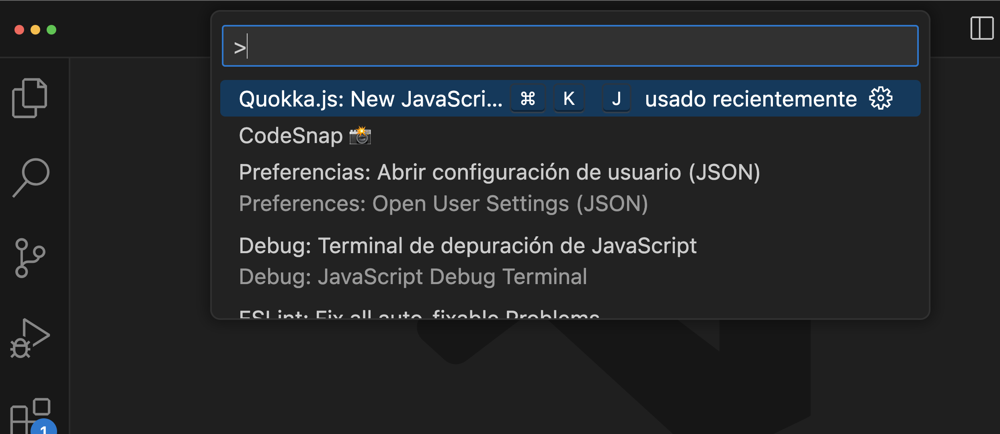

  

# Guía del IDE

Repasemos los elementos más importantes de nuestro entorno de desarrollo y algunos consejos para empezar a utilizar Visual Studio Code.

## Explorador

---

Para abrir el **Explorador** en Visual Studio Code, puedes hacer clic en el icono de la carpeta en la barra lateral izquierda o usar el atajo de teclado **Ctrl/Cmd + Shift + E**.

Esto abrirá el Explorador de archivos, donde puedes navegar por tu proyecto y ver la estructura de carpetas y archivos.

Para cerrar el Explorador, simplemente haz clic en el icono de la carpeta nuevamente o usa el atajo de teclado **Ctrl/Cmd + Shift + E**.

## Barra lateral

---

La barra lateral completa se puede mostrar y ocultar con **Ctrl/Cmd + B**. Nos será muy útil para tener mas visión del editor de código.

## Panel de comandos

---

El **Panel de comandos** en Visual Studio Code te permite ejecutar comandos y realizar diversas acciones.

Puedes abrir el Panel de comandos usando el atajo de teclado **Ctrl/Cmd + Shift + P** o haciendo clic en el icono de la lupa en la esquina superior derecha y escribiendo "Panel de comandos".

Desde el Panel de comandos, puedes buscar y ejecutar comandos específicos, como abrir un archivo, buscar y reemplazar texto, instalar extensiones, entre otros.

## Atajos de teclado

---

En tu flujo de trabajo diario con Visual Studio Code, puedes realizar varias tareas básicas, como abrir archivos y carpetas, editar y guardar archivos, buscar y reemplazar texto, y ejecutar y depurar tu código.

Aquí os dejamos con algunos **atajos** de teclado útiles para agilizar tu trabajo

**Windows**

- Abrir un archivo: **Ctrl + O**
- Guardar un archivo: **Ctrl + S**
- Buscar texto en el archivo actual: **Ctrl + F**
- Buscar y reemplazar texto en el archivo actual: **Ctrl + H**
- Ejecutar o depurar tu código: **F5**
- Buscar en todos los archivos del proyecto: **Ctrl + Shift + F**
- Abrir la terminal integrada: **Ctrl + J**

**macOS**

- Abrir un archivo: **Cmd + O**
- Guardar un archivo: **Cmd + S**
- Buscar texto en el archivo actual: **Cmd + F**
- Buscar y reemplazar texto en el archivo actual: **Cmd + H**
- Ejecutar o depurar tu código: **F5**
- Buscar en todos los archivos del proyecto: **Cmd + Shift + F**
- Abrir la terminal integrada: **Cmd + J**

## **Creación de ficheros y archivos**

---

En la parte superior del Explorador de archivos tendremos dos iconos de "**Nuevo Fichero**" y "**Nueva carpeta**".

Será la manera más ágil y rápida de crear nuevas estructuras en nuestras aplicaciones.

Recordad que siempre tendremos que trabajar en carpetas donde almacenaremos todo nuestro proyecto desde "**Abrir carpeta**" del menú contextual superior.

