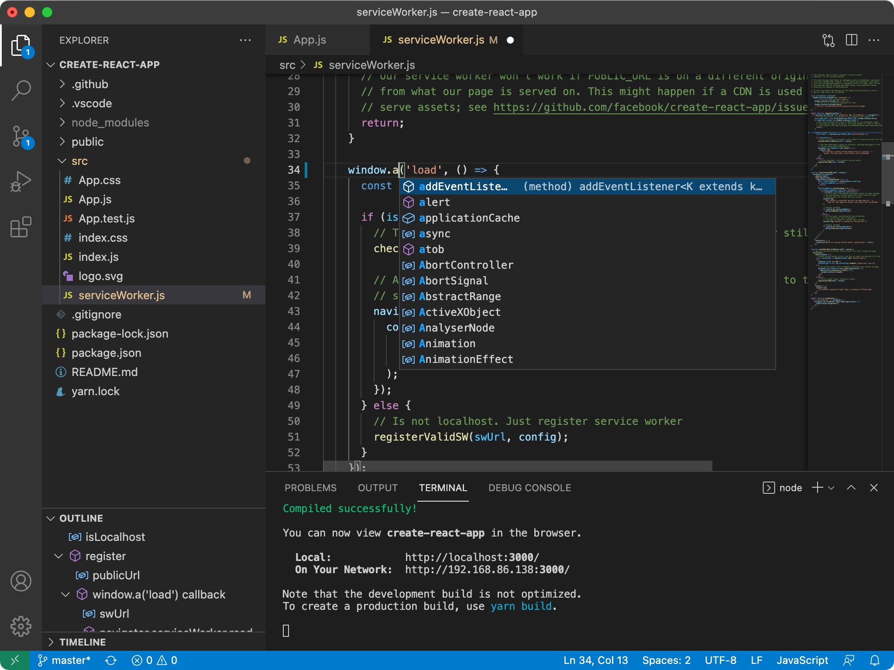

  

# Instalación de Visual Studio Code

**Visual Studio Code** es un editor de código fuente desarrollado por Microsoft que se utiliza ampliamente en el desarrollo web. Es una herramienta potente y altamente personalizable que ofrece una amplia gama de características para facilitar el flujo de trabajo de desarrollo. Será nuestra herramienta en el día a día en cuanto terminemos de instalar todo lo necesario en nuestro equipo.

## Características de Visual Studio Code

---

- Resaltado de sintaxis inteligente para varios lenguajes de programación.
- Finalización de código y sugerencias inteligentes.
- Integración con control de versiones, como Git.
- Depuración de código en tiempo real.
- Soporte para extensiones que permiten ampliar la funcionalidad del editor.
- Integración con herramientas de desarrollo web populares, como Node.js.

## Cómo instalar Visual Studio Code

---

Para instalar Visual Studio Code en tu equipo, sigue estos pasos:

1. Ve al sitio web oficial de Visual Studio Code en [https://code.visualstudio.com](https://code.visualstudio.com/).
2. Descarga el instalador correspondiente a tu plataforma (Windows o macOS).
3. Ejecuta el instalador y sigue las instrucciones en pantalla.
4. Una vez completada la instalación, podrás abrir Visual Studio Code desde el menú de inicio o el dock de tu sistema operativo.
5. Te recomendamos que ancles de alguna forma Visual Studio Code en la barra de tareas o al escritorio, ya que será la herramienta principal durante toda la formación.